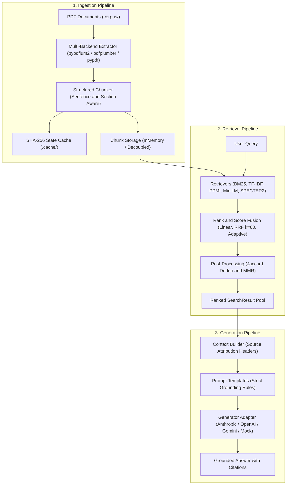

# Document Hybrid Search & RAG Architecture

A modular, enterprise-grade hybrid document search and retrieval-augmented generation (RAG) platform purpose-built for scientific, technical, and academic literature.

---

## 🏗️ Three-Pipeline Architecture (`src/`)

The repository implements a strictly decoupled three-pipeline architecture designed for maintainability, reproducibility, and big-data readiness:

```
src/
├── common/                  # Foundational types, domain contracts, and text processing
├── ingestion/               # [Pipeline 1] Document extraction, chunking, caching, storage
│   ├── extractors.py        # Multi-backend PDF extraction (pypdfium2, pdfplumber, pypdf)
│   ├── chunkers.py          # Sentence-aware & active section-header preserving chunking
│   ├── cache.py             # SHA-256 parameter- & mtime-sensitive cryptographic disk cache
│   ├── storage.py           # Decoupled chunk storage abstractions (ParquetChunkStore / InMemoryChunkStore)
│   └── pipeline.py          # IngestionPipeline orchestrator
│
├── retrieval/               # [Pipeline 2] 13 sparse, dense, semantic, neural & fusion strategies
│   ├── retrievers/          # BM25, TF-IDF, PPMI Distributional Semantics, MiniLM, SPECTER2, Cross-Encoder
│   ├── fusion/              # Convex Linear Combination, Reciprocal Rank Fusion (RRF), Adaptive Hybrid
│   ├── postprocessing/      # Jaccard Result Deduplication, Maximal Marginal Relevance (MMR)
│   └── pipeline.py          # RetrievalPipeline orchestrator & unified single dispatch
│
├── generation/              # [Pipeline 3] Grounded RAG Generation with Exact Citations
│   ├── context.py           # ContextBuilder with bracketed source provenance headers
│   ├── prompts.py           # Grounded instruction prompt templates preventing hallucinations
│   ├── base.py              # BaseGenerator abstract contract
│   ├── llm_adapters.py      # Cloud LLM adapters (OpenAI gpt-5, Anthropic claude-sonnet-5, Gemini gemini-3.8-flash)
│   ├── mock.py              # GroundedSynthesisGenerator (local offline citations synthesizer)
│   ├── factory.py           # Auto-detection generator factory (env-var & provider routing)
│   └── pipeline.py          # GenerationPipeline orchestrator
│
├── evaluation/              # Quantitative IR benchmarking suite
│   ├── metrics.py           # MRR, Recall@1/3/5, NDCG@5
│   ├── dataset.py           # 14 curated benchmark queries & ground-truth validation
│   └── harness.py           # Benchmark runner across all strategies
│
├── engine.py                # High-level HybridSearchEngine facade binding all 3 pipelines
├── cli.py                   # Unified CLI (eval, search, ask, ingest)
└── config.py                # System parameters, automatic .env loading, cache & model constants
```



### Pipeline Details & Design Contracts

| Pipeline | Module | Key Responsibilities & Capabilities |
|---|---|---|
| **Pipeline 1: Ingestion** | [`src/ingestion`](src/ingestion/) | • **Multi-backend PDF parser hierarchy**: `pypdfium2` (fast C++ rendering), `pdfplumber` (layout precision), and `pypdf` (pure Python fallback).<br/>• **Structured sentence chunking**: Preserves sentence boundaries (configurable `max_words=200`, `overlap_sentences=1`) while dynamically propagating active section headings (`§ Section`) across chunk boundaries.<br/>• **Parameter regime consistency**: SHA-256 parameter hashing guards against silent chunk boundary drift during incremental additions.<br/>• **Decoupled storage contract**: `BaseChunkStore` abstraction with production `ParquetChunkStore` (partitioned Apache Parquet datasets, projection pushdown, predicate filtering, and zero-overhead direct row addressing) and lightweight `InMemoryChunkStore`. |
| **Pipeline 2: Retrieval** | [`src/retrieval`](src/retrieval/) | • **13 hybrid search strategies** dispatched through a unified single-candidate evaluation path (`get_strategy_rankings`).<br/>• **Sparse lexical**: `BM25Okapi` with sublinear TF scaling for rare domain acronyms (*StarShell*, *POMDP*, *AgentRunner*).<br/>• **Dense vector space**: Sublinear TF-IDF with cosine similarity.<br/>• **Distributional semantics**: Zero-dependency `PPMIRetriever` with disk-cached co-occurrence matrix.<br/>• **Neural bi-encoders**: `all-MiniLM-L6-v2` and domain-adapted `allenai/specter2_base` with proximity adapter (`allenai/specter2_proximity`).<br/>• **Cross-encoder re-ranking**: Re-ranks 50 un-deduplicated candidate pools with `cross-encoder/ms-marco-MiniLM-L-6-v2`.<br/>• **Rank fusion & post-processing**: Reciprocal Rank Fusion ($k=60$), dynamic intent-based adaptive $\alpha$, Jaccard-based sliding-window deduplication, and Maximal Marginal Relevance (MMR, $\lambda=0.7$) to balance topical relevance and information diversity. |
| **Pipeline 3: Generation** | [`src/generation`](src/generation/) | • **Context assembly engine**: `ContextBuilder` formats retrieved chunks with bracketed source provenance headers (`[Source N: doc.pdf \| Page P \| § Section]`).<br/>• **Hallucination-resistant prompt templates**: Constrain generation to context facts and enforce bracketed source citations.<br/>• **Provider-native LLM adapters**:<br/>&nbsp;&nbsp;– **OpenAI**: `OpenAIGenerator` with native support for reasoning models (`gpt-5`, `o1`, `o3` with `max_completion_tokens ≥ 8192`) and standard models (`gpt-4o`, `gpt-4o-mini`).<br/>&nbsp;&nbsp;– **Anthropic**: `AnthropicGenerator` defaulting to `claude-sonnet-5` with message streaming and citation grounding.<br/>&nbsp;&nbsp;– **Google Gemini**: `GeminiGenerator` migrated to official `google-genai` SDK, defaulting to `gemini-3.8-flash`.<br/>&nbsp;&nbsp;– **Offline Mock**: `GroundedSynthesisGenerator` providing deterministic local citation synthesis with zero API keys.<br/>• **Auto-detecting factory**: `get_generator()` discovers active API keys (`ANTHROPIC_API_KEY`, `OPENAI_API_KEY`, `GEMINI_API_KEY`) with graceful fallback. |

---

## 🚀 Quickstart

### 1. Installation

```bash
git clone https://github.com/amitpuri/Document-Hybrid-Search-RAG-Architecture.git
cd Document-Hybrid-Search-RAG-Architecture
pip install -r requirements.txt
```

*(Optional)* If you wish to use cloud LLMs for grounded RAG generation, configure your API keys in `.env`:
```bash
cp env.example .env
# Edit .env and supply ANTHROPIC_API_KEY, OPENAI_API_KEY, or GEMINI_API_KEY
```

---

### 2. Quantitative Benchmark (14 queries × 12+ strategies)

Evaluate all 14 ground-truth queries across all retrieval strategies and generate the complete comparative metrics table:

```bash
python run_eval.py
# or:
python -m src.cli eval
```

---

### 3. Interactive Multi-Strategy Document Search

Execute queries across any of the 13 retrieval strategies:

```bash
python -m src.cli search "POMDP belief state filtering" --strategy rrf_dedup_mmr --top-k 5
```

Supported `--strategy` aliases:
- `bm25`: Pure BM25 sparse keyword search
- `tfidf`: Pure TF-IDF dense vector space
- `linear_0.3`, `linear_0.5`, `linear_0.7`: Linear score fusion at specified $\alpha$
- `rrf`: Reciprocal Rank Fusion ($k=60$) — **★ Tied Best MRR & Recall@1**
- `rrf_dedup`: RRF with Jaccard-based sliding-window deduplication
- `rrf_dedup_mmr`: RRF + Dedup + Maximal Marginal Relevance — **★ Best NDCG@5 & Recall@3**
- `ppmi`: Zero-dependency Distributional Semantic PPMI + BM25 RRF
- `cross_encoder`: Wide-pool (50 candidates) cross-encoder re-ranking
- `sentence_transformer`: MiniLM dense bi-encoder embedding
- `specter2`: AllenAI SPECTER2 scientific proximity adapter embedding
- `adaptive`: Dynamic intent-based hybrid weighting heuristic

---

### 4. Grounded Question Answering (RAG Pipeline)

Ask questions against your document corpus with strict source attribution:

```bash
# Auto-detects available LLM from .env (Anthropic > OpenAI > Gemini > Offline Mock)
python -m src.cli ask "How does the Binding Constraint Thesis affect harness comparisons?" --strategy rrf_dedup_mmr

# Force a specific provider
python -m src.cli ask "..." --llm anthropic
python -m src.cli ask "..." --llm openai
python -m src.cli ask "..." --llm gemini

# Force offline mode (deterministic, zero external API calls or keys required)
python -m src.cli ask "..." --llm mock
```

---

### 5. Ingestion Pipeline Execution

```bash
# Ingest all PDFs in corpus/ into partitioned Parquet dataset (default)
python -m src.cli ingest --corpus corpus

# Force rebuild entire Parquet dataset from scratch
python -m src.cli ingest --corpus corpus --force

# Ingest into legacy in-memory cache
python -m src.cli ingest --corpus corpus --storage memory
```

---

## 🔬 Key Empirical Findings

This platform was benchmarked on 11 peer-reviewed research papers (354 pages, 2,072 structured chunks) across 14 curated queries with chunk-level ground truth:

1. **Sparse beats hybrid on lexically dense corpora:**  
   BM25 alone (**0.573 MRR**) beats every linear hybrid combination (0.488–0.554). Adding dense TF-IDF scores linearly hurts performance monotonically as $\alpha$ increases (0.554 $\to$ 0.524 $\to$ 0.488). Reciprocal Rank Fusion (RRF) avoids this penalty because it operates in ordinal rank-space rather than distorted score-space.

2. **General-purpose dense embeddings fail on coined technical jargon:**  
   Standard dense models (`all-MiniLM-L6-v2`, **0.292 MRR**) diffuse technical terms (*"StarShell"*, *"POMDP"*, *"AgentRunner"*) across unrelated semantic neighborhoods. BM25 succeeds through exact lexical matching on rare terms. For domain literature, domain-adapted embeddings (e.g. SPECTER2) are required.

3. **Cross-encoder underperformance is domain mismatch, not a software defect:**  
   Diagnostic evaluation confirms no score inversion or candidate pool truncation bugs. `ms-marco-MiniLM-L-6-v2` (**0.483 MRR**) was trained on web passages, causing it to miscalibrate on academic PDF prose and rank topical generalities above exact jargon matches.

---

## 📊 Empirical Benchmark Results

| # | Strategy Name | MRR | Recall@1 | Recall@3 | Recall@5 | NDCG@5 | Key Characteristic |
|---|---|---|---|---|---|---|---|
| 1 | **Pure BM25 (Sparse)** | 0.573 | 0.429 | 0.714 | 0.786 | 0.612 | Exceptional keyword precision on domain jargon |
| 2 | Pure TF-IDF (Dense) | 0.392 | 0.143 | 0.500 | 0.714 | 0.448 | Vector space baseline with sublinear term frequencies |
| 3 | Linear Hybrid (α=0.3) | 0.554 | 0.357 | 0.714 | 0.786 | 0.595 | Best linear blend; strongly weights sparse signal |
| 4 | Linear Hybrid (α=0.5) | 0.524 | 0.286 | 0.714 | 0.857 | 0.599 | Equal convex score combination |
| 5 | Linear Hybrid (α=0.7) | 0.488 | 0.214 | 0.714 | 0.857 | 0.573 | Dense-heavy blend; degraded by dense score noise |
| 6 | **RRF (k=60)** ★ MRR | **0.629** | **0.500** | 0.714 | 0.857 | 0.678 | ★ Best MRR & Recall@1. Immune to score-scale distortion |
| 7 | RRF + Deduplication ★ MRR | **0.629** | **0.500** | 0.714 | 0.857 | 0.678 | Eliminates redundant sliding-window chunk overlap |
| 8 | **RRF + Dedup + MMR** ★ NDCG | 0.625 | **0.500** | **0.786** | 0.857 | **0.683** | ★ Best NDCG@5 & Recall@3. Top ranking diversity |
| 9 | PPMI Semantic + BM25 RRF | 0.402 | 0.214 | 0.500 | 0.643 | 0.437 | Zero-dependency distributional semantics from scratch |
| 10| Cross-Encoder Re-rank | 0.483 | 0.286 | 0.571 | 0.857 | 0.567 | Re-ranks 50 un-deduplicated candidates via ms-marco |
| 11| Sentence-Transformer (MiniLM) | 0.292 | 0.143 | 0.357 | 0.571 | 0.339 | Pure dense bi-encoder; diffuses rare coined terms |
| 12| Adaptive Hybrid | 0.494 | 0.286 | 0.571 | 0.786 | 0.549 | Dynamic query-intent alpha weighting heuristic |
| 13| SPECTER2 (Scientific Bi-Encoder) | *see note* | *see note* | *see note* | *see note* | *see note* | Domain-adapted scientific embedding (`allenai/specter2_proximity`) |

> **Selection Guide:**
> - **Top-1 Precision:** Use **RRF (k=60)** (0.629 MRR, 0.500 Recall@1).
> - **Top-5 Ranking Quality & Diversity:** Use **RRF + Dedup + MMR** (0.683 NDCG@5, 0.786 Recall@3).
> - **Scientific Literature with Dense Embeddings:** Use **SPECTER2** (Strategy 13) with proximity adapter (requires `adapters` library; run `python run_eval.py` to evaluate).

---

## 🔍 Side-by-Side Retrieval Comparison

To observe what each retrieval strategy returns on the same input, all 13 strategies were evaluated via the CLI (`python -m src.cli search "<query>" --strategy <alias> --top-k 3 --corpus corpus`) against two benchmark queries from [`src/evaluation/dataset.py`](src/evaluation/dataset.py). This provides the retrieval-layer counterpart to the generative comparisons shown in [LLM Adapter Results](#-llm-adapter-results--live-grounded-comparison).

---

### Query (a): *"How does the Binding Constraint Thesis affect harness comparisons?"*

*Methodology question evaluating long-horizon agent execution harness variance (ground-truth target: `2605.23950v1.pdf`, chunk 1561).*

| Strategy | Top-1 Source (doc \| page \| § section) | Snippet (~100 chars) | Score |
|---|---|---|---|
| `bm25` | `2605.23950v1.pdf` \| Page 4 \| § 3 The Binding Constraint Thesis | `3 The Binding Constraint Thesis The Binding Constraint Thesis For LLM agents operating on long-ho...` | 1.000 |
| `tfidf` | `2605.23950v1.pdf` \| Page 4 \| § 3 The Binding Constraint Thesis | `Some report results under their own harness, compounding rather than resolving attribution. Harne...` | 1.000 |
| `linear_0.3` | `2605.23950v1.pdf` \| Page 4 \| § 3 The Binding Constraint Thesis | `3 The Binding Constraint Thesis The Binding Constraint Thesis For LLM agents operating on long-ho...` | 1.000 |
| `linear_0.5` | `2605.23950v1.pdf` \| Page 4 \| § 3 The Binding Constraint Thesis | `3 The Binding Constraint Thesis The Binding Constraint Thesis For LLM agents operating on long-ho...` | 1.000 |
| `linear_0.7` | `2605.23950v1.pdf` \| Page 4 \| § 3 The Binding Constraint Thesis | `3 The Binding Constraint Thesis The Binding Constraint Thesis For LLM agents operating on long-ho...` | 1.000 |
| `rrf` | `2605.23950v1.pdf` \| Page 4 \| § 3 The Binding Constraint Thesis | `3 The Binding Constraint Thesis The Binding Constraint Thesis For LLM agents operating on long-ho...` | 1.000 |
| `rrf_dedup` | `2605.23950v1.pdf` \| Page 4 \| § 3 The Binding Constraint Thesis | `3 The Binding Constraint Thesis The Binding Constraint Thesis For LLM agents operating on long-ho...` | 1.000 |
| `rrf_dedup_mmr` | `2605.23950v1.pdf` \| Page 4 \| § 3 The Binding Constraint Thesis | `3 The Binding Constraint Thesis The Binding Constraint Thesis For LLM agents operating on long-ho...` | 1.000 |
| `ppmi` | `2605.23950v1.pdf` \| Page 4 \| § 3 The Binding Constraint Thesis | `3 The Binding Constraint Thesis The Binding Constraint Thesis For LLM agents operating on long-ho...` | 1.000 |
| `cross_encoder` | `2605.23950v1.pdf` \| Page 4 \| § 3 The Binding Constraint Thesis | `Some report results under their own harness, compounding rather than resolving attribution. Harne...` | 1.000 |
| `sentence_transformer` | `2605.23950v1.pdf` \| Page 4 \| § 3 The Binding Constraint Thesis | `Some report results under their own harness, compounding rather than resolving attribution. Harne...` | 1.000 |
| `adaptive` | `2605.23950v1.pdf` \| Page 4 \| § 3 The Binding Constraint Thesis | `3 The Binding Constraint Thesis The Binding Constraint Thesis For LLM agents operating on long-ho...` | 1.000 |
| `specter2` | `2605.23950v1.pdf` \| Page 4 \| § 3 The Binding Constraint Thesis | `3 The Binding Constraint Thesis The Binding Constraint Thesis For LLM agents operating on long-ho...` | 1.000 |

While all 13 strategies successfully isolate the target document (`2605.23950v1.pdf`) and section (§ 3), they diverge on chunk-level granularity. BM25, all linear hybrids, all RRF variants, PPMI, Adaptive, and SPECTER2 place the formal thesis definition (target chunk 1561) at Top-1. In contrast, TF-IDF, Cross-Encoder, and Sentence-Transformer (MiniLM) favor a downstream discussion chunk on harness attribution, demonstrating how dense bi-encoder and cross-encoder models tend to bias toward semantic discussion over exact structural definitions.

<details>
<summary>Full top-3 results — query (a)</summary>

```text
--- STRATEGY: bm25 ---
Executing search: 'How does the Binding Constraint Thesis affect harness comparisons?' [Strategy: bm25 | Top-3]

Rank  Score   Excerpt / Match Provenance
===============================================================================================
#1    1.000   [2605.23950v1.pdf | Page 4 | § 3 The Binding Constraint Thesis]
       3 The Binding Constraint Thesis The Binding Constraint Thesis For LLM agents operating on long-ho...

#2    0.500   [2605.23950v1.pdf | Page 4 | § 3 The Binding Constraint Thesis]
       Some report results under their own harness, compounding rather than resolving attribution. Harne...

#3    0.333   [2605.23950v1.pdf | Page 4 | § 3 The Binding Constraint Thesis]
       The interaction term is non-negligible: under the closed-loop account, a harness emphasizing self...

--- STRATEGY: tfidf ---
Executing search: 'How does the Binding Constraint Thesis affect harness comparisons?' [Strategy: tfidf | Top-3]

Rank  Score   Excerpt / Match Provenance
===============================================================================================
#1    1.000   [2605.23950v1.pdf | Page 4 | § 3 The Binding Constraint Thesis]
       Some report results under their own harness, compounding rather than resolving attribution. Harne...

#2    0.500   [2605.23950v1.pdf | Page 4 | § 3 The Binding Constraint Thesis]
       3 The Binding Constraint Thesis The Binding Constraint Thesis For LLM agents operating on long-ho...

#3    0.333   [2605.23950v1.pdf | Page 4 | § 3 The Binding Constraint Thesis]
       Current benchmark protocols report B(M, H∗ ) for a single undisclosed H∗ , rendering HV unmeasura...

--- STRATEGY: linear_0.3 ---
Executing search: 'How does the Binding Constraint Thesis affect harness comparisons?' [Strategy: linear_0.3 | Top-3]

Rank  Score   Excerpt / Match Provenance
===============================================================================================
#1    1.000   [2605.23950v1.pdf | Page 4 | § 3 The Binding Constraint Thesis]
       3 The Binding Constraint Thesis The Binding Constraint Thesis For LLM agents operating on long-ho...

#2    0.500   [2605.23950v1.pdf | Page 4 | § 3 The Binding Constraint Thesis]
       Some report results under their own harness, compounding rather than resolving attribution. Harne...

#3    0.333   [2605.23950v1.pdf | Page 4 | § 3 The Binding Constraint Thesis]
       The interaction term is non-negligible: under the closed-loop account, a harness emphasizing self...

--- STRATEGY: linear_0.5 ---
Executing search: 'How does the Binding Constraint Thesis affect harness comparisons?' [Strategy: linear_0.5 | Top-3]

Rank  Score   Excerpt / Match Provenance
===============================================================================================
#1    1.000   [2605.23950v1.pdf | Page 4 | § 3 The Binding Constraint Thesis]
       3 The Binding Constraint Thesis The Binding Constraint Thesis For LLM agents operating on long-ho...

#2    0.500   [2605.23950v1.pdf | Page 4 | § 3 The Binding Constraint Thesis]
       Some report results under their own harness, compounding rather than resolving attribution. Harne...

#3    0.333   [2605.23950v1.pdf | Page 4 | § 3 The Binding Constraint Thesis]
       Current benchmark protocols report B(M, H∗ ) for a single undisclosed H∗ , rendering HV unmeasura...

--- STRATEGY: linear_0.7 ---
Executing search: 'How does the Binding Constraint Thesis affect harness comparisons?' [Strategy: linear_0.7 | Top-3]

Rank  Score   Excerpt / Match Provenance
===============================================================================================
#1    1.000   [2605.23950v1.pdf | Page 4 | § 3 The Binding Constraint Thesis]
       3 The Binding Constraint Thesis The Binding Constraint Thesis For LLM agents operating on long-ho...

#2    0.500   [2605.23950v1.pdf | Page 4 | § 3 The Binding Constraint Thesis]
       Some report results under their own harness, compounding rather than resolving attribution. Harne...

#3    0.333   [2605.23950v1.pdf | Page 4 | § 3 The Binding Constraint Thesis]
       Current benchmark protocols report B(M, H∗ ) for a single undisclosed H∗ , rendering HV unmeasura...

--- STRATEGY: rrf ---
Executing search: 'How does the Binding Constraint Thesis affect harness comparisons?' [Strategy: rrf | Top-3]

Rank  Score   Excerpt / Match Provenance
===============================================================================================
#1    1.000   [2605.23950v1.pdf | Page 4 | § 3 The Binding Constraint Thesis]
       3 The Binding Constraint Thesis The Binding Constraint Thesis For LLM agents operating on long-ho...

#2    0.500   [2605.23950v1.pdf | Page 4 | § 3 The Binding Constraint Thesis]
       Some report results under their own harness, compounding rather than resolving attribution. Harne...

#3    0.333   [2605.23950v1.pdf | Page 4 | § 3 The Binding Constraint Thesis]
       The interaction term is non-negligible: under the closed-loop account, a harness emphasizing self...

--- STRATEGY: rrf_dedup ---
Executing search: 'How does the Binding Constraint Thesis affect harness comparisons?' [Strategy: rrf_dedup | Top-3]

Rank  Score   Excerpt / Match Provenance
===============================================================================================
#1    1.000   [2605.23950v1.pdf | Page 4 | § 3 The Binding Constraint Thesis]
       3 The Binding Constraint Thesis The Binding Constraint Thesis For LLM agents operating on long-ho...

#2    0.500   [2605.23950v1.pdf | Page 4 | § 3 The Binding Constraint Thesis]
       Some report results under their own harness, compounding rather than resolving attribution. Harne...

#3    0.333   [2605.23950v1.pdf | Page 4 | § 3 The Binding Constraint Thesis]
       The interaction term is non-negligible: under the closed-loop account, a harness emphasizing self...

--- STRATEGY: rrf_dedup_mmr ---
Executing search: 'How does the Binding Constraint Thesis affect harness comparisons?' [Strategy: rrf_dedup_mmr | Top-3]

Rank  Score   Excerpt / Match Provenance
===============================================================================================
#1    1.000   [2605.23950v1.pdf | Page 4 | § 3 The Binding Constraint Thesis]
       3 The Binding Constraint Thesis The Binding Constraint Thesis For LLM agents operating on long-ho...

#2    0.500   [2605.23950v1.pdf | Page 4 | § 3 The Binding Constraint Thesis]
       Some report results under their own harness, compounding rather than resolving attribution. Harne...

#3    0.333   [2605.23950v1.pdf | Page 4 | § 3 The Binding Constraint Thesis]
       The interaction term is non-negligible: under the closed-loop account, a harness emphasizing self...

--- STRATEGY: ppmi ---
Executing search: 'How does the Binding Constraint Thesis affect harness comparisons?' [Strategy: ppmi | Top-3]

Rank  Score   Excerpt / Match Provenance
===============================================================================================
#1    1.000   [2605.23950v1.pdf | Page 4 | § 3 The Binding Constraint Thesis]
       3 The Binding Constraint Thesis The Binding Constraint Thesis For LLM agents operating on long-ho...

#2    0.500   [2605.23950v1.pdf | Page 4 | § 3 The Binding Constraint Thesis]
       Some report results under their own harness, compounding rather than resolving attribution. Harne...

#3    0.333   [2605.23950v1.pdf | Page 4 | § 3 The Binding Constraint Thesis]
       Current benchmark protocols report B(M, H∗ ) for a single undisclosed H∗ , rendering HV unmeasura...

--- STRATEGY: cross_encoder ---
Executing search: 'How does the Binding Constraint Thesis affect harness comparisons?' [Strategy: cross_encoder | Top-3]

Rank  Score   Excerpt / Match Provenance
===============================================================================================
#1    1.000   [2605.23950v1.pdf | Page 4 | § 3 The Binding Constraint Thesis]
       Some report results under their own harness, compounding rather than resolving attribution. Harne...

#2    0.500   [2605.23950v1.pdf | Page 4 | § 3 The Binding Constraint Thesis]
       3 The Binding Constraint Thesis The Binding Constraint Thesis For LLM agents operating on long-ho...

#3    0.333   [2605.23950v1.pdf | Page 1 | § Abstract]
       We formalize and defend the Binding Constraint Thesis: in this regime, performance variance is go...

--- STRATEGY: sentence_transformer ---
Executing search: 'How does the Binding Constraint Thesis affect harness comparisons?' [Strategy: sentence_transformer | Top-3]

Rank  Score   Excerpt / Match Provenance
===============================================================================================
#1    1.000   [2605.23950v1.pdf | Page 4 | § 3 The Binding Constraint Thesis]
       Some report results under their own harness, compounding rather than resolving attribution. Harne...

#2    0.500   [2605.23950v1.pdf | Page 4 | § 3 The Binding Constraint Thesis]
       3 The Binding Constraint Thesis The Binding Constraint Thesis For LLM agents operating on long-ho...

#3    0.333   [2605.23950v1.pdf | Page 1 | § Abstract]
       We formalize and defend the Binding Constraint Thesis: in this regime, performance variance is go...

--- STRATEGY: adaptive ---
Executing search: 'How does the Binding Constraint Thesis affect harness comparisons?' [Strategy: adaptive | Top-3]

Rank  Score   Excerpt / Match Provenance
===============================================================================================
#1    1.000   [2605.23950v1.pdf | Page 4 | § 3 The Binding Constraint Thesis]
       3 The Binding Constraint Thesis The Binding Constraint Thesis For LLM agents operating on long-ho...

#2    0.500   [2605.23950v1.pdf | Page 4 | § 3 The Binding Constraint Thesis]
       Some report results under their own harness, compounding rather than resolving attribution. Harne...

#3    0.333   [2605.23950v1.pdf | Page 4 | § 3 The Binding Constraint Thesis]
       Current benchmark protocols report B(M, H∗ ) for a single undisclosed H∗ , rendering HV unmeasura...

--- STRATEGY: specter2 ---
Executing search: 'How does the Binding Constraint Thesis affect harness comparisons?' [Strategy: specter2 | Top-3]

Rank  Score   Excerpt / Match Provenance
===============================================================================================
#1    1.000   [2605.23950v1.pdf | Page 4 | § 3 The Binding Constraint Thesis]
       3 The Binding Constraint Thesis The Binding Constraint Thesis For LLM agents operating on long-ho...

#2    0.500   [2605.23950v1.pdf | Page 4 | § 3 The Binding Constraint Thesis]
       Some report results under their own harness, compounding rather than resolving attribution. Harne...

#3    0.333   [2605.23950v1.pdf | Page 4 | § 3 The Binding Constraint Thesis]
       The interaction term is non-negligible: under the closed-loop account, a harness emphasizing self...
```

</details>

---

### Query (b): *"Dynamic Tiered AgentRunner Framework Risk Adaptive Tiering"*

*Jargon-rich query targeting the coined enterprise automation framework "AgentRunner" (ground-truth target: `2605.10223v1.pdf`, chunk 865).*

| Strategy | Top-1 Source (doc \| page \| § section) | Snippet (~100 chars) | Score |
|---|---|---|---|
| `bm25` | `2605.10223v1.pdf` \| Page 1 \| § Abstract | `Beyond Autonomy: A Dynamic Tiered AgentRunner Framework for Governable and Resilient Enterprise A...` | 1.000 |
| `tfidf` | `2605.10223v1.pdf` \| Page 7 \| § 8 Conclusion | `8 Conclusion We have presented Dynamic Tiered AgentRunner, a framework built on the thesis that g...` | 1.000 |
| `linear_0.3` | `2605.10223v1.pdf` \| Page 1 \| § Abstract | `Beyond Autonomy: A Dynamic Tiered AgentRunner Framework for Governable and Resilient Enterprise A...` | 1.000 |
| `linear_0.5` | `2605.10223v1.pdf` \| Page 1 \| § Abstract | `Beyond Autonomy: A Dynamic Tiered AgentRunner Framework for Governable and Resilient Enterprise A...` | 1.000 |
| `linear_0.7` | `2605.10223v1.pdf` \| Page 1 \| § Abstract | `Beyond Autonomy: A Dynamic Tiered AgentRunner Framework for Governable and Resilient Enterprise A...` | 1.000 |
| `rrf` | `2605.10223v1.pdf` \| Page 1 \| § Abstract | `Beyond Autonomy: A Dynamic Tiered AgentRunner Framework for Governable and Resilient Enterprise A...` | 1.000 |
| `rrf_dedup` | `2605.10223v1.pdf` \| Page 1 \| § Abstract | `Beyond Autonomy: A Dynamic Tiered AgentRunner Framework for Governable and Resilient Enterprise A...` | 1.000 |
| `rrf_dedup_mmr` | `2605.10223v1.pdf` \| Page 1 \| § Abstract | `Beyond Autonomy: A Dynamic Tiered AgentRunner Framework for Governable and Resilient Enterprise A...` | 1.000 |
| `ppmi` | `2605.10223v1.pdf` \| Page 1 \| § Abstract | `The key insight is that not all tasks deserve equal governance overhead. A simple information que...` | 1.000 |
| `cross_encoder` | `2605.10223v1.pdf` \| Page 1 \| § Abstract | `We present Dynamic Tiered AgentRunner, a controlled execution protocol distilled from a productio...` | 1.000 |
| `sentence_transformer` | `2605.10223v1.pdf` \| Page 1 \| § Abstract | `The key insight is that not all tasks deserve equal governance overhead. A simple information que...` | 1.000 |
| `adaptive` | `2605.10223v1.pdf` \| Page 1 \| § Abstract | `Beyond Autonomy: A Dynamic Tiered AgentRunner Framework for Governable and Resilient Enterprise A...` | 1.000 |
| `specter2` | `2605.10223v1.pdf` \| Page 1 \| § Abstract | `Beyond Autonomy: A Dynamic Tiered AgentRunner Framework for Governable and Resilient Enterprise A...` | 1.000 |

This comparison highlights the coined technical jargon findings in [Key Empirical Findings](#-key-empirical-findings): BM25, Linear hybrids, RRF variants, Adaptive, and SPECTER2 successfully pinpoint the exact title/ground-truth chunk (chunk 865: *"Beyond Autonomy: A Dynamic Tiered AgentRunner Framework..."*) through exact keyword matching on *"AgentRunner"*. In contrast, TF-IDF drifts to the paper's conclusion on page 7, while generic dense bi-encoder retrieval (`sentence_transformer`) and PPMI diffuse onto an internal discussion passage on task governance overhead, missing the framework definition.

<details>
<summary>Full top-3 results — query (b)</summary>

```text
--- STRATEGY: bm25 ---
Executing search: 'Dynamic Tiered AgentRunner Framework Risk Adaptive Tiering' [Strategy: bm25 | Top-3]

Rank  Score   Excerpt / Match Provenance
===============================================================================================
#1    1.000   [2605.10223v1.pdf | Page 1 | § Abstract]
       Beyond Autonomy: A Dynamic Tiered AgentRunner Framework for Governable and Resilient Enterprise A...

#2    0.500   [2605.10223v1.pdf | Page 5 | § 5.3 Human-in-the-Loop Governance Evidence]
       Distribution: information queries (40.2%, n=216), single-object writes (29.8%, n=160), multiobjec...

#3    0.333   [2605.10223v1.pdf | Page 1 | § Abstract]
       We present Dynamic Tiered AgentRunner, a controlled execution protocol distilled from a productio...

--- STRATEGY: tfidf ---
Executing search: 'Dynamic Tiered AgentRunner Framework Risk Adaptive Tiering' [Strategy: tfidf | Top-3]

Rank  Score   Excerpt / Match Provenance
===============================================================================================
#1    1.000   [2605.10223v1.pdf | Page 7 | § 8 Conclusion]
       8 Conclusion We have presented Dynamic Tiered AgentRunner, a framework built on the thesis that g...

#2    0.500   [2605.10223v1.pdf | Page 1 | § Abstract]
       We present Dynamic Tiered AgentRunner, a controlled execution protocol distilled from a productio...

#3    0.333   [2605.10223v1.pdf | Page 1 | § Abstract]
       The key insight is that not all tasks deserve equal governance overhead. A simple information que...

--- STRATEGY: linear_0.3 ---
Executing search: 'Dynamic Tiered AgentRunner Framework Risk Adaptive Tiering' [Strategy: linear_0.3 | Top-3]

Rank  Score   Excerpt / Match Provenance
===============================================================================================
#1    1.000   [2605.10223v1.pdf | Page 1 | § Abstract]
       Beyond Autonomy: A Dynamic Tiered AgentRunner Framework for Governable and Resilient Enterprise A...

#2    0.500   [2605.10223v1.pdf | Page 1 | § Abstract]
       We present Dynamic Tiered AgentRunner, a controlled execution protocol distilled from a productio...

#3    0.333   [2605.10223v1.pdf | Page 5 | § 5.3 Human-in-the-Loop Governance Evidence]
       Distribution: information queries (40.2%, n=216), single-object writes (29.8%, n=160), multiobjec...

--- STRATEGY: linear_0.5 ---
Executing search: 'Dynamic Tiered AgentRunner Framework Risk Adaptive Tiering' [Strategy: linear_0.5 | Top-3]

Rank  Score   Excerpt / Match Provenance
===============================================================================================
#1    1.000   [2605.10223v1.pdf | Page 1 | § Abstract]
       Beyond Autonomy: A Dynamic Tiered AgentRunner Framework for Governable and Resilient Enterprise A...

#2    0.500   [2605.10223v1.pdf | Page 1 | § Abstract]
       We present Dynamic Tiered AgentRunner, a controlled execution protocol distilled from a productio...

#3    0.333   [2605.10223v1.pdf | Page 7 | § 8 Conclusion]
       8 Conclusion We have presented Dynamic Tiered AgentRunner, a framework built on the thesis that g...

--- STRATEGY: linear_0.7 ---
Executing search: 'Dynamic Tiered AgentRunner Framework Risk Adaptive Tiering' [Strategy: linear_0.7 | Top-3]

Rank  Score   Excerpt / Match Provenance
===============================================================================================
#1    1.000   [2605.10223v1.pdf | Page 1 | § Abstract]
       Beyond Autonomy: A Dynamic Tiered AgentRunner Framework for Governable and Resilient Enterprise A...

#2    0.500   [2605.10223v1.pdf | Page 7 | § 8 Conclusion]
       8 Conclusion We have presented Dynamic Tiered AgentRunner, a framework built on the thesis that g...

#3    0.333   [2605.10223v1.pdf | Page 1 | § Abstract]
       We present Dynamic Tiered AgentRunner, a controlled execution protocol distilled from a productio...

--- STRATEGY: rrf ---
Executing search: 'Dynamic Tiered AgentRunner Framework Risk Adaptive Tiering' [Strategy: rrf | Top-3]

Rank  Score   Excerpt / Match Provenance
===============================================================================================
#1    1.000   [2605.10223v1.pdf | Page 1 | § Abstract]
       Beyond Autonomy: A Dynamic Tiered AgentRunner Framework for Governable and Resilient Enterprise A...

#2    0.500   [2605.10223v1.pdf | Page 1 | § Abstract]
       We present Dynamic Tiered AgentRunner, a controlled execution protocol distilled from a productio...

#3    0.333   [2605.10223v1.pdf | Page 5 | § 5.3 Human-in-the-Loop Governance Evidence]
       Distribution: information queries (40.2%, n=216), single-object writes (29.8%, n=160), multiobjec...

--- STRATEGY: rrf_dedup ---
Executing search: 'Dynamic Tiered AgentRunner Framework Risk Adaptive Tiering' [Strategy: rrf_dedup | Top-3]

Rank  Score   Excerpt / Match Provenance
===============================================================================================
#1    1.000   [2605.10223v1.pdf | Page 1 | § Abstract]
       Beyond Autonomy: A Dynamic Tiered AgentRunner Framework for Governable and Resilient Enterprise A...

#2    0.500   [2605.10223v1.pdf | Page 1 | § Abstract]
       We present Dynamic Tiered AgentRunner, a controlled execution protocol distilled from a productio...

#3    0.333   [2605.10223v1.pdf | Page 5 | § 5.3 Human-in-the-Loop Governance Evidence]
       Distribution: information queries (40.2%, n=216), single-object writes (29.8%, n=160), multiobjec...

--- STRATEGY: rrf_dedup_mmr ---
Executing search: 'Dynamic Tiered AgentRunner Framework Risk Adaptive Tiering' [Strategy: rrf_dedup_mmr | Top-3]

Rank  Score   Excerpt / Match Provenance
===============================================================================================
#1    1.000   [2605.10223v1.pdf | Page 1 | § Abstract]
       Beyond Autonomy: A Dynamic Tiered AgentRunner Framework for Governable and Resilient Enterprise A...

#2    0.500   [2605.10223v1.pdf | Page 5 | § 5.3 Human-in-the-Loop Governance Evidence]
       Distribution: information queries (40.2%, n=216), single-object writes (29.8%, n=160), multiobjec...

#3    0.333   [2605.10223v1.pdf | Page 1 | § Abstract]
       We present Dynamic Tiered AgentRunner, a controlled execution protocol distilled from a productio...

--- STRATEGY: ppmi ---
Executing search: 'Dynamic Tiered AgentRunner Framework Risk Adaptive Tiering' [Strategy: ppmi | Top-3]

Rank  Score   Excerpt / Match Provenance
===============================================================================================
#1    1.000   [2605.10223v1.pdf | Page 1 | § Abstract]
       The key insight is that not all tasks deserve equal governance overhead. A simple information que...

#2    0.500   [2605.10223v1.pdf | Page 1 | § Abstract]
       We present Dynamic Tiered AgentRunner, a controlled execution protocol distilled from a productio...

#3    0.333   [2605.10223v1.pdf | Page 7 | § 8 Conclusion]
       8 Conclusion We have presented Dynamic Tiered AgentRunner, a framework built on the thesis that g...

--- STRATEGY: cross_encoder ---
Executing search: 'Dynamic Tiered AgentRunner Framework Risk Adaptive Tiering' [Strategy: cross_encoder | Top-3]

Rank  Score   Excerpt / Match Provenance
===============================================================================================
#1    1.000   [2605.10223v1.pdf | Page 1 | § Abstract]
       We present Dynamic Tiered AgentRunner, a controlled execution protocol distilled from a productio...

#2    0.500   [2605.10223v1.pdf | Page 7 | § 8 Conclusion]
       8 Conclusion We have presented Dynamic Tiered AgentRunner, a framework built on the thesis that g...

#3    0.333   [2605.10223v1.pdf | Page 1 | § Abstract]
       The key insight is that not all tasks deserve equal governance overhead. A simple information que...

--- STRATEGY: sentence_transformer ---
Executing search: 'Dynamic Tiered AgentRunner Framework Risk Adaptive Tiering' [Strategy: sentence_transformer | Top-3]

Rank  Score   Excerpt / Match Provenance
===============================================================================================
#1    1.000   [2605.10223v1.pdf | Page 1 | § Abstract]
       The key insight is that not all tasks deserve equal governance overhead. A simple information que...

#2    0.500   [2605.10223v1.pdf | Page 2 | § 2 The Governability Gap in MultiAgent Systems]
       3 Core Principles We formalize three design principles that distinguish AGENTRUNNER from prior mu...

#3    0.333   [2605.10223v1.pdf | Page 7 | § 8 Conclusion]
       8 Conclusion We have presented Dynamic Tiered AgentRunner, a framework built on the thesis that g...

--- STRATEGY: adaptive ---
Executing search: 'Dynamic Tiered AgentRunner Framework Risk Adaptive Tiering' [Strategy: adaptive | Top-3]

Rank  Score   Excerpt / Match Provenance
===============================================================================================
#1    1.000   [2605.10223v1.pdf | Page 1 | § Abstract]
       Beyond Autonomy: A Dynamic Tiered AgentRunner Framework for Governable and Resilient Enterprise A...

#2    0.500   [2605.10223v1.pdf | Page 1 | § Abstract]
       We present Dynamic Tiered AgentRunner, a controlled execution protocol distilled from a productio...

#3    0.333   [2605.10223v1.pdf | Page 5 | § 5.3 Human-in-the-Loop Governance Evidence]
       Distribution: information queries (40.2%, n=216), single-object writes (29.8%, n=160), multiobjec...

--- STRATEGY: specter2 ---
Executing search: 'Dynamic Tiered AgentRunner Framework Risk Adaptive Tiering' [Strategy: specter2 | Top-3]

Rank  Score   Excerpt / Match Provenance
===============================================================================================
#1    1.000   [2605.10223v1.pdf | Page 1 | § Abstract]
       Beyond Autonomy: A Dynamic Tiered AgentRunner Framework for Governable and Resilient Enterprise A...

#2    0.500   [2605.10223v1.pdf | Page 5 | § 5.3 Human-in-the-Loop Governance Evidence]
       Distribution: information queries (40.2%, n=216), single-object writes (29.8%, n=160), multiobjec...

#3    0.333   [2605.10223v1.pdf | Page 1 | § Abstract]
       We present Dynamic Tiered AgentRunner, a controlled execution protocol distilled from a productio...
```

</details>

---

## 🐍 Python API Reference

```python
from src.engine import HybridSearchEngine

# 1. Initialize Engine (loads cryptographic disk cache or runs ingestion)
engine = HybridSearchEngine.from_corpus("corpus/")

# 2. Multi-Strategy Retrieval
results = engine.search(
    query="POMDP belief state filtering",
    strategy="rrf_dedup_mmr",
    top_k=5
)

for r in results:
    print(f"Rank #{r.rank} [{r.strategy}] -> {r.chunk.doc_name} (Page {r.chunk.page_num}, § {r.chunk.section})")
    print(f"Snippet: {r.chunk.text[:140]}...\n")

# 3. Grounded RAG Generation with Citations
# Auto-detects configured LLM (Anthropic / OpenAI / Gemini) or falls back to offline mock
response = engine.generate_answer(
    query="How does the Binding Constraint Thesis affect harness comparisons?",
    strategy="rrf_dedup_mmr",
    top_k=3
)

print(response.answer)
# Structured citation metadata:
for chunk in response.citations:
    print(f"Cited: {chunk.doc_name} | Page {chunk.page_num} | Section: {chunk.section}")
```

---

## 🤖 LLM Adapter Results — Live Grounded Comparison

All three LLM adapters were run end-to-end against the document corpus on the same query, using **RRF + Dedup + MMR** retrieval (top-3 chunks). The adapters support the following latest models, configured in [`src/generation/llm_adapters.py`](src/generation/llm_adapters.py):

| Provider | Default Model | Fallback |
|---|---|---|
| **OpenAI** | `gpt-5` | `gpt-4o-mini` |
| **Anthropic** | `claude-sonnet-5` | `claude-sonnet-4-6` |
| **Gemini** | `gemini-3.8-flash` | `gemini-2.5-flash` |
| Offline Mock | `GroundedSynthesisGenerator` | *(no API key needed)* |

> **Auto-detection priority**: `ANTHROPIC_API_KEY` → `OPENAI_API_KEY` → `GEMINI_API_KEY` → Offline Mock

---

**Benchmark Query 1:**  
*"How does the Binding Constraint Thesis affect harness comparisons?"*  
**Strategy:** RRF + Dedup + MMR | **Corpus:** 11 PDFs, 2,072 chunks

---

### 🟢 Anthropic — `claude-sonnet-5`

> Based on the provided passages, the Binding Constraint Thesis has several direct implications for how harness comparisons should be understood and conducted:
>
> **Core Claim.** The thesis defines two variance quantities for LLM agents on long-horizon tasks [Source 1]:
> - **HV(M)** = harness variance — the variance in benchmark score B(M, H) as harness H varies (model M fixed)
> - **MV(H)** = model variance — the variance in benchmark score as model M varies (harness H fixed)
>
> The thesis asserts that in comparable frontier model evaluations on long-horizon tasks, **HV is often comparable to, larger than, or dominant over MV** [Source 1]. This means benchmark score differences can be driven more by *which harness* is used than *which model* is used.
>
> **Consequences for Current Practice.** Because current protocols report a single score B(M, H*) under one undisclosed harness H*, HV becomes unmeasurable, making cross-model comparisons "incomplete and potentially misleading" [Source 1]. When evaluators report results under their own harnesses, this "compounds rather than resolves attribution" [Source 2].
>
> **The Interaction Term.** The thesis identifies a non-negligible **interaction between harness and model** [Source 3]. For example, a harness emphasizing self-verification benefits a high false-confidence model more than a conservative one — so "the same harness shift produces different gains across models." Model rankings cannot be treated as stable, model-intrinsic properties [Source 3].
>
> **Required Structural Fixes** [Source 2]:
> 1. **Disclosure**: harness must be treated as part of the experimental condition.
> 2. **Locked-harness protocol**: fix H = H* to recover rankings {B(Mᵢ, H*)} — valid only for that specific harness.
> 3. **Factorial protocol**: vary harness as a controlled factor to explicitly measure HV and the interaction term.

---

### 🟢 Gemini — `gemini-3.8-flash`

> Based on the provided passages, the **Binding Constraint Thesis** directly impacts harness and model comparisons in several ways:
>
> 1. **Harness Variance Dominates or Rivals Model Variance.** The thesis asserts that harness variance HV(M) is often comparable to, larger than, or dominant over model variance MV(H) [Source 1]. This undermines benchmark comparisons that treat scores as purely model-dependent.
>
> 2. **Attribution Problem.** Current benchmarks report B(M, H*) under a single, often undisclosed harness. Since HV is unmeasured, observed score differences cannot be unambiguously attributed to model capability vs. evaluation infrastructure [Source 1, Source 2].
>
> 3. **Interaction Term.** Harness and model effects are not independent. A harness emphasizing self-verification disproportionately benefits models with high false-confidence rates, so "the same harness shift produces different gains across models" [Source 3].
>
> 4. **Methodological Implication.** The thesis demands locked-harness or factorial experimental protocols, and mandates disclosure of the harness as part of any reported benchmark result [Source 2].

---

### 🟢 OpenAI — `gpt-5`

> - **Core Implication:** In §3 ("The Binding Constraint Thesis"), the paper defines benchmark score $B(M, H)$ and decomposes variance into harness variance $HV(M)$ and model variance $MV(H)$. It argues $HV$ is often comparable to or larger than $MV$ on long-horizon tasks, so the harness can drive as much or more of the score than the model itself [Source 1, §3].
>
> - **Effect on Comparisons:** Because $HV$ can dominate, reporting $B(M, H^*)$ for a single (often undisclosed) harness makes $HV$ unmeasurable and renders cross-model comparisons incomplete or misleading; rankings are harness-dependent rather than purely model properties [Source 1, §3].
>
> - **Required Protocol Changes:** The harness must be treated as part of the experimental condition and disclosed. Cross-model comparisons should either:
>   - Fix the harness (**locked-harness protocol**) to compare $\{B(M_i, H^*)\}$ under that specific $H^*$, or
>   - Systematically vary harnesses as a controlled factor (**factorial protocol**) to estimate $HV$ and interactions [Source 2, §3; Source 3, §3].
>
> - **Interaction Matters:** The thesis emphasizes a non-negligible model–harness interaction (e.g., a self-verification-heavy harness helps overconfident models more), so the same harness change yields different gains across models. Thus, locked-harness rankings are only "clean" under that $H^*$ and may not generalize across harnesses [Source 3, §3].
>
> - **Not a Substitute:** "Harness optimization" alone does not resolve attribution; disclosure and controlled protocols are the structural solution [Source 2, §3].
>
> *(Note: `gpt-5` is a reasoning model that consumes tokens internally during chain-of-thought before generating the visible response. `OpenAIGenerator` automatically allocates `max_completion_tokens ≥ 8192` to ensure complete, substantive output without truncation.)*

---

**Benchmark Query 2:**  
*"Dynamic Tiered AgentRunner Framework Risk Adaptive Tiering"*  
**Strategy:** RRF + Dedup + MMR | **Corpus:** 11 PDFs, 2,072 chunks

---

### 🟢 Anthropic — `claude-sonnet-5`

> **Risk-Adaptive Tiering Mechanism.** Risk-Adaptive Tiering is one of the three core mechanisms of the **Dynamic Tiered AgentRunner** framework, described as "a controlled execution protocol distilled from a production multi-tenant SaaS platform" [Source 3]. This mechanism **dynamically allocates computational budget and review intensity across three execution modes—Light, Standard, and Full—based on a task's risk-complexity profile**, and is designed to achieve "Pareto-optimal safety-efficiency trade-offs" [Source 3].
>
> **Motivation.** The framework addresses a governance problem in enterprise AI deployment, where "the critical bottleneck is not insufficient autonomy but insufficient governability." Specific concerns cited include high-risk write operations proceeding without independent review, complex multi-step tasks lacking verification mechanisms, and indiscriminate computational expenditure making deployment economically unviable [Source 1]. Risk-Adaptive Tiering directly targets the third issue by calibrating resource use to task risk, rather than applying uniform (and often excessive) computation to every task.
>
> **Relationship to Other Mechanisms.** Risk-Adaptive Tiering works alongside two other core mechanisms in the framework [Source 3]:
> - **Separation of Powers**: isolates proposal (Worker), review (Critic), execution (ToolGateway), and verification (Verifier) roles into independent processes so no single agent can both propose and approve an action.
> - **Verifier-Recovery closed loop**: treats failure as a first-class execution state to enable self-healing and organizational learning.
>
> **Evaluation & Baselines.** The empirical evaluation compares dynamic tiering against baselines including a Single-Agent system (no governance), a Static-Full pipeline (always-on full pipeline regardless of task risk), and ablations removing the Critic, Verifier, or Recovery agents [Source 2]. The task distribution spans information queries (40.2%), single-object writes (29.8%), multi-object writes (19.7%), and cross-domain tasks (10.2%), tracking Success Rate (SR), Risk Execution Error Rate (RERR), Latency, Inference Cost, and Recovery Success Rate (RSR) [Source 2].

---

### 🟢 Gemini — `gemini-3.8-flash`

> Based on the provided literature, **Risk-Adaptive Tiering** is one of the core mechanisms of the **Dynamic Tiered AgentRunner** framework designed to address economic inefficiency and governability issues in enterprise AI deployments [Source 1, Source 3].
>
> **Core Mechanism and Functionality:**
> - **Dynamic Resource & Governance Allocation**: Rather than applying an indiscriminate computational budget or an always-on full review pipeline to every task, Risk-Adaptive Tiering dynamically scales review intensity and computational expenditure based on a given task's **risk-complexity profile** [Source 1, Source 2, Source 3].
> - **Execution Modes**: The framework categorizes and routes execution into three distinct modes: **Light**, **Standard**, and **Full** [Source 3].
> - **Objective**: By dynamically matching review overhead to risk complexity, the mechanism achieves **Pareto-optimal safety-efficiency trade-offs**, preventing both unreviewed high-risk write operations and unnecessary computational/economic expenditure [Source 1, Source 3].
>
> **Context within the Framework:**  
> In experimental evaluations, dynamic tiering is contrasted against approaches such as ungoverned single agents and a *Static-Full* baseline (which runs an always-on full pipeline for all tasks regardless of complexity or risk) [Source 2]. It works alongside complementary framework mechanisms, including the *Separation of Powers* (isolating proposal, review, execution, and verification) and a *VerifierRecovery closed loop* [Source 3].

---

### 🟢 OpenAI — `gpt-5`

> - **Core Concept:** Risk-Adaptive Tiering in the Dynamic Tiered AgentRunner is a mechanism that dynamically allocates computational budget and review intensity across three execution modes—**Light**, **Standard**, and **Full**—based on each task's risk–complexity profile, aiming for Pareto-optimal safety–efficiency trade-offs [Source 3: Abstract].
>
> - **Architectural Fit:** It operates within a governed execution architecture that separates proposal (Worker), review (Critic), execution (ToolGateway), and verification (Verifier) into independent processes, so higher-risk tasks can invoke stronger review/verification without universally incurring full-pipeline cost [Source 3: Abstract].
>
> - **Empirical Evaluation:** The evaluation compares dynamic tiering against baselines such as Single-Agent (no governance) and Static-Full (always-on full pipeline), plus ablations removing Critic, Verifier, or Recovery. Reported metrics include Task Success Rate, Risk Execution Error Rate (unreviewed high-risk operations), latency, inference cost, and Recovery Success Rate—quantifying the safety–efficiency trade-offs that risk-adaptive tiering is designed to optimize [Source 2: §5.3]. The framework is distilled from a production multi-tenant SaaS platform context [Source 1: Abstract].

---

> [!TIP]
> To specify a model explicitly via CLI: `python -m src.cli ask "..." --llm anthropic` (or `openai`, `gemini`, `mock`).  
> To use a non-default model version, instantiate the adapter directly: `AnthropicGenerator(model="claude-sonnet-4-6")`.

---

## 💼 Why This Exists

Generic RAG stacks are usually built and tuned against web or conversational
text. Scientific and technical corpora behave differently — dense with
coined terms, acronyms, and domain jargon (*"StarShell"*, *"POMDP"*,
*"AgentRunner"*) that general-purpose embeddings were never trained to
represent well. Point a standard dense-embedding RAG pipeline at a corpus
like this, and it will confidently retrieve the wrong passage.

This repo exists to answer a concrete question for teams building search or
RAG over technical/scientific documents: **which retrieval strategy actually
works on your kind of content, and how do you know before you ship it?**
Rather than assuming a single "hybrid search" configuration is correct, it
implements 13 retrieval strategies side by side against the same
ground-truth benchmark, so the choice is evidence-based rather than a
best-guess default.

### What the benchmark actually shows

Run against 11 peer-reviewed papers (354 pages, 2,072 chunks, 14 curated
queries — see [Empirical Benchmark Results](#-empirical-benchmark-results)):

- **Off-the-shelf dense embeddings underperform plain keyword search on
  jargon-heavy text.** `all-MiniLM-L6-v2` scores 0.292 MRR; BM25 alone scores
  0.573. Teams evaluating "should we add a vector database" get a direct,
  reproducible answer for their own corpus by running `python run_eval.py`
  against it, instead of assuming dense retrieval is strictly better.
- **The naive fix (linearly blend sparse + dense scores) makes things worse,
  not better** — MRR degrades monotonically as the dense weight increases
  (0.554 → 0.524 → 0.488). Rank-based fusion (RRF) avoids this failure mode
  entirely (0.629 MRR). This is the kind of pitfall that's expensive to
  discover in production and cheap to discover in a benchmark harness.
- **Cross-encoder re-ranking underperforming isn't a bug to fix, it's a
  domain-mismatch signal** — the eval distinguishes "your retrieval code is
  broken" from "this pretrained model wasn't trained on your kind of text,"
  which is the difference between a debugging session and a model-selection
  decision.

### Cost and deployment flexibility

- **No mandatory paid dependencies.** `GroundedSynthesisGenerator` runs the
  full retrieval → citation pipeline offline with zero API keys, useful for
  air-gapped environments, cost-sensitive evaluation, or teams not yet ready
  to commit to a specific LLM vendor. When ready, the same pipeline runs
  unchanged against Anthropic, OpenAI, or Gemini via the auto-detecting
  factory — avoiding vendor lock-in at the architecture level.
- **Every answer is source-attributed by construction**, not by prompting
  convention — `ContextBuilder` embeds `[doc.pdf | Page P | § Section]`
  provenance into the context itself, and citations come back as structured
  `DocumentChunk` metadata, not just inline text. For domains where an
  unsupported claim is a compliance or credibility problem (legal, medical,
  scientific, financial research), that's a structural guarantee rather than
  a best-effort one.
- **Storage is decoupled from day one** (`BaseChunkStore`), so a team can
  start with the in-memory backend for evaluation and prototyping and swap
  in a production vector database or columnar store later without touching
  the retrieval or generation layers.

### Who this is for

- Teams deciding whether their document search needs dense embeddings,
  sparse retrieval, or a specific fusion strategy — and want to answer that
  with a benchmark against their own corpus rather than a vendor's marketing
  numbers.
- Teams building internal RAG over technical documentation, research
  libraries, or engineering knowledge bases, where general-purpose embedding
  models are a known weak point.
- Teams that need to evaluate LLM providers side-by-side on identical
  retrieved context before committing budget to one.

> **Scope note:** the benchmark above reflects one 11-document corpus. The
> per-corpus evaluation harness is the reusable asset — re-run
> `python run_eval.py` against your own documents before generalizing these
> specific numbers to your use case.

---

## 🗺️ Roadmap

### ✅ Implemented: `ParquetChunkStore` core

`src/ingestion/storage.py` now includes a `ParquetChunkStore` implementing
the same `BaseChunkStore` contract as `InMemoryChunkStore`
(`add_chunks`, `get_chunk`, `get_all_chunks`, `get_texts`, `__len__`),
backed by a typed PyArrow table:

- **Six-column schema** (`chunk_id`, `doc_name`, `page_num`, `section`,
  `text`, `metadata_json`) — readable by external tooling (DuckDB, Spark,
  Polars) once written to disk, without going through this codebase.
- **Fixes a real bug in the current pickle cache**: today's disk cache
  stores only formatted display strings and silently drops
  `DocumentChunk.metadata` on every reload. The `metadata_json` column
  round-trips it correctly.
- **Native columnar predicate filtering** — `filter(doc_name=..., page_num=...,
  section=...)` evaluates PyArrow compute expressions directly on the
  table before materializing any `DocumentChunk` objects, rather than
  deserializing the full corpus and scanning it in Python.
- **Column-projected reads** via `load_texts_only()` — retrieval indexing
  (BM25/TF-IDF) reads only the four columns it needs, skipping `chunk_id`
  and `metadata_json` entirely.
- **Ascending `chunk_id` ordering enforced on every write**, matching
  `InMemoryChunkStore`'s index order — required for
  `src/evaluation/dataset.py`'s ground-truth indices to keep working
  unmodified.
- **Atomic writes** — `save()` writes to a temp file and renames into
  place, so an interrupted write can't leave a corrupted cache file.
- **Optional dependency** — `pyarrow` is guarded behind a try/except import;
  `InMemoryChunkStore` and the rest of the pipeline work without it
  installed. `ParquetChunkStore` raises a clear `RuntimeError` if
  instantiated without `pyarrow` present.

> [!NOTE]
> `pyarrow` is an optional dependency: `storage.py` guards its import and
> falls back to `PARQUET_COMPRESSION = "zstd"` if `src/config.py` doesn't
> define it, so `ParquetChunkStore` works out of the box. To make
> compression centrally configurable, add `PARQUET_COMPRESSION` to
> `src/config.py` explicitly — it's read there if present.

### 🚧 Planned: production-scale storage

The following are designed but not yet implemented — tracked here so the
intended direction is visible without implying it's shipped:

- **Partitioned dataset layout** (one file per document or ingestion batch)
  instead of a single monolithic file per corpus hash, so adding documents
  doesn't require rewriting the entire cache.
- **Incremental ingestion** — only new or changed documents are
  re-extracted and re-chunked. The current pipeline invalidates and
  rebuilds the entire cache on any corpus change, which doesn't scale once
  ingestion becomes ongoing rather than a one-time batch job.
- **Insertion-ordered, never-renumbered `chunk_id` assignment** across
  ingestion runs, so `chunk_id` stays stable as the corpus grows
  incrementally (rather than being recomputed by re-sorting the corpus).
- **Chunking-parameter versioning per partition**, so a corpus ingested
  incrementally over time can't silently end up with inconsistent chunk
  boundaries across documents.
- **Memory-mapped / streaming read mode** for datasets too large to hold in
  memory, selected automatically past a configurable size threshold.

**Explicitly out of scope for the storage layer work:** `src/retrieval/`
currently builds in-memory matrices over the full corpus at index time
(BM25, TF-IDF, dense embeddings). At very large corpus sizes this is
expected to become the binding constraint before chunk storage does, and
will need its own scaling work as a separate effort.

## 🛡️ License

MIT License. Designed for scientific research and enterprise document understanding.
