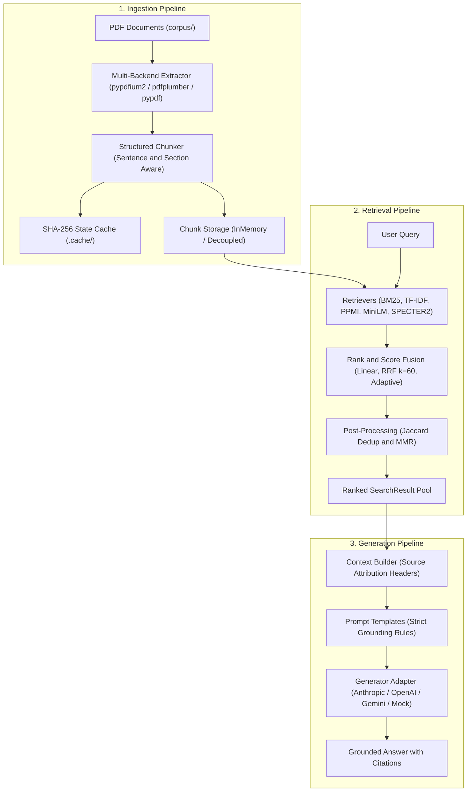

# Document Hybrid Search & RAG Architecture

A modular, enterprise-grade hybrid document search and retrieval-augmented generation (RAG) platform purpose-built for scientific, technical, and academic literature.

---

## 🏗️ Three-Pipeline Architecture (`src/`)

The repository implements a strictly decoupled three-pipeline architecture designed for maintainability, reproducibility, and big-data readiness:

```
src/
├── common/                  # Foundational types, domain contracts, and text processing
├── ingestion/               # [Pipeline 1] Document extraction, chunking, caching, storage
│   ├── extractors.py        # Multi-backend PDF extraction (pypdfium2, pdfplumber, pypdf)
│   ├── chunkers.py          # Sentence-aware & active section-header preserving chunking
│   ├── cache.py             # SHA-256 parameter- & mtime-sensitive cryptographic disk cache
│   ├── storage.py           # Decoupled chunk storage abstractions (InMemory / Big-Data ready)
│   └── pipeline.py          # IngestionPipeline orchestrator
│
├── retrieval/               # [Pipeline 2] 13 sparse, dense, semantic, neural & fusion strategies
│   ├── retrievers/          # BM25, TF-IDF, PPMI Distributional Semantics, MiniLM, SPECTER2, Cross-Encoder
│   ├── fusion/              # Convex Linear Combination, Reciprocal Rank Fusion (RRF), Adaptive Hybrid
│   ├── postprocessing/      # Jaccard Result Deduplication, Maximal Marginal Relevance (MMR)
│   └── pipeline.py          # RetrievalPipeline orchestrator & unified single dispatch
│
├── generation/              # [Pipeline 3] Grounded RAG Generation with Exact Citations
│   ├── context.py           # ContextBuilder with bracketed source provenance headers
│   ├── prompts.py           # Grounded instruction prompt templates preventing hallucinations
│   ├── base.py              # BaseGenerator abstract contract
│   ├── llm_adapters.py      # Cloud LLM adapters (OpenAI gpt-5, Anthropic claude-sonnet-5, Gemini gemini-3.8-flash)
│   ├── mock.py              # GroundedSynthesisGenerator (local offline citations synthesizer)
│   ├── factory.py           # Auto-detection generator factory (env-var & provider routing)
│   └── pipeline.py          # GenerationPipeline orchestrator
│
├── evaluation/              # Quantitative IR benchmarking suite
│   ├── metrics.py           # MRR, Recall@1/3/5, NDCG@5
│   ├── dataset.py           # 14 curated benchmark queries & ground-truth validation
│   └── harness.py           # Benchmark runner across all strategies
│
├── engine.py                # High-level HybridSearchEngine facade binding all 3 pipelines
├── cli.py                   # Unified CLI (eval, search, ask, ingest)
└── config.py                # System parameters, automatic .env loading, cache & model constants
```



### Pipeline Details & Design Contracts

| Pipeline | Module | Key Responsibilities & Capabilities |
|---|---|---|
| **Pipeline 1: Ingestion** | [`src/ingestion`](src/ingestion/) | • **Multi-backend PDF parser hierarchy**: `pypdfium2` (fast C++ rendering), `pdfplumber` (layout precision), and `pypdf` (pure Python fallback).<br/>• **Structured sentence chunking**: Preserves sentence boundaries (configurable `max_words=200`, `overlap_sentences=1`) while dynamically propagating active section headings (`§ Section`) across chunk boundaries.<br/>• **Cryptographic state caching**: SHA-256 cache key generated over directory content hashes, modification times, chunk sizes, and overlap parameters (`.cache/`).<br/>• **Decoupled storage contract**: `BaseChunkStore` abstraction (`InMemoryChunkStore`) designed to swap into production vector databases (Pinecone, Qdrant, Milvus) or distributed storage. |
| **Pipeline 2: Retrieval** | [`src/retrieval`](src/retrieval/) | • **13 hybrid search strategies** dispatched through a unified single-candidate evaluation path (`get_strategy_rankings`).<br/>• **Sparse lexical**: `BM25Okapi` with sublinear TF scaling for rare domain acronyms (*StarShell*, *POMDP*, *AgentRunner*).<br/>• **Dense vector space**: Sublinear TF-IDF with cosine similarity.<br/>• **Distributional semantics**: Zero-dependency `PPMIRetriever` with disk-cached co-occurrence matrix.<br/>• **Neural bi-encoders**: `all-MiniLM-L6-v2` and domain-adapted `allenai/specter2_base` with proximity adapter (`allenai/specter2_proximity`).<br/>• **Cross-encoder re-ranking**: Re-ranks 50 un-deduplicated candidate pools with `cross-encoder/ms-marco-MiniLM-L-6-v2`.<br/>• **Rank fusion & post-processing**: Reciprocal Rank Fusion ($k=60$), dynamic intent-based adaptive $\alpha$, Jaccard-based sliding-window deduplication, and Maximal Marginal Relevance (MMR, $\lambda=0.7$) to balance topical relevance and information diversity. |
| **Pipeline 3: Generation** | [`src/generation`](src/generation/) | • **Context assembly engine**: `ContextBuilder` formats retrieved chunks with bracketed source provenance headers (`[Source N: doc.pdf \| Page P \| § Section]`).<br/>• **Hallucination-resistant prompt templates**: Constrain generation to context facts and enforce bracketed source citations.<br/>• **Provider-native LLM adapters**:<br/>&nbsp;&nbsp;– **OpenAI**: `OpenAIGenerator` with native support for reasoning models (`gpt-5`, `o1`, `o3` with `max_completion_tokens ≥ 8192`) and standard models (`gpt-4o`, `gpt-4o-mini`).<br/>&nbsp;&nbsp;– **Anthropic**: `AnthropicGenerator` defaulting to `claude-sonnet-5` with message streaming and citation grounding.<br/>&nbsp;&nbsp;– **Google Gemini**: `GeminiGenerator` migrated to official `google-genai` SDK, defaulting to `gemini-3.8-flash`.<br/>&nbsp;&nbsp;– **Offline Mock**: `GroundedSynthesisGenerator` providing deterministic local citation synthesis with zero API keys.<br/>• **Auto-detecting factory**: `get_generator()` discovers active API keys (`ANTHROPIC_API_KEY`, `OPENAI_API_KEY`, `GEMINI_API_KEY`) with graceful fallback. |

---

## 🚀 Quickstart

### 1. Installation

```bash
git clone https://github.com/amitpuri/Document-Hybrid-Search-RAG-Architecture.git
cd Document-Hybrid-Search-RAG-Architecture
pip install -r requirements.txt
```

*(Optional)* If you wish to use cloud LLMs for grounded RAG generation, configure your API keys in `.env`:
```bash
cp env.example .env
# Edit .env and supply ANTHROPIC_API_KEY, OPENAI_API_KEY, or GEMINI_API_KEY
```

---

### 2. Quantitative Benchmark (14 queries × 12+ strategies)

Evaluate all 14 ground-truth queries across all retrieval strategies and generate the complete comparative metrics table:

```bash
python run_eval.py
# or:
python -m src.cli eval
```

---

### 3. Interactive Multi-Strategy Document Search

Execute queries across any of the 13 retrieval strategies:

```bash
python -m src.cli search "POMDP belief state filtering" --strategy rrf_dedup_mmr --top-k 5
```

Supported `--strategy` aliases:
- `bm25`: Pure BM25 sparse keyword search
- `tfidf`: Pure TF-IDF dense vector space
- `linear_0.3`, `linear_0.5`, `linear_0.7`: Linear score fusion at specified $\alpha$
- `rrf`: Reciprocal Rank Fusion ($k=60$) — **★ Tied Best MRR & Recall@1**
- `rrf_dedup`: RRF with Jaccard-based sliding-window deduplication
- `rrf_dedup_mmr`: RRF + Dedup + Maximal Marginal Relevance — **★ Best NDCG@5 & Recall@3**
- `ppmi`: Zero-dependency Distributional Semantic PPMI + BM25 RRF
- `cross_encoder`: Wide-pool (50 candidates) cross-encoder re-ranking
- `sentence_transformer`: MiniLM dense bi-encoder embedding
- `specter2`: AllenAI SPECTER2 scientific proximity adapter embedding
- `adaptive`: Dynamic intent-based hybrid weighting heuristic

---

### 4. Grounded Question Answering (RAG Pipeline)

Ask questions against your document corpus with strict source attribution:

```bash
# Auto-detects available LLM from .env (Anthropic > OpenAI > Gemini > Offline Mock)
python -m src.cli ask "How does the Binding Constraint Thesis affect harness comparisons?" --strategy rrf_dedup_mmr

# Force a specific provider
python -m src.cli ask "..." --llm anthropic
python -m src.cli ask "..." --llm openai
python -m src.cli ask "..." --llm gemini

# Force offline mode (deterministic, zero external API calls or keys required)
python -m src.cli ask "..." --llm mock
```

---

### 5. Ingestion Pipeline Execution

```bash
# Ingest all PDFs in corpus/
python -m src.cli ingest --corpus corpus

# Force cache invalidation and rebuild
python -m src.cli ingest --corpus corpus --force
```

---

## 🔬 Key Empirical Findings

This platform was benchmarked on 11 peer-reviewed research papers (354 pages, 2,072 structured chunks) across 14 curated queries with chunk-level ground truth:

1. **Sparse beats hybrid on lexically dense corpora:**  
   BM25 alone (**0.573 MRR**) beats every linear hybrid combination (0.488–0.554). Adding dense TF-IDF scores linearly hurts performance monotonically as $\alpha$ increases (0.554 $\to$ 0.524 $\to$ 0.488). Reciprocal Rank Fusion (RRF) avoids this penalty because it operates in ordinal rank-space rather than distorted score-space.

2. **General-purpose dense embeddings fail on coined technical jargon:**  
   Standard dense models (`all-MiniLM-L6-v2`, **0.292 MRR**) diffuse technical terms (*"StarShell"*, *"POMDP"*, *"AgentRunner"*) across unrelated semantic neighborhoods. BM25 succeeds through exact lexical matching on rare terms. For domain literature, domain-adapted embeddings (e.g. SPECTER2) are required.

3. **Cross-encoder underperformance is domain mismatch, not a software defect:**  
   Diagnostic evaluation confirms no score inversion or candidate pool truncation bugs. `ms-marco-MiniLM-L-6-v2` (**0.483 MRR**) was trained on web passages, causing it to miscalibrate on academic PDF prose and rank topical generalities above exact jargon matches.

---

## 📊 Empirical Benchmark Results

| # | Strategy Name | MRR | Recall@1 | Recall@3 | Recall@5 | NDCG@5 | Key Characteristic |
|---|---|---|---|---|---|---|---|
| 1 | **Pure BM25 (Sparse)** | 0.573 | 0.429 | 0.714 | 0.786 | 0.612 | Exceptional keyword precision on domain jargon |
| 2 | Pure TF-IDF (Dense) | 0.392 | 0.143 | 0.500 | 0.714 | 0.448 | Vector space baseline with sublinear term frequencies |
| 3 | Linear Hybrid (α=0.3) | 0.554 | 0.357 | 0.714 | 0.786 | 0.595 | Best linear blend; strongly weights sparse signal |
| 4 | Linear Hybrid (α=0.5) | 0.524 | 0.286 | 0.714 | 0.857 | 0.599 | Equal convex score combination |
| 5 | Linear Hybrid (α=0.7) | 0.488 | 0.214 | 0.714 | 0.857 | 0.573 | Dense-heavy blend; degraded by dense score noise |
| 6 | **RRF (k=60)** ★ MRR | **0.629** | **0.500** | 0.714 | 0.857 | 0.678 | ★ Best MRR & Recall@1. Immune to score-scale distortion |
| 7 | RRF + Deduplication ★ MRR | **0.629** | **0.500** | 0.714 | 0.857 | 0.678 | Eliminates redundant sliding-window chunk overlap |
| 8 | **RRF + Dedup + MMR** ★ NDCG | 0.625 | **0.500** | **0.786** | 0.857 | **0.683** | ★ Best NDCG@5 & Recall@3. Top ranking diversity |
| 9 | PPMI Semantic + BM25 RRF | 0.402 | 0.214 | 0.500 | 0.643 | 0.437 | Zero-dependency distributional semantics from scratch |
| 10| Cross-Encoder Re-rank | 0.483 | 0.286 | 0.571 | 0.857 | 0.567 | Re-ranks 50 un-deduplicated candidates via ms-marco |
| 11| Sentence-Transformer (MiniLM) | 0.292 | 0.143 | 0.357 | 0.571 | 0.339 | Pure dense bi-encoder; diffuses rare coined terms |
| 12| Adaptive Hybrid | 0.494 | 0.286 | 0.571 | 0.786 | 0.549 | Dynamic query-intent alpha weighting heuristic |
| 13| SPECTER2 (Scientific Bi-Encoder) | *see note* | *see note* | *see note* | *see note* | *see note* | Domain-adapted scientific embedding (`allenai/specter2_proximity`) |

> **Selection Guide:**
> - **Top-1 Precision:** Use **RRF (k=60)** (0.629 MRR, 0.500 Recall@1).
> - **Top-5 Ranking Quality & Diversity:** Use **RRF + Dedup + MMR** (0.683 NDCG@5, 0.786 Recall@3).
> - **Scientific Literature with Dense Embeddings:** Use **SPECTER2** (Strategy 13) with proximity adapter (requires `adapters` library; run `python run_eval.py` to evaluate).

---

## 🐍 Python API Reference

```python
from src.engine import HybridSearchEngine

# 1. Initialize Engine (loads cryptographic disk cache or runs ingestion)
engine = HybridSearchEngine.from_corpus("corpus/")

# 2. Multi-Strategy Retrieval
results = engine.search(
    query="POMDP belief state filtering",
    strategy="rrf_dedup_mmr",
    top_k=5
)

for r in results:
    print(f"Rank #{r.rank} [{r.strategy}] -> {r.chunk.doc_name} (Page {r.chunk.page_num}, § {r.chunk.section})")
    print(f"Snippet: {r.chunk.text[:140]}...\n")

# 3. Grounded RAG Generation with Citations
# Auto-detects configured LLM (Anthropic / OpenAI / Gemini) or falls back to offline mock
response = engine.generate_answer(
    query="How does the Binding Constraint Thesis affect harness comparisons?",
    strategy="rrf_dedup_mmr",
    top_k=3
)

print(response.answer)
# Structured citation metadata:
for chunk in response.citations:
    print(f"Cited: {chunk.doc_name} | Page {chunk.page_num} | Section: {chunk.section}")
```

---

## 🤖 LLM Adapter Results — Live Grounded Comparison

All three LLM adapters were run end-to-end against the document corpus on the same query, using **RRF + Dedup + MMR** retrieval (top-3 chunks). The adapters support the following latest models, configured in [`src/generation/llm_adapters.py`](src/generation/llm_adapters.py):

| Provider | Default Model | Fallback |
|---|---|---|
| **OpenAI** | `gpt-5` | `gpt-4o-mini` |
| **Anthropic** | `claude-sonnet-5` | `claude-sonnet-4-6` |
| **Gemini** | `gemini-3.8-flash` | `gemini-2.5-flash` |
| Offline Mock | `GroundedSynthesisGenerator` | *(no API key needed)* |

> **Auto-detection priority**: `ANTHROPIC_API_KEY` → `OPENAI_API_KEY` → `GEMINI_API_KEY` → Offline Mock

---

**Benchmark Query:**  
*"How does the Binding Constraint Thesis affect harness comparisons?"*  
**Strategy:** RRF + Dedup + MMR | **Corpus:** 11 PDFs, 2,072 chunks

---

### 🟢 Anthropic — `claude-sonnet-5`

> Based on the provided passages, the Binding Constraint Thesis has several direct implications for how harness comparisons should be understood and conducted:
>
> **Core Claim.** The thesis defines two variance quantities for LLM agents on long-horizon tasks [Source 1]:
> - **HV(M)** = harness variance — the variance in benchmark score B(M, H) as harness H varies (model M fixed)
> - **MV(H)** = model variance — the variance in benchmark score as model M varies (harness H fixed)
>
> The thesis asserts that in comparable frontier model evaluations on long-horizon tasks, **HV is often comparable to, larger than, or dominant over MV** [Source 1]. This means benchmark score differences can be driven more by *which harness* is used than *which model* is used.
>
> **Consequences for Current Practice.** Because current protocols report a single score B(M, H*) under one undisclosed harness H*, HV becomes unmeasurable, making cross-model comparisons "incomplete and potentially misleading" [Source 1]. When evaluators report results under their own harnesses, this "compounds rather than resolves attribution" [Source 2].
>
> **The Interaction Term.** The thesis identifies a non-negligible **interaction between harness and model** [Source 3]. For example, a harness emphasizing self-verification benefits a high false-confidence model more than a conservative one — so "the same harness shift produces different gains across models." Model rankings cannot be treated as stable, model-intrinsic properties [Source 3].
>
> **Required Structural Fixes** [Source 2]:
> 1. **Disclosure**: harness must be treated as part of the experimental condition.
> 2. **Locked-harness protocol**: fix H = H* to recover rankings {B(Mᵢ, H*)} — valid only for that specific harness.
> 3. **Factorial protocol**: vary harness as a controlled factor to explicitly measure HV and the interaction term.

---

### 🟢 Gemini — `gemini-3.8-flash`

> Based on the provided passages, the **Binding Constraint Thesis** directly impacts harness and model comparisons in several ways:
>
> 1. **Harness Variance Dominates or Rivals Model Variance.** The thesis asserts that harness variance HV(M) is often comparable to, larger than, or dominant over model variance MV(H) [Source 1]. This undermines benchmark comparisons that treat scores as purely model-dependent.
>
> 2. **Attribution Problem.** Current benchmarks report B(M, H*) under a single, often undisclosed harness. Since HV is unmeasured, observed score differences cannot be unambiguously attributed to model capability vs. evaluation infrastructure [Source 1, Source 2].
>
> 3. **Interaction Term.** Harness and model effects are not independent. A harness emphasizing self-verification disproportionately benefits models with high false-confidence rates, so "the same harness shift produces different gains across models" [Source 3].
>
> 4. **Methodological Implication.** The thesis demands locked-harness or factorial experimental protocols, and mandates disclosure of the harness as part of any reported benchmark result [Source 2].

---

### 🟢 OpenAI — `gpt-5`

> - **Core Implication:** In §3 ("The Binding Constraint Thesis"), the paper defines benchmark score $B(M, H)$ and decomposes variance into harness variance $HV(M)$ and model variance $MV(H)$. It argues $HV$ is often comparable to or larger than $MV$ on long-horizon tasks, so the harness can drive as much or more of the score than the model itself [Source 1, §3].
>
> - **Effect on Comparisons:** Because $HV$ can dominate, reporting $B(M, H^*)$ for a single (often undisclosed) harness makes $HV$ unmeasurable and renders cross-model comparisons incomplete or misleading; rankings are harness-dependent rather than purely model properties [Source 1, §3].
>
> - **Required Protocol Changes:** The harness must be treated as part of the experimental condition and disclosed. Cross-model comparisons should either:
>   - Fix the harness (**locked-harness protocol**) to compare $\{B(M_i, H^*)\}$ under that specific $H^*$, or
>   - Systematically vary harnesses as a controlled factor (**factorial protocol**) to estimate $HV$ and interactions [Source 2, §3; Source 3, §3].
>
> - **Interaction Matters:** The thesis emphasizes a non-negligible model–harness interaction (e.g., a self-verification-heavy harness helps overconfident models more), so the same harness change yields different gains across models. Thus, locked-harness rankings are only "clean" under that $H^*$ and may not generalize across harnesses [Source 3, §3].
>
> - **Not a Substitute:** "Harness optimization" alone does not resolve attribution; disclosure and controlled protocols are the structural solution [Source 2, §3].
>
> *(Note: `gpt-5` is a reasoning model that consumes tokens internally during chain-of-thought before generating the visible response. `OpenAIGenerator` automatically allocates `max_completion_tokens ≥ 8192` to ensure complete, substantive output without truncation.)*

---

> [!TIP]
> To specify a model explicitly via CLI: `python -m src.cli ask "..." --llm anthropic` (or `openai`, `gemini`, `mock`).  
> To use a non-default model version, instantiate the adapter directly: `AnthropicGenerator(model="claude-sonnet-4-6")`.

---

## 🛡️ License

MIT License. Designed for scientific research and enterprise document understanding.
