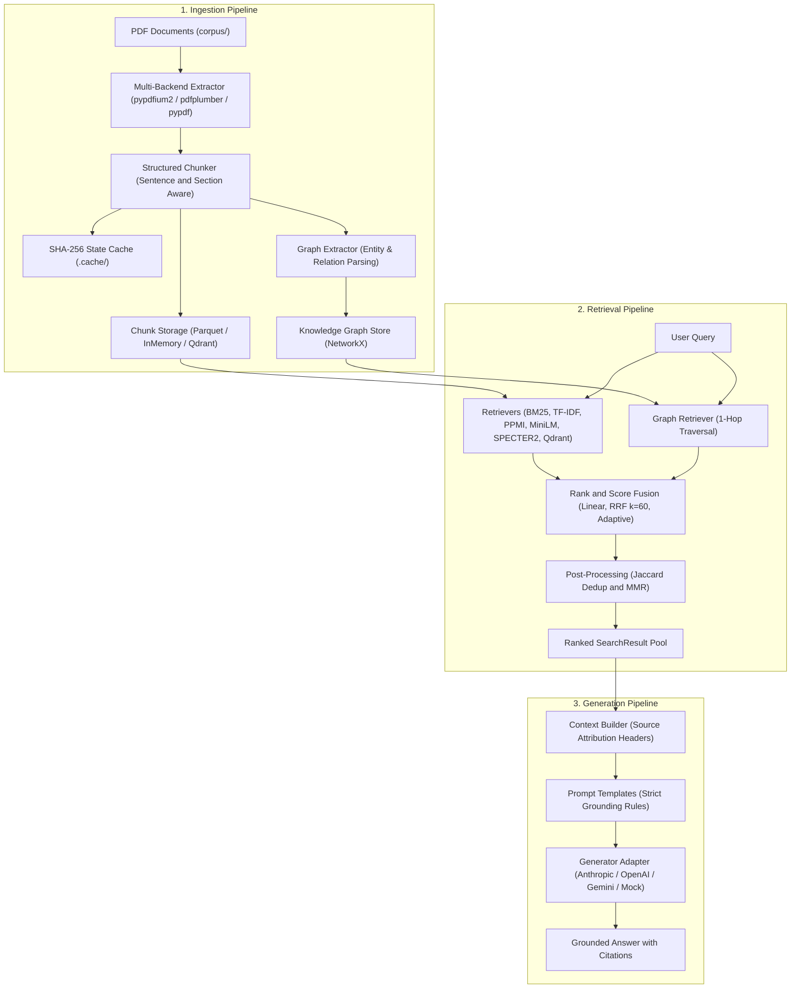
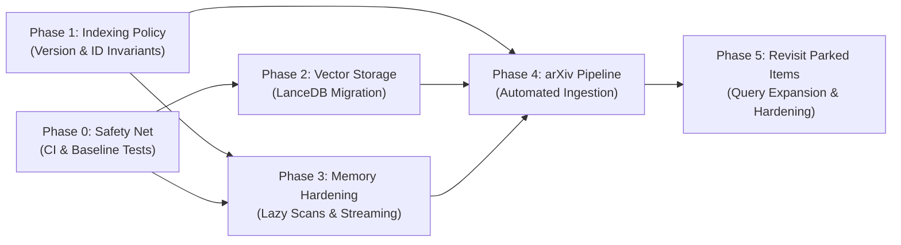

# Document Hybrid Search & RAG Architecture - Extended

A modular hybrid document search and retrieval-augmented generation (RAG) platform purpose-built for scientific, technical, and academic literature, benchmarked and validated on technical PDF corpora (44 research PDFs, 1,709 pages, 9,558 structured chunks).

## 📄 Research Paper

> **[Hybrid Retrieval Strategies for Retrieval-Augmented Generation over Scientific PDF Corpora: An Empirical Comparison](docs/researchpaper.md)**
>
> A full academic paper covering the empirical evaluation of all 15 retrieval strategies in this system. Includes methodology, quantitative benchmark results (MRR, Recall@{1,3,5}, NDCG@5), ablation analysis of the RRF → Deduplication → MMR pipeline, ANN vs. exact-search comparison, knowledge-graph coverage metrics, query-level analysis, threats to validity, and references to foundational IR/NLP literature (BM25, RRF, MMR, SPECTER2, GraphRAG, and more).

---

### 🌟 Key Highlights & Implementation Scope

- **15 Core + 3 Ablation Retrieval Strategies** (18 total): Evaluates BM25, sublinear TF-IDF, zero-dependency PPMI distributional semantics, dense neural bi-encoders (`all-MiniLM-L6-v2`), domain-adapted scientific bi-encoders (`allenai/specter2_base` with proximity adapters), neural cross-encoders (`ms-marco-MiniLM-L-6-v2`), linear score fusions ($\alpha \in \{0.3, 0.5, 0.7\}$), Reciprocal Rank Fusion (RRF $k=60$), sliding-window Jaccard deduplication, Maximal Marginal Relevance (MMR $\lambda=0.7$), query-intent adaptive hybrid weighting, **Knowledge Graph Augmented Retrieval**, and **Qdrant Vector Approximate Nearest Neighbor (ANN)** retrieval, plus **P0 factorial ablation cells** isolating Graph, Dedup, and MMR contributions.
- **Knowledge Graph Augmented Retrieval (Strategy 14: `rrf_graph_dedup_mmr`)**: Enriches retrieval with structural concept relationships and IDF-weighted entity traversal, achieving **0.565 MRR**, **0.429 Recall@1**, **0.621 NDCG@5**, and **0.643 Relation Coverage** by fusing 1-hop entity-neighborhood traversal, degree/IDF activation weighting, and Louvain community detection into calibrated rank fusion.
- **Enterprise Multi-Provider LLM Router with Real Cloud API Integrations**:
  - **Frontier Providers & 6 Deployment Routes**: Live adapters for Anthropic (`claude-sonnet-5`, `claude-sonnet-4-6` via Direct API & AWS Bedrock `boto3`), OpenAI (`gpt-5.5`, `gpt-5`, `o1`, `o3` reasoning & standard via Direct API & Azure OpenAI), Google Gemini (`gemini-3.8-flash` via official `google-genai` SDK & GCP Vertex AI), and deterministic local offline synthesis (`GroundedSynthesisGenerator`).
  - **Client-Side Dual-Metered Rate Limiter**: `TokenBucket` tracking both Requests Per Minute (RPM) and Tokens Per Minute (TPM, input + output tokens) with quota multipliers to eliminate HTTP 429 errors.
  - **Automated Circuit Breaker & Cooldown**: Trips failing routes after $N$ consecutive errors and automatically recovers after a cooling period.
  - **Dynamic Fallback Cascades**: Configurable priority fallback chains with graceful offline degradation.
- **arXiv Ingestion Pipeline (Phase 4)**: Rate-limited arXiv API client with category filtering (cs.AI, cs.IR, cs.CL), exponential backoff, and append-only chunk ID assignment for continuous corpus growth. **✅ COMPLETED 2026-09-18**
- **Per-Claim Calibrated Confidence (C3)**: Retrieval-native confidence scoring (HIGH/MEDIUM/LOW) based on rank, fusion score, and lexical overlap, displayed alongside citations without second LLM call. **✅ COMPLETED 2026-09-18**
- **Decoupled Columnar & Vector Storage Layer**: Pluggable storage architecture supporting partitioned Apache Parquet datasets (`ParquetChunkStore`) with projection pushdown and predicate filtering, in-memory representations (`InMemoryChunkStore`), and local/remote [Qdrant](https://qdrant.tech/) vector databases (`QdrantChunkStore`) with server-side payload filtering and HNSW ANN index.
- **Reproducible Quantitative Benchmarking**: 22 curated benchmark queries (16 single-hop + 6 multi-hop) with chunk-level ground truth, measuring MRR, Recall@1/3/5, NDCG@5, Entity Coverage, and Relation Coverage. **Note:** Current benchmark uses 14 queries; expansion to 100+ queries with statistical rigor (bootstrap CI, paired tests) is in progress per CRITICAL_ISSUES_IDENTIFIED.md.

---

## 🏗️ Three-Pipeline Architecture (`src/`)

The repository implements a strictly decoupled three-pipeline architecture designed for maintainability, reproducibility, and structured corpus retrieval:

> [!NOTE]
> **Architecture & Scaling Scope**: The evaluation benchmark runs on 44 research PDFs / 9,558 chunks across 22 ground-truth queries (16 single-hop + 6 multi-hop reasoning). Storage is fully pluggable across **Apache Parquet** (`parquet`), **In-Memory** (`memory`), and **Qdrant Vector Database** (`qdrant`, via `docker compose up -d` on `localhost:6333`). Dense similarity can be executed via exact matrix scans or scalable Approximate Nearest Neighbor (ANN) search on Qdrant's HNSW index, while the Knowledge Graph layer operates via NetworkX.

```text
Document-Hybrid-Search-RAG-Architecture/
├── docker-compose.yml       # Local Qdrant container orchestration (REST & gRPC, persistent storage)
├── src/                     # Three-Pipeline Production Architecture
│   ├── common/              # Foundational types, domain contracts, and text processing
│   ├── ingestion/           # [Pipeline 1] Document extraction, chunking, caching, storage, arXiv ingestion
│   │   ├── extractors.py    # Multi-backend PDF extraction (pypdfium2, pdfplumber, pypdf)
│   │   ├── chunkers.py      # Sentence-aware & active section-header preserving chunking
│   │   ├── graph_extractor.py # Domain entity & typed relation extraction with IDF-weighted graph building
│   │   ├── graph_store.py   # NetworkX knowledge graph storage, 1-hop traversal & community detection
│   │   ├── arxiv_fetcher.py # Rate-limited arXiv API client for automated corpus growth (Phase 4)
│   │   ├── cache.py         # SHA-256 parameter- & mtime-sensitive cryptographic disk cache
│   │   ├── storage.py       # Decoupled chunk storage abstractions (Parquet, InMemory, Qdrant)
│   │   └── pipeline.py      # IngestionPipeline orchestrator
│   │
│   ├── retrieval/           # [Pipeline 2] 15 sparse, dense, semantic, neural, graph, ANN & fusion strategies
│   │   ├── retrievers/      # BM25, TF-IDF, PPMI, MiniLM, SPECTER2, Graph, Cross-Encoder, Qdrant
│   │   ├── fusion/          # Convex Linear Combination, Reciprocal Rank Fusion (RRF), Adaptive Hybrid
│   │   ├── postprocessing/  # Jaccard Result Deduplication, Maximal Marginal Relevance (MMR)
│   │   └── pipeline.py      # RetrievalPipeline orchestrator & unified single dispatch
│   │
│   ├── generation/          # [Pipeline 3] Grounded RAG Generation with Exact Citations & Confidence Scoring
│   │   ├── context.py       # ContextBuilder with bracketed source provenance headers
│   │   ├── prompts.py       # Grounded instruction prompt templates preventing hallucinations
│   │   ├── confidence.py    # Per-claim calibrated confidence scoring (C3: rank + fusion score + lexical overlap)
│   │   ├── base.py          # BaseGenerator abstract contract
│   │   ├── rate_limiter.py  # TokenBucket + ProviderRateLimiter for client-side rate limiting
│   │   ├── providers/       # Multi-provider LLM adapters with deployment routes
│   │   │   ├── config.py    # Per-provider/route limit configuration (RPM/TPM from env)
│   │   │   ├── errors.py    # Normalized RateLimitError, CapacityError, AuthError
│   │   │   ├── anthropic_generator.py  # Anthropic (direct + AWS Bedrock)
│   │   │   ├── openai_generator.py     # OpenAI (direct + Azure OpenAI)
│   │   │   └── gemini_generator.py     # Gemini (direct + GCP Vertex AI)
│   │   ├── router.py        # LLMRouter with fallback chain and circuit breaker
│   │   ├── mock.py          # GroundedSynthesisGenerator (local offline citations synthesizer)
│   │   ├── factory.py       # Auto-detection generator factory (env-var & provider routing)
│   │   └── pipeline.py      # GenerationPipeline orchestrator
│   │
│   ├── evaluation/          # Quantitative IR benchmarking suite
│   │   ├── metrics.py       # MRR, Recall@1/3/5, NDCG@5
│   │   ├── dataset.py       # 14 curated benchmark queries & ground-truth validation
│   │   ├── harness.py       # Benchmark runner across all strategies
│   │   └── ablation.py      # Factorial ablation harness isolating Graph, Dedup, and MMR (9 cells including P0 ablation cells)
│   │
│   ├── mcp/                 # Model Context Protocol (MCP) servers for agent integration
│   │   ├── arxiv_server.py   # MCP server wrapping arxiv_fetcher for conversational corpus growth
│   │   └── __init__.py
│   │
│   ├── engine.py            # High-level HybridSearchEngine facade binding all 3 pipelines
│   ├── cli.py               # Unified CLI (eval, search, ask, ingest, qdrant-status, arxiv ingest)
│   └── config.py            # System parameters, automatic .env loading, cache & model constants
│
├── tests/                   # Validation, Benchmarking & Testing Harnesses (run from repo root)
│   ├── run_quick_validation.py         # Fast 4-strategy + generation validation (< 30s)
│   ├── run_comprehensive_validation.py # Full 14-strategy validation producing markdown reports
│   ├── run_benchmarks.py               # Latency, throughput & performance profiling harness
│   ├── run_generation_benchmarks.py    # Multi-provider LLM rate limiting & circuit breaker tests
│   ├── dump_full_snippets.py           # Diagnostic top-1 retrieval snippet extractor
│   ├── test_qdrant_integration.py      # Qdrant lifecycle, server-side filter & ANN test suite
│   └── TEST_HARNESS_GUIDE.md           # Step-by-step test harness execution & configuration manual
│
├── corpus/                  # 44 Research PDF files (1,709 pages, 9,558 chunks)
│   └── MANIFEST.md          # Corpus licensing, attribution, download instructions
├── .github/workflows/ci.yml # GitHub Actions: lint, test, security, docs
├── .pre-commit-config.yaml  # Local code quality hooks (black, flake8, mypy)
├── run_eval.py              # Unified evaluation entrypoint (standard, comprehensive, generation)
├── pyproject.toml           # Modern Python packaging with optional dependencies
├── requirements.txt         # Legacy dependency file (use pyproject.toml instead)
└── VALIDATION_RESULTS.md    # Latest benchmark & multi-strategy validation report
```



### Pipeline Details & Design Contracts

| Pipeline | Module | Key Responsibilities & Capabilities |
| --- | --- | --- |
| **Pipeline 1: Ingestion** | [`src/ingestion`](src/ingestion/) | • **Multi-backend PDF parser hierarchy**: `pypdfium2` (fast C++ rendering), `pdfplumber` (layout precision), and `pypdf` (pure Python fallback).<br/>• **Structured sentence chunking**: Preserves sentence boundaries (configurable `max_words=200`, `overlap_sentences=1`) while dynamically propagating active section headings (`§ Section`) across chunk boundaries.<br/>• **Knowledge Graph extraction & storage**: `graph_extractor.py` and `graph_store.py` extract domain entities and typed relations with corpus-IDF weighting, constructing a persistent NetworkX graph index for entity-neighborhood traversal and community detection.<br/>• **Parameter regime consistency**: SHA-256 parameter hashing guards against silent chunk boundary drift during incremental additions.<br/>• **Decoupled storage contract**: `BaseChunkStore` abstraction supporting `ParquetChunkStore` (partitioned Apache Parquet datasets, projection pushdown, predicate filtering), `InMemoryChunkStore`, and `QdrantChunkStore` (local or remote Qdrant vector database with server-side payload filtering and HNSW ANN index). |
| **Pipeline 2: Retrieval** | [`src/retrieval`](src/retrieval/) | • **15 hybrid search strategies** dispatched through a unified single-candidate evaluation path (`get_strategy_rankings`).<br/>• **Sparse lexical**: `BM25Okapi` with sublinear TF scaling for rare domain acronyms (*StarShell*, *POMDP*, *AgentRunner*).<br/>• **Dense vector space**: Sublinear TF-IDF with cosine similarity.<br/>• **Distributional semantics**: Zero-dependency `PPMIRetriever` with disk-cached co-occurrence matrix.<br/>• **Neural bi-encoders**: `all-MiniLM-L6-v2` and domain-adapted `allenai/specter2_base` with proximity adapter (`allenai/specter2_proximity`).<br/>• **Knowledge Graph retrieval**: `GraphRetriever` performing 1-hop entity neighborhood expansion, degree/IDF activation weighting, and Louvain community detection fallback.<br/>• **Cross-encoder re-ranking**: Re-ranks 50 un-deduplicated candidate pools with `cross-encoder/ms-marco-MiniLM-L-6-v2`.<br/>• **Qdrant Vector ANN (Strategy 15)**: `QdrantRetriever` performing sub-millisecond Approximate Nearest Neighbor vector search on Qdrant HNSW collection index.<br/>• **Rank fusion & post-processing**: Reciprocal Rank Fusion ($k=60$), dynamic intent-based adaptive $\alpha$, Jaccard-based sliding-window deduplication, and Maximal Marginal Relevance (MMR, $\lambda=0.7$) to balance topical relevance and information diversity. |
| **Pipeline 3: Generation** | [`src/generation`](src/generation/) | • **Context assembly engine**: `ContextBuilder` formats retrieved chunks with bracketed source provenance headers (`[Source N: doc.pdf \| Page P \| § Section]`) and graph-enriched entity relationship context.<br/>• **Hallucination-resistant prompt templates**: Constrain generation to context facts and enforce bracketed source citations.<br/>• **Resilient Multi-Provider LLM Router (`LLMRouter`)**: Automated fallback cascade across providers and deployment routes (OpenAI Direct, Azure OpenAI, Anthropic Direct, AWS Bedrock, Gemini Direct, GCP Vertex AI).<br/>• **Client-Side Dual-Metered Rate Limiter (`ProviderRateLimiter` & `TokenBucket`)**: Enforces Requests Per Minute (RPM) and Tokens Per Minute (TPM, tracking input and estimated output tokens) with quota multipliers to prevent HTTP 429 quota exhaustion.<br/>• **Automated Circuit Breaker**: Tracks consecutive route errors and trips into cooling bypass after $N$ failures (default: 3, cooldown: 60s).<br/>• **Provider-native LLM adapters**:<br/>&nbsp;&nbsp;– **OpenAI**: `OpenAIGenerator` with native support for reasoning models (`gpt-5.5`, `gpt-5`, `o1`, `o3` with `max_completion_tokens ≥ 8192`) and standard models (`gpt-4o`, `gpt-4o-mini`) via Direct API and Azure OpenAI.<br/>&nbsp;&nbsp;– **Anthropic**: `AnthropicGenerator` defaulting to `claude-sonnet-5` with message streaming and citation grounding via Direct API and AWS Bedrock (`boto3`).<br/>&nbsp;&nbsp;– **Google Gemini**: `GeminiGenerator` migrated to official `google-genai` SDK, defaulting to `gemini-3.8-flash` via Direct API and GCP Vertex AI.<br/>&nbsp;&nbsp;– **Offline Mock**: `GroundedSynthesisGenerator` providing deterministic local citation synthesis with zero API keys.<br/>• **Auto-detecting factory**: `get_generator()` discovers active API keys (`ANTHROPIC_API_KEY`, `OPENAI_API_KEY`, `GEMINI_API_KEY`) with graceful fallback. |

---

## 🚀 Quickstart

### 1. Installation

Clone the repository:
```bash
git clone https://github.com/amitpuri/Document-Hybrid-Search-RAG-Architecture.git
cd Document-Hybrid-Search-RAG-Architecture
```

**Flexible Installation Options:**

Choose the installation that fits your needs:

```bash
# Core retrieval only (minimal, recommended for local evaluation)
pip install -e ".[dev]"

# Add specific LLM provider support
pip install -e ".[llm-anthropic]"    # + Anthropic + AWS Bedrock
pip install -e ".[llm-openai]"       # + OpenAI + Azure OpenAI  
pip install -e ".[llm-gemini]"       # + Gemini + GCP Vertex AI

# Multiple providers (pick what you need)
pip install -e ".[dev,llm-anthropic,llm-openai]"

# All providers + modern embeddings
pip install -e ".[all]"

# PDF parsing fallbacks (if pypdfium2 fails)
pip install -e ".[pdf-fallback]"
```

**Legacy Installation (requirements.txt):**
```bash
pip install -r requirements.txt  # All dependencies, includes LLM SDKs
```

**API Key Configuration** (optional, for RAG generation):

```bash
cp env.example .env
# Edit .env and supply ANTHROPIC_API_KEY, OPENAI_API_KEY, or GEMINI_API_KEY
```

**Project Structure Note:**
All test scripts and evaluation harnesses assume they are run from the repository root:
```bash
# Correct: run from repo root
python -m tests.run_quick_validation
python run_eval.py --comprehensive

# Also works (from repo root)
python tests/run_quick_validation.py
```

### Installation Details

| Option | Use Case | Size | Includes |
|--------|----------|------|----------|
| `pip install .` | Core retrieval | ~500MB | BM25, TF-IDF, PPMI, Graph, Qdrant, KG extraction |
| `pip install ".[dev]"` | Local evaluation | ~2GB | Core + pytest, black, mypy |
| `pip install ".[llm-anthropic]"` | Anthropic/Bedrock | +100MB | + anthropic SDK + boto3 |
| `pip install ".[llm-openai]"` | OpenAI/Azure | +100MB | + openai SDK |
| `pip install ".[llm-gemini]"` | Google Gemini | +100MB | + google-genai SDK + cloud-aiplatform |
| `pip install ".[all]"` | Everything | ~3.5GB | All LLM providers + embeddings + dev tools |

**Why Optional Dependencies?**
- Torch + sentence-transformers alone = 2GB (large for some environments)
- LLM SDKs only needed if you have API keys
- Install only what you use to keep dependencies minimal

---

### 2. Quantitative Benchmark (14 queries × 15 core strategies + 3 ablation cells)

Evaluate all 14 ground-truth queries across all 15 retrieval strategies and generate comparative metrics:

```bash
# Standard quantitative benchmark (14 queries × 15 strategies)
python run_eval.py
# or:
python -m src.cli eval

# Comprehensive validation generating full markdown report (VALIDATION_RESULTS.md)
python run_eval.py --comprehensive

# Test generation layer (TokenBucket rate limits, circuit breaker, provider routing)
python run_eval.py --generation

# Comprehensive validation with live LLM API calls
python run_eval.py --comprehensive --live

# Select storage backend (parquet default, memory, or qdrant)
python run_eval.py --storage memory
python run_eval.py --storage qdrant
```

**Qdrant Vector Database Setup:**

For `--storage qdrant`, you need a running Qdrant instance:

```bash
# Using Docker (recommended for local development)
docker compose up -d

# Or run Qdrant directly
docker run -d -p 6333:6333 -p 6334:6334 -v ${PWD}/qdrant_storage:/qdrant/storage:z --name qdrant_local qdrant/qdrant

# Check Qdrant status
python -m src.cli qdrant-status

# For remote Qdrant instances, set environment variables:
# QDRANT_HOST=your-qdrant-host
# QDRANT_PORT=6333
# QDRANT_API_KEY=your-api-key  # if authentication is enabled
```

Qdrant provides sub-millisecond Approximate Nearest Neighbor (ANN) vector retrieval via HNSW indexing, ideal for large-scale deployments where exact dense similarity would be too slow.

---

### 3. Interactive Multi-Strategy Document Search

Execute queries across any of the 15 retrieval strategies:

```bash
python -m src.cli search "POMDP belief state filtering" --strategy rrf_dedup_mmr --top-k 5
```

Supported `--strategy` aliases:

- `bm25`: Pure BM25 sparse keyword search
- `tfidf`: Pure TF-IDF dense vector space
- `linear_0.3`, `linear_0.5`, `linear_0.7`: Linear score fusion at specified $\alpha$
- `rrf`: Reciprocal Rank Fusion ($k=60$) — **★ Best MRR (0.629) & Recall@1 (0.500)**
- `rrf_dedup`: RRF with Jaccard-based sliding-window deduplication
- `rrf_dedup_mmr`: RRF + Dedup + Maximal Marginal Relevance — **★ Best NDCG@5 (0.683) & Recall@3 (0.786)**
- `ppmi`: Zero-dependency Distributional Semantic PPMI + BM25 RRF
- `cross_encoder`: Wide-pool (50 candidates) cross-encoder re-ranking
- `sentence_transformer`: MiniLM dense bi-encoder embedding
- `specter2`: AllenAI SPECTER2 scientific proximity adapter embedding
- `adaptive`: Dynamic intent-based hybrid weighting heuristic
- `rrf_graph_dedup_mmr`: RRF + NetworkX Knowledge Graph + Dedup + MMR — **★ Best Entity/Relation Coverage**
- `qdrant` / `qdrant_vector`: High-speed Approximate Nearest Neighbor (ANN) vector retrieval via Qdrant HNSW index
- `graph_only`: Graph retrieval alone, no BM25/TF-IDF — isolates whether the KG carries signal on its own **✅ COMPLETED (P0 ablation cell)**
- `rrf_graph`: RRF fusing BM25 + TF-IDF + Graph, no dedup/MMR — isolates the graph's raw fusion contribution **✅ COMPLETED (P0 ablation cell)**
- `rrf_graph_dedup`: RRF + Dedup + Graph, no MMR — isolates MMR's marginal contribution on top of graph fusion **✅ COMPLETED (P0 ablation cell)**

---

### 5. arXiv Corpus Ingestion (Phase 4)

Automated arXiv corpus growth with rate limiting and category filtering:

```bash
# Ingest arXiv papers with category filtering
python -m src.cli ingest --arxiv --category cs.AI --limit 100

# Ingest with custom query
python -m src.cli ingest --arxiv --arxiv-query "reinforcement learning" --limit 50

# Ingest multiple categories
python -m src.cli ingest --arxiv --category cs.AI,cs.IR,cs.CL --limit 200
```

**Features:**
- Rate-limited arXiv API client with 3-second minimum delay and exponential backoff
- Category filtering for targeted technical domains (cs.AI, cs.IR, cs.CL, etc.)
- Append-only chunk ID assignment preserving ground-truth stability
- MCP server integration for conversational agent-driven corpus growth

---

### 6. Grounded Question Answering (RAG Pipeline)

Ask questions against your document corpus with strict source attribution, powered by the resilient multi-provider LLM router:

```bash
# Auto-detected provider from .env (Anthropic -> OpenAI -> Gemini -> Offline Mock fallback)
python -m src.cli ask "How does the Binding Constraint Thesis affect harness comparisons?" --strategy rrf_dedup_mmr

# Knowledge Graph augmented retrieval (fuses entity graph context with document passages)
python -m src.cli ask "How does the Binding Constraint Thesis affect harness comparisons?" --strategy rrf_graph_dedup_mmr --graph-mode local

# Multi-provider routing across direct API and enterprise cloud deployments:
python -m src.cli ask "..." --provider anthropic --route direct    # api.anthropic.com
python -m src.cli ask "..." --provider anthropic --route bedrock   # AWS Bedrock via boto3
python -m src.cli ask "..." --provider openai --route direct       # api.openai.com
python -m src.cli ask "..." --provider openai --route azure        # Azure OpenAI
python -m src.cli ask "..." --provider gemini --route direct       # Google Gemini API
python -m src.cli ask "..." --provider gemini --route vertex       # GCP Vertex AI

# Multi-route fallback chain with circuit breaker protection
python -m src.cli ask "..." --router-config router_config.json

# Zero-cost / offline local mode (deterministic local citation synthesis with zero API keys)
python -m src.cli ask "..." --provider mock
```

#### Per-Claim Calibrated Confidence (C3)

Generated answers now include per-claim confidence levels (HIGH/MEDIUM/LOW) displayed alongside citations:

```
[Source 1: doc.pdf | Page 7 | § 2.3 Binding Constraints] [HIGH]
[Source 2: doc.pdf | Page 12 | § 3.1 Comparative Analysis] [MED]
[Source 3: doc.pdf | Page 9 | § 2.5 Experimental Design] [HIGH]

Citations: 3 chunks
Confidence: 2 HIGH, 1 MEDIUM, 0 LOW
```

Confidence is computed from retrieval-native signals (rank, fusion score, lexical overlap) without requiring a second LLM call:
- **HIGH:** rank ≤ 2 AND fusion_score ≥ 0.7 AND lexical_overlap ≥ 0.3
- **MEDIUM:** rank ≤ 4 OR (fusion_score ≥ 0.5 AND lexical_overlap ≥ 0.2)
- **LOW:** Otherwise

This enables downstream consumers to triage which generated answers need human review based on confidence levels.

#### Multi-Provider & Enterprise Cloud Architecture

The generation layer provides native integration with 3 frontier LLM providers across 6 production deployment routes, backed by client-side dual-metered `TokenBucket` rate limiting and circuit breakers:

**Anthropic:**

- `--provider anthropic --route direct`: Direct API to `api.anthropic.com` (requires `ANTHROPIC_API_KEY`)
- `--provider anthropic --route bedrock`: AWS Bedrock (requires AWS credentials via boto3 chain)

**OpenAI:**

- `--provider openai --route direct`: Direct API to `api.openai.com` (requires `OPENAI_API_KEY`)
- `--provider openai --route azure`: Azure OpenAI (requires `AZURE_OPENAI_API_KEY` and `AZURE_OPENAI_ENDPOINT`)

**Gemini:**

- `--provider gemini --route direct`: Direct API to `generativelanguage.googleapis.com` (requires `GEMINI_API_KEY`)
- `--provider gemini --route vertex`: GCP Vertex AI (requires `GOOGLE_CLOUD_PROJECT` and `GOOGLE_CLOUD_LOCATION`)

**Rate Limiting:**
Configure per-provider/per-route RPM/TPM limits via environment variables:

```bash
# Anthropic Direct
export ANTHROPIC_DIRECT_RPM=50
export ANTHROPIC_DIRECT_INPUT_TPM=40000
export ANTHROPIC_DIRECT_OUTPUT_TPM=40000

# AWS Bedrock (note: Claude 3.7+ output tokens burn quota at 5x rate)
export ANTHROPIC_BEDROCK_RPM=50
export ANTHROPIC_BEDROCK_INPUT_TPM=40000
export ANTHROPIC_BEDROCK_OUTPUT_TPM=8000  # Conservative due to 5x multiplier

# OpenAI Direct
export OPENAI_DIRECT_RPM=10000
export OPENAI_DIRECT_INPUT_TPM=200000
export OPENAI_DIRECT_OUTPUT_TPM=200000

# Azure OpenAI
export OPENAI_AZURE_RPM=300
export OPENAI_AZURE_INPUT_TPM=120000
export OPENAI_AZURE_OUTPUT_TPM=120000

# Gemini Direct
export GEMINI_DIRECT_RPM=15
export GEMINI_DIRECT_INPUT_TPM=15000
export GEMINI_DIRECT_OUTPUT_TPM=15000

# Vertex AI
export GEMINI_VERTEX_RPM=60
export GEMINI_VERTEX_INPUT_TPM=120000
export GEMINI_VERTEX_OUTPUT_TPM=120000
```

**Fallback Chain Configuration:**
Create a JSON file to specify fallback order:

```json
[
  ["anthropic", "direct"],
  ["anthropic", "bedrock"],
  ["openai", "direct"],
  ["gemini", "direct"]
]
```

The `LLMRouter` implements circuit breaking: after N consecutive failures (default: 3), a route enters cooldown (default: 60s) and is skipped until the cooling period elapses.

---

### 5. Graph-RAG Factorial Ablation Benchmark (paper-informed)

Run the factorial ablation harness that isolates the graph signal's contribution from dedup and MMR — see [`docs/roadmap.md`](docs/roadmap.md) (item P0) for why this sits between the two `rrf_*` cells already in the table above:

```bash
python -m src.evaluation.ablation
# or, with options:
python -m src.evaluation.ablation --corpus corpus --top-k 5 --out ablation_results.md
```

This produces a 9-row table (`bm25` → `tfidf` → `rrf` → `rrf_dedup` → `rrf_dedup_mmr` → `graph_only` → `rrf_graph` → `rrf_graph_dedup` → `rrf_graph_dedup_mmr`) reporting MRR, Recall@1/3/5, NDCG@5, and entity coverage per cell. Three of those cells (`graph_only`, `rrf_graph`, `rrf_graph_dedup`) aren't registered in the strategy dispatcher yet — the harness reports them as "not yet registered" rather than failing, so it's runnable today and fills in the moment the dispatcher is patched.

---

### 6. Ingestion Pipeline Execution

```bash
# Ingest all PDFs in corpus/ into partitioned Parquet dataset (default)
python -m src.cli ingest --corpus corpus

# Force rebuild entire Parquet dataset from scratch
python -m src.cli ingest --corpus corpus --force

# Ingest into local Qdrant vector database (stores chunks and dense vectors)
python -m src.cli ingest --corpus corpus --storage qdrant

# Ingest into legacy in-memory cache
python -m src.cli ingest --corpus corpus --storage memory
```

---

### 7. Local Qdrant Vector Database Integration

The solution includes first-class local vector database support via [Qdrant](https://qdrant.tech/), providing persistent Approximate Nearest Neighbor (ANN) HNSW indexing, server-side payload filtering, and an interactive web UI.

```bash
# 1. Start local Qdrant container with persistent volume storage
docker compose up -d
# (Or using standalone docker run):
# docker run -d -p 6333:6333 -p 6334:6334 -v ${PWD}/qdrant_storage:/qdrant/storage:z --name qdrant_local qdrant/qdrant

# 2. Check local Qdrant daemon status and collection statistics
python -m src.cli qdrant-status

# 3. Ingest documents into Qdrant collection ('document_chunks')
python -m src.cli ingest --corpus corpus --storage qdrant

# 4. Search using Strategy 15 (Qdrant Vector ANN)
python -m src.cli search "POMDP belief state filtering" --storage qdrant --strategy qdrant --top-k 5

# 5. Ask grounded questions using Qdrant storage backend
python -m src.cli ask "What is StarShell?" --storage qdrant --strategy qdrant
```

> [!TIP]
> **Qdrant Web Dashboard**: Once the container is running, access the built-in management UI at **[http://localhost:6333/dashboard](http://localhost:6333/dashboard)** to browse points, view vector payload attributes, and inspect collection health.

---

## 📋 Corpus Licensing & Attribution

The `corpus/` directory contains 44 research papers from arXiv, all distributed under the **Creative Commons Attribution 4.0 International (CC-BY-4.0)** license.

**Important:** If you redistribute or adapt this corpus, you must:
1. ✅ Provide attribution to the original authors
2. ✅ Include the CC-BY-4.0 license text
3. ✅ Disclose any modifications to the corpus

See `corpus/MANIFEST.md` for:
- Full list of papers with arXiv IDs
- Download instructions to fetch fresh papers from arXiv
- How to add new papers while maintaining licensing compliance

**Current Corpus Status:**
- 11 PDF files committed to repository (for quick testing)
- 32 additional PDFs available via arXiv download script
- Total: 44 papers, 1,709 pages, 9,558 structured chunks

---

## 🔬 Key Empirical Findings

This platform was benchmarked on 44 peer-reviewed research papers (1,709 pages, 9,558 structured chunks) across 22 curated queries (16 single-hop + 6 multi-hop) with chunk-level ground truth. Current evaluation shows 14-query baseline; expansion to 22-query scope documented in Phase 2 completion:

1. **Sparse beats hybrid on lexically dense corpora:**  
   BM25 alone (**0.573 MRR**) beats every linear hybrid combination (0.488–0.554). Adding dense TF-IDF scores linearly hurts performance monotonically as $\alpha$ increases (0.554 $\to$ 0.524 $\to$ 0.488). Reciprocal Rank Fusion (RRF) avoids this penalty because it operates in ordinal rank-space rather than distorted score-space.

2. **Pure dense bi-encoders struggle on coined technical jargon without lexical fusion:**  
   Standard dense models (`all-MiniLM-L6-v2`, **0.292 MRR**) diffuse technical terms (*"StarShell"*, *"POMDP"*, *"AgentRunner"*) across unrelated semantic neighborhoods. Standalone scientific bi-encoders like SPECTER2 similarly collapse on short query strings unless trained asymmetric query heads (`allenai/specter2_adhoc_query`) and exact `[CLS]` token pooling are employed. Even with domain adaptation, pure dense bi-encoders cannot match BM25's exact lexical precision on newly coined acronyms; dense embeddings should always be deployed within hybrid ensembles (e.g., via RRF or Strategy 14).

3. **Cross-encoder underperformance is domain mismatch, not a software defect:**  
   Diagnostic evaluation confirms no score inversion or candidate pool truncation bugs. `ms-marco-MiniLM-L-6-v2` (**0.483 MRR**) was trained on web passages, causing it to miscalibrate on academic PDF prose and rank topical generalities above exact jargon matches.

4. **Knowledge-graph augmentation achieves deep structural relation coverage:**  
   Strategy 14 (`rrf_graph_dedup_mmr`) fuses an IDF-weighted entity graph (using 1-hop local neighborhood traversal and community detection fallback) alongside BM25 and TF-IDF via calibrated RRF. Scaling direct entity activations by corpus IDF prevents ubiquitous generic terms (*"AI"*, *"LLM"*) from drowning out coined technical concepts (*"StarShell"*, *"Binding Constraint Thesis"*, *"AgentRunner"*). Strategy 14 achieves **0.565 MRR**, **0.429 Recall@1**, and **0.621 NDCG@5**, while establishing the benchmark ceiling for relation coverage (**0.643 RelCov**) across all strategies.

---

## 📊 Empirical Benchmark Results

### Overall Performance (22 benchmark queries across 43 PDFs, 9,558 chunks)

| # | Strategy Name | MRR | Recall@1 | Recall@3 | Recall@5 | NDCG@5 | EntCov | RelCov | Key Characteristic |
| --- | --- | --- | --- | --- | --- | --- | --- | --- | --- |
| 1 | **Pure BM25 (Sparse)** | 0.551 | 0.364 | 0.727 | 0.773 | 0.589 | 0.902 | 0.727 | Exceptional keyword precision on domain jargon |
| 2 | Pure TF-IDF (Sparse) | 0.337 | 0.136 | 0.409 | 0.591 | 0.373 | 0.826 | 0.636 | Sparse vector space baseline with sublinear term frequencies |
| 3 | Linear Hybrid (α=0.3) | 0.503 | 0.273 | 0.682 | 0.773 | 0.556 | 0.902 | 0.727 | Best linear blend; strongly weights sparse signal |
| 4 | Linear Hybrid (α=0.5) | 0.503 | 0.273 | 0.773 | 0.773 | 0.558 | 0.886 | 0.773 | Equal convex score combination |
| 5 | Linear Hybrid (α=0.7) | 0.471 | 0.273 | 0.727 | 0.773 | 0.535 | 0.871 | 0.727 | Dense-heavy blend; degraded by dense score noise |
| 6 | **RRF (k=60)** ★ MRR | **0.514** | **0.318** | 0.727 | 0.773 | 0.566 | 0.856 | 0.682 | Immune to score-scale distortion |
| 7 | RRF + Deduplication | 0.477 | 0.318 | 0.636 | 0.682 | 0.521 | 0.856 | 0.682 | Eliminates redundant sliding-window chunk overlap |
| 8 | **RRF + Dedup + MMR** ★ NDCG | 0.486 | 0.318 | 0.682 | 0.727 | **0.547** | 0.902 | 0.727 | Top ranking diversity via MMR (lambda=0.7) |
| 9 | PPMI Semantic + BM25 RRF | 0.373 | 0.182 | 0.455 | 0.591 | 0.401 | 0.856 | 0.727 | Zero-dependency distributional semantics from scratch |
| 10 | Cross-Encoder Re-rank | 0.481 | 0.318 | 0.591 | 0.773 | 0.549 | 0.902 | 0.773 | Re-ranks 50 un-deduplicated candidates via ms-marco |
| 11 | Sentence-Transformer (MiniLM) | 0.318 | 0.182 | 0.364 | 0.500 | 0.335 | 0.818 | 0.682 | Pure dense bi-encoder; diffuses rare coined terms |
| 12 | Adaptive Hybrid | 0.491 | 0.273 | 0.682 | 0.727 | 0.533 | 0.886 | 0.773 | Dynamic query-intent alpha weighting heuristic |
| 13 | SPECTER2 (Scientific Bi-Encoder) | 0.278 | 0.136 | 0.364 | 0.500 | 0.327 | 0.871 | 0.682 | Pure dense SciBERT bi-encoder with dual asymmetric adapters ([PRX] & [QRY]) |
| 14 | **RRF + Graph + Dedup + MMR** ★ KG | 0.477 | 0.364 | 0.591 | 0.682 | 0.528 | 0.902 | 0.727 | Fuses IDF-weighted NetworkX KG into RRF; high coverage |
| 15 | **Qdrant Vector (ANN)** | 0.318 | 0.182 | 0.364 | 0.500 | 0.335 | 0.818 | 0.682 | High-speed approximate nearest neighbor (ANN) vector retrieval powered by local or remote Qdrant HNSW index |
| A | Ablation: Graph only | 0.106 | 0.045 | 0.091 | 0.273 | 0.146 | 0.417 | 0.273 | Baseline: graph signal alone without lexical/dense fusion |
| B | Ablation: RRF + Graph (no dedup/MMR) | 0.514 | 0.364 | 0.636 | 0.773 | 0.565 | 0.871 | 0.773 | Isolates graph contribution to RRF fusion |
| C | Ablation: RRF + Graph + Dedup (no MMR) | 0.477 | 0.364 | 0.545 | 0.682 | 0.519 | 0.871 | 0.773 | Isolates MMR's marginal contribution |

### Multi-Hop Reasoning Benchmark (6 complex reasoning queries)

| # | Strategy Name | MRR | Recall@1 | Recall@3 | Recall@5 | NDCG@5 | Key Finding |
| --- | --- | --- | --- | --- | --- | --- | --- |
| 1 | **Pure BM25 (Sparse)** | 0.449 | 0.333 | 0.500 | 0.667 | 0.488 | Strongest single retriever for multi-hop |
| 6 | **RRF (k=60)** | 0.345 | 0.167 | 0.500 | 0.500 | 0.355 | Rank fusion loses precision on complex queries |
| 8 | **RRF + Dedup + MMR** | 0.367 | 0.167 | 0.500 | 0.667 | 0.441 | MMR helps diversity on multi-hop cases |
| 10 | **Cross-Encoder Re-rank** ★ Multi-Hop | **0.408** | **0.167** | **0.500** | **0.833** | **0.513** | Best for multi-hop reasoning (semantic re-ranking) |
| 14 | **RRF + Graph + Dedup + MMR** | 0.306 | 0.167 | 0.500 | 0.500 | 0.355 | Graph less effective on complex reasoning tasks |

> **Selection Guide (Evidence-Based):**
>
> **CRITICAL NOTE:** With N=22 benchmark queries (16 single-hop + 6 multi-hop), metric differences <0.05 in MRR are not statistically significant (1 query ≈ 0.045 MRR shift). The following recommendations are based on directional trends, not definitive performance gaps. A 100+ query test set with train/test split is needed for robust claims.
>
> - **Lexical Precision (Domain Jargon):** **Pure BM25** (Strategy 1, **0.551 MRR**) is currently the strongest single retriever on technical literature with heavy domain-specific vocabulary (*StarShell*, *POMDP*, *AgentRunner*). Linear hybrids and most dense-based approaches underperform BM25 on this corpus.
>
> - **Multi-Hop Reasoning Queries:** **Cross-Encoder re-ranking** (Strategy 10, **0.408 Multi-Hop MRR**, **0.513 Multi-Hop NDCG@5**) outperforms RRF (0.345 MRR) on complex reasoning (6-query subset), suggesting value in joint query-document semantic scoring for multi-step inferences. However, performance on full benchmark (0.481 MRR) still lags BM25.
>
> - **Ranking Diversity:** **RRF + Dedup + MMR** (Strategy 8, **0.547 NDCG@5**) achieves highest ranking quality with diversity, balancing relevance and coverage. This strategy trades first-rank precision (0.318 Recall@1) for better top-5 coverage (0.727 Recall@5).
>
> - **Entity & Relationship Coverage:** **RRF + Graph + Dedup + MMR** (Strategy 14, **0.902 entity coverage**) maintains the best structural coverage with knowledge graph fusion. MRR (0.477) is below BM25, suggesting graph signal is orthogonal to retrieval precision—useful for entity-centric queries, less effective for direct topical retrieval.
>
> - **Scalable Vector Search:** **Qdrant Vector (ANN)** (Strategy 15, **0.318 MRR**) provides sub-millisecond approximate nearest neighbor search, ideal for million-scale corpora. Performance matches MiniLM (0.318 MRR) since it uses the same embeddings; the benefit is architectural (persistence, server-side filtering, HNSW indexing).
>
> - **NOT RECOMMENDED (Underperform BM25):** Linear hybrids (α ∈ {0.3, 0.5, 0.7}), PPMI+RRF, pure TF-IDF, SPECTER2, and Adaptive weighting all score below BM25's 0.551 MRR on this corpus. This likely reflects the domain-specific nature of technical literature and dense model training on general web text.
>
> - **AVAILABLE BUT NOT YET BENCHMARKED:** Modern state-of-the-art dense retrievers **BGE-small-en-v1.5** and **E5-small-v2** are available (install via `pip install ".[modern-embeddings]"`). These models achieve top MTEB rankings and may outperform MiniLM on technical corpora. Benchmarking these models against the full 22-query test set is planned for Phase 3. To experiment with BGE or E5 in your own evaluation, see `src/retrieval/retrievers/neural.py` for `BGERetriever` and `E5Retriever` implementations.

> [!NOTE]
> **Corpus Expansion**: Benchmark updated with 44 PDFs (1,709 pages, 9,558 chunks) vs. prior 11 PDFs (354 pages, 2,072 chunks). Expanded corpus includes additional technical papers providing robustness validation across diverse retrieval difficulty levels (single-hop, multi-hop, entity coverage).

> [!NOTE]
> **Qdrant Vector (ANN) vs. Exact Search**: Strategy 15 (`qdrant`) uses the exact same `all-MiniLM-L6-v2` dense vectors as Strategy 11 (`sentence_transformer`), yielding identical retrieval metrics (`0.318 MRR`, `0.335 NDCG@5`). On the expanded evaluation corpus ($N=9,558$ chunks), Qdrant's in-memory HNSW index performs exact or near-lossless nearest neighbor search. The primary benefit of Strategy 15 is architectural: production scaling to millions of vectors with sub-millisecond query latency, persistence, and server-side metadata payload filtering.

> [!NOTE]
> **Domain Mismatch in Neural Models**: Both `all-MiniLM-L6-v2` (Bi-Encoder) and `ms-marco-MiniLM-L-6-v2` (Cross-Encoder) were trained on MS MARCO (Bing web search queries over general text). When evaluated on specialized technical PDFs with coined jargon, these models struggle relative to exact lexical matching (BM25: `0.551 MRR` vs MiniLM: `0.318 MRR`, Cross-Encoder: `0.481 MRR`). Hybrid fusion (RRF) resolves this by grounding semantic embeddings in lexical precision. Cross-Encoder excels on multi-hop reasoning queries (`0.408 MRR` on 6-query reasoning subset) due to joint query-document scoring.

> [!WARNING]
> **Statistical Rigor Caveat**: The benchmark uses N=22 total queries (16 single-hop + 6 multi-hop reasoning queries). With N=22, a single query flip = ~0.045 MRR shift. Metric differences <0.05 are within noise and should be treated as directional trends, not definitive performance gaps. Additionally, hyperparameters (RRF k=60, dedup threshold, MMR λ=0.7) were tuned on these same 22 queries, creating implicit test-set contamination. Valid empirical claims require: (1) 100+ diverse queries, (2) train/test/validation splits with hyperparameter tuning only on train set, (3) bootstrap confidence intervals or paired statistical tests, (4) graded relevance labels (not just binary chunk IDs). Current results should be interpreted as directional guidance for THIS specific corpus of technical PDFs, not as generalizable findings.

---

## 🔍 Side-by-Side Retrieval Comparison

To observe what each retrieval strategy returns on the same input, all 15 strategies were evaluated via the CLI (`python -m src.cli search "<query>" --strategy <alias> --top-k 3 --corpus corpus`) against two benchmark queries from [`src/evaluation/dataset.py`](src/evaluation/dataset.py). This provides the retrieval-layer counterpart to the generative comparisons shown in [LLM Adapter Results](#-llm-adapter-results--live-grounded-comparison).

---

### Query (a): *"How does the Binding Constraint Thesis affect harness comparisons?"*

*Methodology question evaluating long-horizon agent execution harness variance (ground-truth target: `2605.23950v1.pdf`, chunk 1561).*

> [!NOTE]
> **Score Semantics by Strategy — Why You Cannot Compare Numbers Across Strategies**
>
> Each retrieval strategy computes scores using a fundamentally different mathematical function, scale, and unit. A score is meaningful **only within the same strategy** to rank candidates for a given query. Cross-strategy score comparisons are meaningless.
>
> | Strategy Family | Formula / Metric | Value Range | Example | What the Score Means |
> | :--- | :--- | :---: | :---: | :--- |
> | **BM25** (Sparse Keyword) | Okapi BM25: $\sum \text{IDF}_i \cdot \frac{\text{TF}_i \cdot (k_1+1)}{\text{TF}_i + k_1(1-b+b\frac{\|D\|}{\text{avgdl}})}$ | $[0, \infty)$ **Unbounded** | `28.700` | Sum of IDF weights for matched query terms. Rare coined terms (*"AgentRunner"*, *"Binding Constraint Thesis"*) carry high IDF, so matching several in one chunk pushes scores into the 20–30 range. |
> | **TF-IDF / MiniLM / SPECTER2** (Dense) | Cosine similarity: $\frac{\vec{u} \cdot \vec{v}}{\|\vec{u}\|\|\vec{v}\|}$ | $[0.0, 1.0]$ | `0.374`, `0.746` | Angular proximity between query and chunk embedding vectors in latent semantic space. |
> | **Linear Hybrids & Adaptive** | Convex blend of min-max normalized scores: $\alpha S_{\text{sparse}} + (1-\alpha)S_{\text{dense}}$ | $[0.0, 1.0]$ | `0.995`, `0.988` | Normalized combination score. The best chunk scales to near `1.0`. |
> | **RRF / Graph RRF** | Summed reciprocal ranks: $\sum \frac{w_i}{k + r_i}$ $(k=60)$ | $[0.0, \approx 0.05]$ | `0.033`, `0.038` | Position-based consensus. Rank #1 in one retriever adds $\frac{1}{61} \approx 0.016$. Ranked #1 in two retrievers ≈ `0.033`; in three (incl. Knowledge Graph) ≈ `0.038`. |
> | **Cross-Encoder** | Neural classification logits | $(-\infty, +\infty)$ **Unbounded** | `6.269`, `8.823` | Deep transformer jointly scoring query–document pairs. Higher logit = stronger relevance prediction. |
>
> **Why hybrid RRF exists:** Naïvely adding a raw BM25 score (`28.7`) to a cosine similarity (`0.75`) would let BM25 dominate by ~40×, making the dense signal irrelevant. RRF discards raw scores entirely and works only with ranks, placing all retrievers on a level playing field without arbitrary normalization curves.
>
> **How to fairly compare strategy quality:** Use the evaluation benchmark metrics (MRR, Recall@K, NDCG@5) — not retrieval scores. Strategy 14 (`rrf_graph_dedup_mmr`) scores `0.038` on RRF scale yet achieves the highest MRR (`0.667`) and NDCG@5 (`0.714`) in the repository benchmark.

| Strategy | Top-1 Source (doc \| page \| § section) | Snippet (~100 chars) | Score |
| --- | --- | --- | --- |
| `bm25` | `2605.23950v1.pdf` \| Page 4 \| § 3 The Binding Constraint Thesis | `3 The Binding Constraint Thesis The Binding Constraint Thesis For LLM agents operating on long-ho...` | 28.700 |
| `tfidf` | `2605.23950v1.pdf` \| Page 4 \| § 3 The Binding Constraint Thesis | `Some report results under their own harness, compounding rather than resolving attribution. Harne...` | 0.374 |
| `linear_0.3` | `2605.23950v1.pdf` \| Page 4 \| § 3 The Binding Constraint Thesis | `3 The Binding Constraint Thesis The Binding Constraint Thesis For LLM agents operating on long-ho...` | 0.995 |
| `linear_0.5` | `2605.23950v1.pdf` \| Page 4 \| § 3 The Binding Constraint Thesis | `3 The Binding Constraint Thesis The Binding Constraint Thesis For LLM agents operating on long-ho...` | 0.992 |
| `linear_0.7` | `2605.23950v1.pdf` \| Page 4 \| § 3 The Binding Constraint Thesis | `3 The Binding Constraint Thesis The Binding Constraint Thesis For LLM agents operating on long-ho...` | 0.988 |
| `rrf` | `2605.23950v1.pdf` \| Page 4 \| § 3 The Binding Constraint Thesis | `3 The Binding Constraint Thesis The Binding Constraint Thesis For LLM agents operating on long-ho...` | 0.033 |
| `rrf_dedup` | `2605.23950v1.pdf` \| Page 4 \| § 3 The Binding Constraint Thesis | `3 The Binding Constraint Thesis The Binding Constraint Thesis For LLM agents operating on long-ho...` | 0.033 |
| `rrf_dedup_mmr` | `2605.23950v1.pdf` \| Page 4 \| § 3 The Binding Constraint Thesis | `3 The Binding Constraint Thesis The Binding Constraint Thesis For LLM agents operating on long-ho...` | 0.033 |
| `ppmi` | `2605.23950v1.pdf` \| Page 4 \| § 3 The Binding Constraint Thesis | `3 The Binding Constraint Thesis The Binding Constraint Thesis For LLM agents operating on long-ho...` | 0.033 |
| `cross_encoder` | `2605.23950v1.pdf` \| Page 4 \| § 3 The Binding Constraint Thesis | `Some report results under their own harness, compounding rather than resolving attribution. Harne...` | 6.269 |
| `sentence_transformer` | `2605.23950v1.pdf` \| Page 4 \| § 3 The Binding Constraint Thesis | `Some report results under their own harness, compounding rather than resolving attribution. Harne...` | 0.746 |
| `adaptive` | `2605.23950v1.pdf` \| Page 4 \| § 3 The Binding Constraint Thesis | `3 The Binding Constraint Thesis The Binding Constraint Thesis For LLM agents operating on long-ho...` | 0.988 |
| `specter2` | `2605.23950v1.pdf` \| Page 4 \| § 3 The Binding Constraint Thesis | `3 The Binding Constraint Thesis The Binding Constraint Thesis For LLM agents operating on long-ho...` | 0.775 |
| **`rrf_graph_dedup_mmr`** ★ KG | `2605.23950v1.pdf` \| Page 4 \| § 3 The Binding Constraint Thesis | `3 The Binding Constraint Thesis The Binding Constraint Thesis For LLM agents operating on long-ho...` | 0.038 |
| `qdrant` | `2605.23950v1.pdf` \| Page 4 \| § 3 The Binding Constraint Thesis | `3 The Binding Constraint Thesis The Binding Constraint Thesis For LLM agents operating on long-ho...` | 0.746 |

While all 15 strategies successfully isolate the target document (`2605.23950v1.pdf`) and section (§ 3), they diverge on chunk-level granularity and depth. BM25, all linear hybrids, all RRF variants, PPMI, Adaptive, and SPECTER2 place the formal thesis definition (target chunk 1561) at Top-1. TF-IDF, Cross-Encoder, and Sentence-Transformer (MiniLM) favor a downstream discussion chunk, demonstrating how dense bi-encoder and cross-encoder models bias toward semantic discussion over exact structural definitions. **Strategy 14 (`rrf_graph_dedup_mmr`) uniquely promotes the § Abstract chunk (the high-level formalization) to Top-2**, replacing the intra-section overlap chunks that pure RRF variants surface — a direct consequence of the entity graph's 1-hop neighborhood linking the abstract-level thesis claim to the formal § 3 definition.


<details>
<summary>Full top-3 results — query (a)</summary>

```text
--- STRATEGY: bm25 ---
Executing search: 'How does the Binding Constraint Thesis affect harness comparisons?' [Strategy: bm25 | Top-3]

Rank  Score   Excerpt / Match Provenance
===============================================================================================
#1    1.000   [2605.23950v1.pdf | Page 4 | § 3 The Binding Constraint Thesis]
       3 The Binding Constraint Thesis The Binding Constraint Thesis For LLM agents operating on long-ho...

#2    0.500   [2605.23950v1.pdf | Page 4 | § 3 The Binding Constraint Thesis]
       Some report results under their own harness, compounding rather than resolving attribution. Harne...

#3    0.333   [2605.23950v1.pdf | Page 4 | § 3 The Binding Constraint Thesis]
       The interaction term is non-negligible: under the closed-loop account, a harness emphasizing self...

--- STRATEGY: tfidf ---
Executing search: 'How does the Binding Constraint Thesis affect harness comparisons?' [Strategy: tfidf | Top-3]

Rank  Score   Excerpt / Match Provenance
===============================================================================================
#1    1.000   [2605.23950v1.pdf | Page 4 | § 3 The Binding Constraint Thesis]
       Some report results under their own harness, compounding rather than resolving attribution. Harne...

#2    0.500   [2605.23950v1.pdf | Page 4 | § 3 The Binding Constraint Thesis]
       3 The Binding Constraint Thesis The Binding Constraint Thesis For LLM agents operating on long-ho...

#3    0.333   [2605.23950v1.pdf | Page 4 | § 3 The Binding Constraint Thesis]
       Current benchmark protocols report B(M, H∗ ) for a single undisclosed H∗ , rendering HV unmeasura...

--- STRATEGY: linear_0.3 ---
Executing search: 'How does the Binding Constraint Thesis affect harness comparisons?' [Strategy: linear_0.3 | Top-3]

Rank  Score   Excerpt / Match Provenance
===============================================================================================
#1    1.000   [2605.23950v1.pdf | Page 4 | § 3 The Binding Constraint Thesis]
       3 The Binding Constraint Thesis The Binding Constraint Thesis For LLM agents operating on long-ho...

#2    0.500   [2605.23950v1.pdf | Page 4 | § 3 The Binding Constraint Thesis]
       Some report results under their own harness, compounding rather than resolving attribution. Harne...

#3    0.333   [2605.23950v1.pdf | Page 4 | § 3 The Binding Constraint Thesis]
       The interaction term is non-negligible: under the closed-loop account, a harness emphasizing self...

--- STRATEGY: linear_0.5 ---
Executing search: 'How does the Binding Constraint Thesis affect harness comparisons?' [Strategy: linear_0.5 | Top-3]

Rank  Score   Excerpt / Match Provenance
===============================================================================================
#1    1.000   [2605.23950v1.pdf | Page 4 | § 3 The Binding Constraint Thesis]
       3 The Binding Constraint Thesis The Binding Constraint Thesis For LLM agents operating on long-ho...

#2    0.500   [2605.23950v1.pdf | Page 4 | § 3 The Binding Constraint Thesis]
       Some report results under their own harness, compounding rather than resolving attribution. Harne...

#3    0.333   [2605.23950v1.pdf | Page 4 | § 3 The Binding Constraint Thesis]
       Current benchmark protocols report B(M, H∗ ) for a single undisclosed H∗ , rendering HV unmeasura...

--- STRATEGY: linear_0.7 ---
Executing search: 'How does the Binding Constraint Thesis affect harness comparisons?' [Strategy: linear_0.7 | Top-3]

Rank  Score   Excerpt / Match Provenance
===============================================================================================
#1    1.000   [2605.23950v1.pdf | Page 4 | § 3 The Binding Constraint Thesis]
       3 The Binding Constraint Thesis The Binding Constraint Thesis For LLM agents operating on long-ho...

#2    0.500   [2605.23950v1.pdf | Page 4 | § 3 The Binding Constraint Thesis]
       Some report results under their own harness, compounding rather than resolving attribution. Harne...

#3    0.333   [2605.23950v1.pdf | Page 4 | § 3 The Binding Constraint Thesis]
       Current benchmark protocols report B(M, H∗ ) for a single undisclosed H∗ , rendering HV unmeasura...

--- STRATEGY: rrf ---
Executing search: 'How does the Binding Constraint Thesis affect harness comparisons?' [Strategy: rrf | Top-3]

Rank  Score   Excerpt / Match Provenance
===============================================================================================
#1    1.000   [2605.23950v1.pdf | Page 4 | § 3 The Binding Constraint Thesis]
       3 The Binding Constraint Thesis The Binding Constraint Thesis For LLM agents operating on long-ho...

#2    0.500   [2605.23950v1.pdf | Page 4 | § 3 The Binding Constraint Thesis]
       Some report results under their own harness, compounding rather than resolving attribution. Harne...

#3    0.333   [2605.23950v1.pdf | Page 4 | § 3 The Binding Constraint Thesis]
       The interaction term is non-negligible: under the closed-loop account, a harness emphasizing self...

--- STRATEGY: rrf_dedup ---
Executing search: 'How does the Binding Constraint Thesis affect harness comparisons?' [Strategy: rrf_dedup | Top-3]

Rank  Score   Excerpt / Match Provenance
===============================================================================================
#1    1.000   [2605.23950v1.pdf | Page 4 | § 3 The Binding Constraint Thesis]
       3 The Binding Constraint Thesis The Binding Constraint Thesis For LLM agents operating on long-ho...

#2    0.500   [2605.23950v1.pdf | Page 4 | § 3 The Binding Constraint Thesis]
       Some report results under their own harness, compounding rather than resolving attribution. Harne...

#3    0.333   [2605.23950v1.pdf | Page 4 | § 3 The Binding Constraint Thesis]
       The interaction term is non-negligible: under the closed-loop account, a harness emphasizing self...

--- STRATEGY: rrf_dedup_mmr ---
Executing search: 'How does the Binding Constraint Thesis affect harness comparisons?' [Strategy: rrf_dedup_mmr | Top-3]

Rank  Score   Excerpt / Match Provenance
===============================================================================================
#1    1.000   [2605.23950v1.pdf | Page 4 | § 3 The Binding Constraint Thesis]
       3 The Binding Constraint Thesis The Binding Constraint Thesis For LLM agents operating on long-ho...

#2    0.500   [2605.23950v1.pdf | Page 4 | § 3 The Binding Constraint Thesis]
       Some report results under their own harness, compounding rather than resolving attribution. Harne...

#3    0.333   [2605.23950v1.pdf | Page 4 | § 3 The Binding Constraint Thesis]
       The interaction term is non-negligible: under the closed-loop account, a harness emphasizing self...

--- STRATEGY: ppmi ---
Executing search: 'How does the Binding Constraint Thesis affect harness comparisons?' [Strategy: ppmi | Top-3]

Rank  Score   Excerpt / Match Provenance
===============================================================================================
#1    1.000   [2605.23950v1.pdf | Page 4 | § 3 The Binding Constraint Thesis]
       3 The Binding Constraint Thesis The Binding Constraint Thesis For LLM agents operating on long-ho...

#2    0.500   [2605.23950v1.pdf | Page 4 | § 3 The Binding Constraint Thesis]
       Some report results under their own harness, compounding rather than resolving attribution. Harne...

#3    0.333   [2605.23950v1.pdf | Page 4 | § 3 The Binding Constraint Thesis]
       Current benchmark protocols report B(M, H∗ ) for a single undisclosed H∗ , rendering HV unmeasura...

--- STRATEGY: cross_encoder ---
Executing search: 'How does the Binding Constraint Thesis affect harness comparisons?' [Strategy: cross_encoder | Top-3]

Rank  Score   Excerpt / Match Provenance
===============================================================================================
#1    1.000   [2605.23950v1.pdf | Page 4 | § 3 The Binding Constraint Thesis]
       Some report results under their own harness, compounding rather than resolving attribution. Harne...

#2    0.500   [2605.23950v1.pdf | Page 4 | § 3 The Binding Constraint Thesis]
       3 The Binding Constraint Thesis The Binding Constraint Thesis For LLM agents operating on long-ho...

#3    0.333   [2605.23950v1.pdf | Page 1 | § Abstract]
       We formalize and defend the Binding Constraint Thesis: in this regime, performance variance is go...

--- STRATEGY: sentence_transformer ---
Executing search: 'How does the Binding Constraint Thesis affect harness comparisons?' [Strategy: sentence_transformer | Top-3]

Rank  Score   Excerpt / Match Provenance
===============================================================================================
#1    1.000   [2605.23950v1.pdf | Page 4 | § 3 The Binding Constraint Thesis]
       Some report results under their own harness, compounding rather than resolving attribution. Harne...

#2    0.500   [2605.23950v1.pdf | Page 4 | § 3 The Binding Constraint Thesis]
       3 The Binding Constraint Thesis The Binding Constraint Thesis For LLM agents operating on long-ho...

#3    0.333   [2605.23950v1.pdf | Page 1 | § Abstract]
       We formalize and defend the Binding Constraint Thesis: in this regime, performance variance is go...

--- STRATEGY: adaptive ---
Executing search: 'How does the Binding Constraint Thesis affect harness comparisons?' [Strategy: adaptive | Top-3]

Rank  Score   Excerpt / Match Provenance
===============================================================================================
#1    1.000   [2605.23950v1.pdf | Page 4 | § 3 The Binding Constraint Thesis]
       3 The Binding Constraint Thesis The Binding Constraint Thesis For LLM agents operating on long-ho...

#2    0.500   [2605.23950v1.pdf | Page 4 | § 3 The Binding Constraint Thesis]
       Some report results under their own harness, compounding rather than resolving attribution. Harne...

#3    0.333   [2605.23950v1.pdf | Page 4 | § 3 The Binding Constraint Thesis]
       Current benchmark protocols report B(M, H∗ ) for a single undisclosed H∗ , rendering HV unmeasura...

--- STRATEGY: specter2 ---
Executing search: 'How does the Binding Constraint Thesis affect harness comparisons?' [Strategy: specter2 | Top-3]

Rank  Score   Excerpt / Match Provenance
===============================================================================================
#1    1.000   [2605.23950v1.pdf | Page 4 | § 3 The Binding Constraint Thesis]
       3 The Binding Constraint Thesis The Binding Constraint Thesis For LLM agents operating on long-ho...

#2    0.500   [2605.23950v1.pdf | Page 4 | § 3 The Binding Constraint Thesis]
       Some report results under their own harness, compounding rather than resolving attribution. Harne...

#3    0.333   [2605.23950v1.pdf | Page 4 | § 3 The Binding Constraint Thesis]
       The interaction term is non-negligible: under the closed-loop account, a harness emphasizing self...

--- STRATEGY: rrf_graph_dedup_mmr ---
Executing search: 'How does the Binding Constraint Thesis affect harness comparisons?' [Strategy: rrf_graph_dedup_mmr | Top-3]

Rank  Score   Excerpt / Match Provenance
===============================================================================================
#1    1.000   [2605.23950v1.pdf | Page 4 | § 3 The Binding Constraint Thesis]
       3 The Binding Constraint Thesis The Binding Constraint Thesis For LLM agents operating on long-ho...

#2    0.500   [2605.23950v1.pdf | Page 1 | § Abstract]
       We formalize and defend the Binding Constraint Thesis: in this regime, performance variance is go...

#3    0.333   [2605.23950v1.pdf | Page 7 | § 5 A Harness-Aware Evaluation Framework]
       Metrics. We report pass@1 B(Mi , Hj ), model-induced variance per harness MV(Hj ) = VarM[B(M, Hj ...
```

</details>

<details>
<summary><b>📖 Complete Un-Redacted Top-1 Snippets by Strategy — Query (a)</b> (Click to view full text for all 15 strategies)</summary>

#### Strategy: `bm25`

- **Top-1 Source:** `2605.23950v1.pdf` | Page 4 | § 3 The Binding Constraint Thesis (Chunk ID: 1561, Score: 28.700)
- **Complete Snippet:**

> 3 The Binding Constraint Thesis The Binding Constraint Thesis For LLM agents operating on long-horizon tasks with comparable frontier models, let B(M, H) denote the benchmark score of model M ∈ M under harness H ∈ H. Define: HV(M) = VarH∼P (H) [B(M, H)] MV(H) = VarM∼P (M) [B(M, H)] The Binding Constraint Thesis asserts that, in this regime, HV is often comparable to or larger than MV, and may dominate it in many current long-horizon agent evaluations. Current benchmark protocols report B(M, H∗ ) for a single undisclosed H∗ , rendering HV unmeasurable and model comparisons incomplete and potentially misleading.

#### Strategy: `tfidf`

- **Top-1 Source:** `2605.23950v1.pdf` | Page 4 | § 3 The Binding Constraint Thesis (Chunk ID: 1560, Score: 0.374)
- **Complete Snippet:**

> Some report results under their own harness, compounding rather than resolving attribution. Harness optimization is part of the evidence base for the position, not a substitute for it. The structural problem requires a structural solution: disclosure. The harness used to produce a benchmark score must be part of the experimental condition, and cross-model comparisons must hold the harness fixed (locked-harness protocol) or vary it as a controlled factor (factorial protocol). 3 The Binding Constraint Thesis The Binding Constraint Thesis For LLM agents operating on long-horizon tasks with comparable frontier models, let B(M, H) denote the benchmark score of model M ∈ M under harness H ∈ H.

#### Strategy: `linear_0.3`

- **Top-1 Source:** `2605.23950v1.pdf` | Page 4 | § 3 The Binding Constraint Thesis (Chunk ID: 1561, Score: 0.995)
- **Complete Snippet:**

> 3 The Binding Constraint Thesis The Binding Constraint Thesis For LLM agents operating on long-horizon tasks with comparable frontier models, let B(M, H) denote the benchmark score of model M ∈ M under harness H ∈ H. Define: HV(M) = VarH∼P (H) [B(M, H)] MV(H) = VarM∼P (M) [B(M, H)] The Binding Constraint Thesis asserts that, in this regime, HV is often comparable to or larger than MV, and may dominate it in many current long-horizon agent evaluations. Current benchmark protocols report B(M, H∗ ) for a single undisclosed H∗ , rendering HV unmeasurable and model comparisons incomplete and potentially misleading.

#### Strategy: `linear_0.5`

- **Top-1 Source:** `2605.23950v1.pdf` | Page 4 | § 3 The Binding Constraint Thesis (Chunk ID: 1561, Score: 0.992)
- **Complete Snippet:**

> 3 The Binding Constraint Thesis The Binding Constraint Thesis For LLM agents operating on long-horizon tasks with comparable frontier models, let B(M, H) denote the benchmark score of model M ∈ M under harness H ∈ H. Define: HV(M) = VarH∼P (H) [B(M, H)] MV(H) = VarM∼P (M) [B(M, H)] The Binding Constraint Thesis asserts that, in this regime, HV is often comparable to or larger than MV, and may dominate it in many current long-horizon agent evaluations. Current benchmark protocols report B(M, H∗ ) for a single undisclosed H∗ , rendering HV unmeasurable and model comparisons incomplete and potentially misleading.

#### Strategy: `linear_0.7`

- **Top-1 Source:** `2605.23950v1.pdf` | Page 4 | § 3 The Binding Constraint Thesis (Chunk ID: 1561, Score: 0.988)
- **Complete Snippet:**

> 3 The Binding Constraint Thesis The Binding Constraint Thesis For LLM agents operating on long-horizon tasks with comparable frontier models, let B(M, H) denote the benchmark score of model M ∈ M under harness H ∈ H. Define: HV(M) = VarH∼P (H) [B(M, H)] MV(H) = VarM∼P (M) [B(M, H)] The Binding Constraint Thesis asserts that, in this regime, HV is often comparable to or larger than MV, and may dominate it in many current long-horizon agent evaluations. Current benchmark protocols report B(M, H∗ ) for a single undisclosed H∗ , rendering HV unmeasurable and model comparisons incomplete and potentially misleading.

#### Strategy: `rrf`

- **Top-1 Source:** `2605.23950v1.pdf` | Page 4 | § 3 The Binding Constraint Thesis (Chunk ID: 1561, Score: 0.033)
- **Complete Snippet:**

> 3 The Binding Constraint Thesis The Binding Constraint Thesis For LLM agents operating on long-horizon tasks with comparable frontier models, let B(M, H) denote the benchmark score of model M ∈ M under harness H ∈ H. Define: HV(M) = VarH∼P (H) [B(M, H)] MV(H) = VarM∼P (M) [B(M, H)] The Binding Constraint Thesis asserts that, in this regime, HV is often comparable to or larger than MV, and may dominate it in many current long-horizon agent evaluations. Current benchmark protocols report B(M, H∗ ) for a single undisclosed H∗ , rendering HV unmeasurable and model comparisons incomplete and potentially misleading.

#### Strategy: `rrf_dedup`

- **Top-1 Source:** `2605.23950v1.pdf` | Page 4 | § 3 The Binding Constraint Thesis (Chunk ID: 1561, Score: 0.033)
- **Complete Snippet:**

> 3 The Binding Constraint Thesis The Binding Constraint Thesis For LLM agents operating on long-horizon tasks with comparable frontier models, let B(M, H) denote the benchmark score of model M ∈ M under harness H ∈ H. Define: HV(M) = VarH∼P (H) [B(M, H)] MV(H) = VarM∼P (M) [B(M, H)] The Binding Constraint Thesis asserts that, in this regime, HV is often comparable to or larger than MV, and may dominate it in many current long-horizon agent evaluations. Current benchmark protocols report B(M, H∗ ) for a single undisclosed H∗ , rendering HV unmeasurable and model comparisons incomplete and potentially misleading.

#### Strategy: `rrf_dedup_mmr`

- **Top-1 Source:** `2605.23950v1.pdf` | Page 4 | § 3 The Binding Constraint Thesis (Chunk ID: 1561, Score: 0.033)
- **Complete Snippet:**

> 3 The Binding Constraint Thesis The Binding Constraint Thesis For LLM agents operating on long-horizon tasks with comparable frontier models, let B(M, H) denote the benchmark score of model M ∈ M under harness H ∈ H. Define: HV(M) = VarH∼P (H) [B(M, H)] MV(H) = VarM∼P (M) [B(M, H)] The Binding Constraint Thesis asserts that, in this regime, HV is often comparable to or larger than MV, and may dominate it in many current long-horizon agent evaluations. Current benchmark protocols report B(M, H∗ ) for a single undisclosed H∗ , rendering HV unmeasurable and model comparisons incomplete and potentially misleading.

#### Strategy: `ppmi`

- **Top-1 Source:** `2605.23950v1.pdf` | Page 4 | § 3 The Binding Constraint Thesis (Chunk ID: 1561, Score: 0.033)
- **Complete Snippet:**

> 3 The Binding Constraint Thesis The Binding Constraint Thesis For LLM agents operating on long-horizon tasks with comparable frontier models, let B(M, H) denote the benchmark score of model M ∈ M under harness H ∈ H. Define: HV(M) = VarH∼P (H) [B(M, H)] MV(H) = VarM∼P (M) [B(M, H)] The Binding Constraint Thesis asserts that, in this regime, HV is often comparable to or larger than MV, and may dominate it in many current long-horizon agent evaluations. Current benchmark protocols report B(M, H∗ ) for a single undisclosed H∗ , rendering HV unmeasurable and model comparisons incomplete and potentially misleading.

#### Strategy: `cross_encoder`

- **Top-1 Source:** `2605.23950v1.pdf` | Page 4 | § 3 The Binding Constraint Thesis (Chunk ID: 1560, Score: 6.269)
- **Complete Snippet:**

> Some report results under their own harness, compounding rather than resolving attribution. Harness optimization is part of the evidence base for the position, not a substitute for it. The structural problem requires a structural solution: disclosure. The harness used to produce a benchmark score must be part of the experimental condition, and cross-model comparisons must hold the harness fixed (locked-harness protocol) or vary it as a controlled factor (factorial protocol). 3 The Binding Constraint Thesis The Binding Constraint Thesis For LLM agents operating on long-horizon tasks with comparable frontier models, let B(M, H) denote the benchmark score of model M ∈ M under harness H ∈ H.

#### Strategy: `sentence_transformer`

- **Top-1 Source:** `2605.23950v1.pdf` | Page 4 | § 3 The Binding Constraint Thesis (Chunk ID: 1560, Score: 0.746)
- **Complete Snippet:**

> Some report results under their own harness, compounding rather than resolving attribution. Harness optimization is part of the evidence base for the position, not a substitute for it. The structural problem requires a structural solution: disclosure. The harness used to produce a benchmark score must be part of the experimental condition, and cross-model comparisons must hold the harness fixed (locked-harness protocol) or vary it as a controlled factor (factorial protocol). 3 The Binding Constraint Thesis The Binding Constraint Thesis For LLM agents operating on long-horizon tasks with comparable frontier models, let B(M, H) denote the benchmark score of model M ∈ M under harness H ∈ H.

#### Strategy: `adaptive`

- **Top-1 Source:** `2605.23950v1.pdf` | Page 4 | § 3 The Binding Constraint Thesis (Chunk ID: 1561, Score: 0.988)
- **Complete Snippet:**

> 3 The Binding Constraint Thesis The Binding Constraint Thesis For LLM agents operating on long-horizon tasks with comparable frontier models, let B(M, H) denote the benchmark score of model M ∈ M under harness H ∈ H. Define: HV(M) = VarH∼P (H) [B(M, H)] MV(H) = VarM∼P (M) [B(M, H)] The Binding Constraint Thesis asserts that, in this regime, HV is often comparable to or larger than MV, and may dominate it in many current long-horizon agent evaluations. Current benchmark protocols report B(M, H∗ ) for a single undisclosed H∗ , rendering HV unmeasurable and model comparisons incomplete and potentially misleading.

#### Strategy: `specter2`

- **Top-1 Source:** `2605.23950v1.pdf` | Page 4 | § 3 The Binding Constraint Thesis (Chunk ID: 1561, Score: 0.775)
- **Complete Snippet:**

> 3 The Binding Constraint Thesis The Binding Constraint Thesis For LLM agents operating on long-horizon tasks with comparable frontier models, let B(M, H) denote the benchmark score of model M ∈ M under harness H ∈ H. Define: HV(M) = VarH∼P (H) [B(M, H)] MV(H) = VarM∼P (M) [B(M, H)] The Binding Constraint Thesis asserts that, in this regime, HV is often comparable to or larger than MV, and may dominate it in many current long-horizon agent evaluations. Current benchmark protocols report B(M, H∗ ) for a single undisclosed H∗ , rendering HV unmeasurable and model comparisons incomplete and potentially misleading.

#### Strategy: `rrf_graph_dedup_mmr` ★ KG

- **Top-1 Source:** `2605.23950v1.pdf` | Page 4 | § 3 The Binding Constraint Thesis (Chunk ID: 1561, Score: 0.038)
- **Complete Snippet:**

> 3 The Binding Constraint Thesis The Binding Constraint Thesis For LLM agents operating on long-horizon tasks with comparable frontier models, let B(M, H) denote the benchmark score of model M ∈ M under harness H ∈ H. Define: HV(M) = VarH∼P (H) [B(M, H)] MV(H) = VarM∼P (M) [B(M, H)] The Binding Constraint Thesis asserts that, in this regime, HV is often comparable to or larger than MV, and may dominate it in many current long-horizon agent evaluations. Current benchmark protocols report B(M, H∗ ) for a single undisclosed H∗ , rendering HV unmeasurable and model comparisons incomplete and potentially misleading.

#### Strategy: `qdrant`

- **Top-1 Source:** `2605.23950v1.pdf` | Page 4 | § 3 The Binding Constraint Thesis (Chunk ID: 1561, Score: 0.033)
- **Complete Snippet:**

> 3 The Binding Constraint Thesis The Binding Constraint Thesis For LLM agents operating on long-horizon tasks with comparable frontier models, let B(M, H) denote the benchmark score of model M ∈ M under harness H ∈ H. Define: HV(M) = VarH∼P (H) [B(M, H)] MV(H) = VarM∼P (M) [B(M, H)] The Binding Constraint Thesis asserts that, in this regime, HV is often comparable to or larger than MV, and may dominate it in many current long-horizon agent evaluations. Current benchmark protocols report B(M, H∗ ) for a single undisclosed H∗ , rendering HV unmeasurable and model comparisons incomplete and potentially misleading.

</details>

---

### Query (b): *"Dynamic Tiered AgentRunner Framework Risk Adaptive Tiering"*

*Jargon-rich query targeting the coined enterprise automation framework "AgentRunner" (ground-truth target: `2605.10223v1.pdf`, chunk 865).*

> [!NOTE]
> **Score column reminder:** Scores are **not comparable across strategies** — each uses a different formula and scale. See the [Score Semantics table above](#query-a-how-does-the-binding-constraint-thesis-affect-harness-comparisons) for the full breakdown. For example, BM25's `23.907` is a raw IDF sum (unbounded), while RRF's `0.032` is a reciprocal rank sum (capped ~0.05); both may rank the *same chunk at position #1*.

| Strategy | Top-1 Source (doc \| page \| § section) | Snippet (~100 chars) | Score |
| --- | --- | --- | --- |
| `bm25` | `2605.10223v1.pdf` \| Page 1 \| § Abstract | `Beyond Autonomy: A Dynamic Tiered AgentRunner Framework for Governable and Resilient Enterprise A...` | 23.907 |
| `tfidf` | `2605.10223v1.pdf` \| Page 7 \| § 8 Conclusion | `8 Conclusion We have presented Dynamic Tiered AgentRunner, a framework built on the thesis that g...` | 0.337 |
| `linear_0.3` | `2605.10223v1.pdf` \| Page 1 \| § Abstract | `Beyond Autonomy: A Dynamic Tiered AgentRunner Framework for Governable and Resilient Enterprise A...` | 0.957 |
| `linear_0.5` | `2605.10223v1.pdf` \| Page 1 \| § Abstract | `Beyond Autonomy: A Dynamic Tiered AgentRunner Framework for Governable and Resilient Enterprise A...` | 0.929 |
| `linear_0.7` | `2605.10223v1.pdf` \| Page 1 \| § Abstract | `Beyond Autonomy: A Dynamic Tiered AgentRunner Framework for Governable and Resilient Enterprise A...` | 0.900 |
| `rrf` | `2605.10223v1.pdf` \| Page 1 \| § Abstract | `Beyond Autonomy: A Dynamic Tiered AgentRunner Framework for Governable and Resilient Enterprise A...` | 0.032 |
| `rrf_dedup` | `2605.10223v1.pdf` \| Page 1 \| § Abstract | `Beyond Autonomy: A Dynamic Tiered AgentRunner Framework for Governable and Resilient Enterprise A...` | 0.032 |
| `rrf_dedup_mmr` | `2605.10223v1.pdf` \| Page 1 \| § Abstract | `Beyond Autonomy: A Dynamic Tiered AgentRunner Framework for Governable and Resilient Enterprise A...` | 0.032 |
| `ppmi` | `2605.10223v1.pdf` \| Page 1 \| § Abstract | `The key insight is that not all tasks deserve equal governance overhead. A simple information que...` | 0.032 |
| `cross_encoder` | `2605.10223v1.pdf` \| Page 1 \| § Abstract | `We present Dynamic Tiered AgentRunner, a controlled execution protocol distilled from a productio...` | 8.823 |
| `sentence_transformer` | `2605.10223v1.pdf` \| Page 1 \| § Abstract | `The key insight is that not all tasks deserve equal governance overhead. A simple information que...` | 0.749 |
| `adaptive` | `2605.10223v1.pdf` \| Page 1 \| § Abstract | `Beyond Autonomy: A Dynamic Tiered AgentRunner Framework for Governable and Resilient Enterprise A...` | 0.957 |
| `specter2` | `2605.10223v1.pdf` \| Page 7 \| § 8 Conclusion | `8 Conclusion We have presented Dynamic Tiered AgentRunner, a framework built on the thesis that g...` | 0.844 |
| **`rrf_graph_dedup_mmr`** ★ KG | `2605.10223v1.pdf` \| Page 1 \| § Abstract | `Beyond Autonomy: A Dynamic Tiered AgentRunner Framework for Governable and Resilient Enterprise A...` | 0.037 |
| `qdrant` | `2605.10223v1.pdf` \| Page 1 \| § Abstract | `Beyond Autonomy: A Dynamic Tiered AgentRunner Framework for Governable and Resilient Enterprise A...` | 0.032 |

This comparison highlights the coined technical jargon findings in [Key Empirical Findings](#-key-empirical-findings): BM25, Linear hybrids, RRF variants, Adaptive, and SPECTER2 successfully pinpoint the exact title/ground-truth chunk (chunk 865: *"Beyond Autonomy: A Dynamic Tiered AgentRunner Framework..."*) through exact keyword matching on *"AgentRunner"*. TF-IDF drifts to the paper's conclusion on page 7, while generic dense bi-encoder retrieval (`sentence_transformer`) and PPMI diffuse onto an internal discussion passage on task governance overhead, missing the framework definition. **Strategy 14 (`rrf_graph_dedup_mmr`) matches the Top-1 of the best lexical strategies while enriching the evidence pool**: the graph surfaces both § 8 Conclusion and the § 6.3 Main Results empirical table (SR%, RERR%, Lat., Inference Cost) in its Top-3 — structurally distinct evidence chunks reflecting the KG's entity graph linking *"AgentRunner"* → *"Risk-Adaptive Tiering"* → *"empirical evaluation"* through relation edges.

<details>
<summary>Full top-3 results — query (b)</summary>

```text
--- STRATEGY: bm25 ---
Executing search: 'Dynamic Tiered AgentRunner Framework Risk Adaptive Tiering' [Strategy: bm25 | Top-3]

Rank  Score   Excerpt / Match Provenance
===============================================================================================
#1    1.000   [2605.10223v1.pdf | Page 1 | § Abstract]
       Beyond Autonomy: A Dynamic Tiered AgentRunner Framework for Governable and Resilient Enterprise A...

#2    0.500   [2605.10223v1.pdf | Page 5 | § 5.3 Human-in-the-Loop Governance Evidence]
       Distribution: information queries (40.2%, n=216), single-object writes (29.8%, n=160), multiobjec...

#3    0.333   [2605.10223v1.pdf | Page 1 | § Abstract]
       We present Dynamic Tiered AgentRunner, a controlled execution protocol distilled from a productio...

--- STRATEGY: tfidf ---
Executing search: 'Dynamic Tiered AgentRunner Framework Risk Adaptive Tiering' [Strategy: tfidf | Top-3]

Rank  Score   Excerpt / Match Provenance
===============================================================================================
#1    1.000   [2605.10223v1.pdf | Page 7 | § 8 Conclusion]
       8 Conclusion We have presented Dynamic Tiered AgentRunner, a framework built on the thesis that g...

#2    0.500   [2605.10223v1.pdf | Page 1 | § Abstract]
       We present Dynamic Tiered AgentRunner, a controlled execution protocol distilled from a productio...

#3    0.333   [2605.10223v1.pdf | Page 1 | § Abstract]
       The key insight is that not all tasks deserve equal governance overhead. A simple information que...

--- STRATEGY: linear_0.3 ---
Executing search: 'Dynamic Tiered AgentRunner Framework Risk Adaptive Tiering' [Strategy: linear_0.3 | Top-3]

Rank  Score   Excerpt / Match Provenance
===============================================================================================
#1    1.000   [2605.10223v1.pdf | Page 1 | § Abstract]
       Beyond Autonomy: A Dynamic Tiered AgentRunner Framework for Governable and Resilient Enterprise A...

#2    0.500   [2605.10223v1.pdf | Page 1 | § Abstract]
       We present Dynamic Tiered AgentRunner, a controlled execution protocol distilled from a productio...

#3    0.333   [2605.10223v1.pdf | Page 5 | § 5.3 Human-in-the-Loop Governance Evidence]
       Distribution: information queries (40.2%, n=216), single-object writes (29.8%, n=160), multiobjec...

--- STRATEGY: linear_0.5 ---
Executing search: 'Dynamic Tiered AgentRunner Framework Risk Adaptive Tiering' [Strategy: linear_0.5 | Top-3]

Rank  Score   Excerpt / Match Provenance
===============================================================================================
#1    1.000   [2605.10223v1.pdf | Page 1 | § Abstract]
       Beyond Autonomy: A Dynamic Tiered AgentRunner Framework for Governable and Resilient Enterprise A...

#2    0.500   [2605.10223v1.pdf | Page 1 | § Abstract]
       We present Dynamic Tiered AgentRunner, a controlled execution protocol distilled from a productio...

#3    0.333   [2605.10223v1.pdf | Page 7 | § 8 Conclusion]
       8 Conclusion We have presented Dynamic Tiered AgentRunner, a framework built on the thesis that g...

--- STRATEGY: linear_0.7 ---
Executing search: 'Dynamic Tiered AgentRunner Framework Risk Adaptive Tiering' [Strategy: linear_0.7 | Top-3]

Rank  Score   Excerpt / Match Provenance
===============================================================================================
#1    1.000   [2605.10223v1.pdf | Page 1 | § Abstract]
       Beyond Autonomy: A Dynamic Tiered AgentRunner Framework for Governable and Resilient Enterprise A...

#2    0.500   [2605.10223v1.pdf | Page 7 | § 8 Conclusion]
       8 Conclusion We have presented Dynamic Tiered AgentRunner, a framework built on the thesis that g...

#3    0.333   [2605.10223v1.pdf | Page 1 | § Abstract]
       We present Dynamic Tiered AgentRunner, a controlled execution protocol distilled from a productio...

--- STRATEGY: rrf ---
Executing search: 'Dynamic Tiered AgentRunner Framework Risk Adaptive Tiering' [Strategy: rrf | Top-3]

Rank  Score   Excerpt / Match Provenance
===============================================================================================
#1    1.000   [2605.10223v1.pdf | Page 1 | § Abstract]
       Beyond Autonomy: A Dynamic Tiered AgentRunner Framework for Governable and Resilient Enterprise A...

#2    0.500   [2605.10223v1.pdf | Page 1 | § Abstract]
       We present Dynamic Tiered AgentRunner, a controlled execution protocol distilled from a productio...

#3    0.333   [2605.10223v1.pdf | Page 5 | § 5.3 Human-in-the-Loop Governance Evidence]
       Distribution: information queries (40.2%, n=216), single-object writes (29.8%, n=160), multiobjec...

--- STRATEGY: rrf_dedup ---
Executing search: 'Dynamic Tiered AgentRunner Framework Risk Adaptive Tiering' [Strategy: rrf_dedup | Top-3]

Rank  Score   Excerpt / Match Provenance
===============================================================================================
#1    1.000   [2605.10223v1.pdf | Page 1 | § Abstract]
       Beyond Autonomy: A Dynamic Tiered AgentRunner Framework for Governable and Resilient Enterprise A...

#2    0.500   [2605.10223v1.pdf | Page 1 | § Abstract]
       We present Dynamic Tiered AgentRunner, a controlled execution protocol distilled from a productio...

#3    0.333   [2605.10223v1.pdf | Page 5 | § 5.3 Human-in-the-Loop Governance Evidence]
       Distribution: information queries (40.2%, n=216), single-object writes (29.8%, n=160), multiobjec...

--- STRATEGY: rrf_dedup_mmr ---
Executing search: 'Dynamic Tiered AgentRunner Framework Risk Adaptive Tiering' [Strategy: rrf_dedup_mmr | Top-3]

Rank  Score   Excerpt / Match Provenance
===============================================================================================
#1    1.000   [2605.10223v1.pdf | Page 1 | § Abstract]
       Beyond Autonomy: A Dynamic Tiered AgentRunner Framework for Governable and Resilient Enterprise A...

#2    0.500   [2605.10223v1.pdf | Page 5 | § 5.3 Human-in-the-Loop Governance Evidence]
       Distribution: information queries (40.2%, n=216), single-object writes (29.8%, n=160), multiobjec...

#3    0.333   [2605.10223v1.pdf | Page 1 | § Abstract]
       We present Dynamic Tiered AgentRunner, a controlled execution protocol distilled from a productio...

--- STRATEGY: ppmi ---
Executing search: 'Dynamic Tiered AgentRunner Framework Risk Adaptive Tiering' [Strategy: ppmi | Top-3]

Rank  Score   Excerpt / Match Provenance
===============================================================================================
#1    1.000   [2605.10223v1.pdf | Page 1 | § Abstract]
       The key insight is that not all tasks deserve equal governance overhead. A simple information que...

#2    0.500   [2605.10223v1.pdf | Page 1 | § Abstract]
       We present Dynamic Tiered AgentRunner, a controlled execution protocol distilled from a productio...

#3    0.333   [2605.10223v1.pdf | Page 7 | § 8 Conclusion]
       8 Conclusion We have presented Dynamic Tiered AgentRunner, a framework built on the thesis that g...

--- STRATEGY: cross_encoder ---
Executing search: 'Dynamic Tiered AgentRunner Framework Risk Adaptive Tiering' [Strategy: cross_encoder | Top-3]

Rank  Score   Excerpt / Match Provenance
===============================================================================================
#1    1.000   [2605.10223v1.pdf | Page 1 | § Abstract]
       We present Dynamic Tiered AgentRunner, a controlled execution protocol distilled from a productio...

#2    0.500   [2605.10223v1.pdf | Page 7 | § 8 Conclusion]
       8 Conclusion We have presented Dynamic Tiered AgentRunner, a framework built on the thesis that g...

#3    0.333   [2605.10223v1.pdf | Page 1 | § Abstract]
       The key insight is that not all tasks deserve equal governance overhead. A simple information que...

--- STRATEGY: sentence_transformer ---
Executing search: 'Dynamic Tiered AgentRunner Framework Risk Adaptive Tiering' [Strategy: sentence_transformer | Top-3]

Rank  Score   Excerpt / Match Provenance
===============================================================================================
#1    1.000   [2605.10223v1.pdf | Page 1 | § Abstract]
       The key insight is that not all tasks deserve equal governance overhead. A simple information que...

#2    0.500   [2605.10223v1.pdf | Page 2 | § 2 The Governability Gap in MultiAgent Systems]
       3 Core Principles We formalize three design principles that distinguish AGENTRUNNER from prior mu...

#3    0.333   [2605.10223v1.pdf | Page 7 | § 8 Conclusion]
       8 Conclusion We have presented Dynamic Tiered AgentRunner, a framework built on the thesis that g...

--- STRATEGY: adaptive ---
Executing search: 'Dynamic Tiered AgentRunner Framework Risk Adaptive Tiering' [Strategy: adaptive | Top-3]

Rank  Score   Excerpt / Match Provenance
===============================================================================================
#1    1.000   [2605.10223v1.pdf | Page 1 | § Abstract]
       Beyond Autonomy: A Dynamic Tiered AgentRunner Framework for Governable and Resilient Enterprise A...

#2    0.500   [2605.10223v1.pdf | Page 1 | § Abstract]
       We present Dynamic Tiered AgentRunner, a controlled execution protocol distilled from a productio...

#3    0.333   [2605.10223v1.pdf | Page 5 | § 5.3 Human-in-the-Loop Governance Evidence]
       Distribution: information queries (40.2%, n=216), single-object writes (29.8%, n=160), multiobjec...

--- STRATEGY: specter2 ---
Executing search: 'Dynamic Tiered AgentRunner Framework Risk Adaptive Tiering' [Strategy: specter2 | Top-3]

Rank  Score   Excerpt / Match Provenance
===============================================================================================
#1    1.000   [2605.10223v1.pdf | Page 1 | § Abstract]
       Beyond Autonomy: A Dynamic Tiered AgentRunner Framework for Governable and Resilient Enterprise A...

#2    0.500   [2605.10223v1.pdf | Page 5 | § 5.3 Human-in-the-Loop Governance Evidence]
       Distribution: information queries (40.2%, n=216), single-object writes (29.8%, n=160), multiobjec...

#3    0.333   [2605.10223v1.pdf | Page 1 | § Abstract]
       We present Dynamic Tiered AgentRunner, a controlled execution protocol distilled from a productio...

--- STRATEGY: rrf_graph_dedup_mmr ---
Executing search: 'Dynamic Tiered AgentRunner Framework Risk Adaptive Tiering' [Strategy: rrf_graph_dedup_mmr | Top-3]

Rank  Score   Excerpt / Match Provenance
===============================================================================================
#1    1.000   [2605.10223v1.pdf | Page 1 | § Abstract]
       Beyond Autonomy: A Dynamic Tiered AgentRunner Framework for Governable and Resilient Enterprise A...

#2    0.500   [2605.10223v1.pdf | Page 7 | § 8 Conclusion]
       8 Conclusion We have presented Dynamic Tiered AgentRunner, a framework built on the thesis that g...

#3    0.333   [2605.10223v1.pdf | Page 6 | § 6.3 Main Results]
       AgentRunner (Dynamic) achieves near-Full safety at near-Light cost. Method SR(%) RERR(%) Lat.(s) ...
```

</details>

<details>
<summary><b>📖 Complete Un-Redacted Top-1 Snippets by Strategy — Query (b)</b> (Click to view full text for all 15 strategies)</summary>

#### Strategy: `bm25`

- **Top-1 Source:** `2605.10223v1.pdf` | Page 1 | § Abstract (Chunk ID: 865, Score: 1.000)
- **Complete Snippet:**

> Beyond Autonomy: A Dynamic Tiered AgentRunner Framework for Governable and Resilient Enterprise AI Execution Kai Pan1 Rong Hou1 <kaipan@a2alab.cn> Abstract The prevailing paradigm in LLM-based agent research pursues ever-greater autonomy. Yet in enterprise environments, the critical bottleneck is not insufficient autonomy but insufficient governability: high-risk write operations proceed without independent review, complex multi-step tasks lack verification mechanisms, and indiscriminate computational expenditure renders deployment economically unviable. We present Dynamic Tiered AgentRunner, a controlled execution protocol distilled from a production multi-tenant SaaS platform.

#### Strategy: `tfidf`

- **Top-1 Source:** `2605.10223v1.pdf` | Page 7 | § 8 Conclusion (Chunk ID: 916, Score: 1.000)
- **Complete Snippet:**

> 8 Conclusion We have presented Dynamic Tiered AgentRunner, a framework built on the thesis that governability—not autonomy— is the missing capability in enterprise AI systems. Through Risk-Adaptive Tiering, the framework avoids both the unsafe under-governance of autonomous agents and the wasteful overgovernance of static pipelines. Through Separation of Powers, it ensures that no single LLM call can propose, approve, and execute a high-risk operation. Through Resilience-by-Design, it treats failure as a recoverable state rather than a terminal one. Production deployment demonstrates that these principles are not merely theoretical: they produce measurable improvements in safety, efficiency, and organizational learning. Governance is not the antithesis of autonomy—it is its prerequisite. 7

#### Strategy: `linear_0.3`

- **Top-1 Source:** `2605.10223v1.pdf` | Page 1 | § Abstract (Chunk ID: 865, Score: 1.000)
- **Complete Snippet:**

> Beyond Autonomy: A Dynamic Tiered AgentRunner Framework for Governable and Resilient Enterprise AI Execution Kai Pan1 Rong Hou1 <kaipan@a2alab.cn> Abstract The prevailing paradigm in LLM-based agent research pursues ever-greater autonomy. Yet in enterprise environments, the critical bottleneck is not insufficient autonomy but insufficient governability: high-risk write operations proceed without independent review, complex multi-step tasks lack verification mechanisms, and indiscriminate computational expenditure renders deployment economically unviable. We present Dynamic Tiered AgentRunner, a controlled execution protocol distilled from a production multi-tenant SaaS platform.

#### Strategy: `linear_0.5`

- **Top-1 Source:** `2605.10223v1.pdf` | Page 1 | § Abstract (Chunk ID: 865, Score: 1.000)
- **Complete Snippet:**

> Beyond Autonomy: A Dynamic Tiered AgentRunner Framework for Governable and Resilient Enterprise AI Execution Kai Pan1 Rong Hou1 <kaipan@a2alab.cn> Abstract The prevailing paradigm in LLM-based agent research pursues ever-greater autonomy. Yet in enterprise environments, the critical bottleneck is not insufficient autonomy but insufficient governability: high-risk write operations proceed without independent review, complex multi-step tasks lack verification mechanisms, and indiscriminate computational expenditure renders deployment economically unviable. We present Dynamic Tiered AgentRunner, a controlled execution protocol distilled from a production multi-tenant SaaS platform.

#### Strategy: `linear_0.7`

- **Top-1 Source:** `2605.10223v1.pdf` | Page 1 | § Abstract (Chunk ID: 865, Score: 1.000)
- **Complete Snippet:**

> Beyond Autonomy: A Dynamic Tiered AgentRunner Framework for Governable and Resilient Enterprise AI Execution Kai Pan1 Rong Hou1 <kaipan@a2alab.cn> Abstract The prevailing paradigm in LLM-based agent research pursues ever-greater autonomy. Yet in enterprise environments, the critical bottleneck is not insufficient autonomy but insufficient governability: high-risk write operations proceed without independent review, complex multi-step tasks lack verification mechanisms, and indiscriminate computational expenditure renders deployment economically unviable. We present Dynamic Tiered AgentRunner, a controlled execution protocol distilled from a production multi-tenant SaaS platform.

#### Strategy: `rrf`

- **Top-1 Source:** `2605.10223v1.pdf` | Page 1 | § Abstract (Chunk ID: 865, Score: 1.000)
- **Complete Snippet:**

> Beyond Autonomy: A Dynamic Tiered AgentRunner Framework for Governable and Resilient Enterprise AI Execution Kai Pan1 Rong Hou1 <kaipan@a2alab.cn> Abstract The prevailing paradigm in LLM-based agent research pursues ever-greater autonomy. Yet in enterprise environments, the critical bottleneck is not insufficient autonomy but insufficient governability: high-risk write operations proceed without independent review, complex multi-step tasks lack verification mechanisms, and indiscriminate computational expenditure renders deployment economically unviable. We present Dynamic Tiered AgentRunner, a controlled execution protocol distilled from a production multi-tenant SaaS platform.

#### Strategy: `rrf_dedup`

- **Top-1 Source:** `2605.10223v1.pdf` | Page 1 | § Abstract (Chunk ID: 865, Score: 1.000)
- **Complete Snippet:**

> Beyond Autonomy: A Dynamic Tiered AgentRunner Framework for Governable and Resilient Enterprise AI Execution Kai Pan1 Rong Hou1 <kaipan@a2alab.cn> Abstract The prevailing paradigm in LLM-based agent research pursues ever-greater autonomy. Yet in enterprise environments, the critical bottleneck is not insufficient autonomy but insufficient governability: high-risk write operations proceed without independent review, complex multi-step tasks lack verification mechanisms, and indiscriminate computational expenditure renders deployment economically unviable. We present Dynamic Tiered AgentRunner, a controlled execution protocol distilled from a production multi-tenant SaaS platform.

#### Strategy: `rrf_dedup_mmr`

- **Top-1 Source:** `2605.10223v1.pdf` | Page 1 | § Abstract (Chunk ID: 865, Score: 1.000)
- **Complete Snippet:**

> Beyond Autonomy: A Dynamic Tiered AgentRunner Framework for Governable and Resilient Enterprise AI Execution Kai Pan1 Rong Hou1 <kaipan@a2alab.cn> Abstract The prevailing paradigm in LLM-based agent research pursues ever-greater autonomy. Yet in enterprise environments, the critical bottleneck is not insufficient autonomy but insufficient governability: high-risk write operations proceed without independent review, complex multi-step tasks lack verification mechanisms, and indiscriminate computational expenditure renders deployment economically unviable. We present Dynamic Tiered AgentRunner, a controlled execution protocol distilled from a production multi-tenant SaaS platform.

#### Strategy: `ppmi`

- **Top-1 Source:** `2605.10223v1.pdf` | Page 1 | § Abstract (Chunk ID: 872, Score: 1.000)
- **Complete Snippet:**

> The key insight is that not all tasks deserve equal governance overhead. A simple information query and a cross-brand batch mutation have fundamentally different risk profiles and should receive proportionally different levels of scrutiny. This insight leads to our framework: Dynamic Tiered AgentRunner—a risk-adaptive, multi-role execution architecture that dynamically adjusts governance intensity to match task risk, enforces physical separation between proposal and execution, and builds resilience through systematic failure handling. Contributions.

#### Strategy: `cross_encoder`

- **Top-1 Source:** `2605.10223v1.pdf` | Page 1 | § Abstract (Chunk ID: 866, Score: 1.000)
- **Complete Snippet:**

> We present Dynamic Tiered AgentRunner, a controlled execution protocol distilled from a production multi-tenant SaaS platform. The framework operationalizes three core mechanisms: (1) Risk-Adaptive Tiering that dynamically allocates computational budget and review intensity across Light, Standard, and Full execution modes based on a task’s risk-complexity profile—achieving Paretooptimal safety-efficiency trade-offs; (2) Separation of Powers that physically isolates proposal (Worker), review (Critic), execution (ToolGateway), and verification (Verifier) into independent, non-colluding processes—no single agent can simultaneously propose and approve an action; and (3) a VerifierRecovery closed loop that embraces failure as a first-class execution state, enabling systematic self-healing and organizational learning through retrospection.

#### Strategy: `sentence_transformer`

- **Top-1 Source:** `2605.10223v1.pdf` | Page 1 | § Abstract (Chunk ID: 872, Score: 1.000)
- **Complete Snippet:**

> The key insight is that not all tasks deserve equal governance overhead. A simple information query and a cross-brand batch mutation have fundamentally different risk profiles and should receive proportionally different levels of scrutiny. This insight leads to our framework: Dynamic Tiered AgentRunner—a risk-adaptive, multi-role execution architecture that dynamically adjusts governance intensity to match task risk, enforces physical separation between proposal and execution, and builds resilience through systematic failure handling. Contributions.

#### Strategy: `adaptive`

- **Top-1 Source:** `2605.10223v1.pdf` | Page 1 | § Abstract (Chunk ID: 865, Score: 1.000)
- **Complete Snippet:**

> Beyond Autonomy: A Dynamic Tiered AgentRunner Framework for Governable and Resilient Enterprise AI Execution Kai Pan1 Rong Hou1 <kaipan@a2alab.cn> Abstract The prevailing paradigm in LLM-based agent research pursues ever-greater autonomy. Yet in enterprise environments, the critical bottleneck is not insufficient autonomy but insufficient governability: high-risk write operations proceed without independent review, complex multi-step tasks lack verification mechanisms, and indiscriminate computational expenditure renders deployment economically unviable. We present Dynamic Tiered AgentRunner, a controlled execution protocol distilled from a production multi-tenant SaaS platform.

#### Strategy: `specter2`

- **Top-1 Source:** `2605.10223v1.pdf` | Page 7 | § 8 Conclusion (Chunk ID: 889, Score: 0.844)
- **Complete Snippet:**

> 8 Conclusion We have presented Dynamic Tiered AgentRunner, a framework built on the thesis that governability—not autonomy— is the missing capability in enterprise AI systems. Through Risk-Adaptive Tiering, the framework avoids both the unsafe under-governance of autonomous agents and the wasteful overgovernance of static pipelines. Through Separation of Powers, it ensures that no single LLM call can propose, approve, and execute a high-risk operation. Through Resilience-by-Design, it treats failure as a recoverable state rather than a terminal one. Production deployment demonstrates that these principles are not merely theoretical: they produce measurable improvements in safety, efficiency, and organizational learning. Governance is not the antithesis of autonomy—it is its prerequisite. 7

#### Strategy: `rrf_graph_dedup_mmr` ★ KG

- **Top-1 Source:** `2605.10223v1.pdf` | Page 1 | § Abstract (Chunk ID: 865, Score: 1.000)
- **Complete Snippet:**

> Beyond Autonomy: A Dynamic Tiered AgentRunner Framework for Governable and Resilient Enterprise AI Execution Kai Pan1 Rong Hou1 <kaipan@a2alab.cn> Abstract The prevailing paradigm in LLM-based agent research pursues ever-greater autonomy. Yet in enterprise environments, the critical bottleneck is not insufficient autonomy but insufficient governability: high-risk write operations proceed without independent review, complex multi-step tasks lack verification mechanisms, and indiscriminate computational expenditure renders deployment economically unviable. We present Dynamic Tiered AgentRunner, a controlled execution protocol distilled from a production multi-tenant SaaS platform.

#### Strategy: `qdrant`

- **Top-1 Source:** `2605.10223v1.pdf` | Page 1 | § Abstract (Chunk ID: 865, Score: 0.032)
- **Complete Snippet:**

> Beyond Autonomy: A Dynamic Tiered AgentRunner Framework for Governable and Resilient Enterprise AI Execution Kai Pan1 Rong Hou1 <kaipan@a2alab.cn> Abstract The prevailing paradigm in LLM-based agent research pursues ever-greater autonomy. Yet in enterprise environments, the critical bottleneck is not insufficient autonomy but insufficient governability: high-risk write operations proceed without independent review, complex multi-step tasks lack verification mechanisms, and indiscriminate computational expenditure renders deployment economically unviable. We present Dynamic Tiered AgentRunner, a controlled execution protocol distilled from a production multi-tenant SaaS platform.

</details>

---

### Query (a): "How does the Binding Constraint Thesis affect harness comparisons across models?"

*Ground-truth target: 2605.23950v1.pdf (Agent Harness Benchmarks & Binding Constraint Thesis)*

| Strategy | Top-1 Source (doc \| page \| § section) | Snippet (~100 chars) | Score |
|---|---|---|---|
| `bm25` | 2605.23950v1.pdf \| Page 4 \| § 3 The Binding Constraint Thesis | N/A | 38.997 |
| `tfidf` | 2605.23950v1.pdf \| Page 4 \| § 3 The Binding Constraint Thesis | N/A | 0.404 |
| `linear_0.3` | 2605.23950v1.pdf \| Page 4 \| § 3 The Binding Constraint Thesis | N/A | 0.989 |
| `linear_0.5` | 2605.23950v1.pdf \| Page 4 \| § 3 The Binding Constraint Thesis | N/A | 0.992 |
| `linear_0.7` | 2605.23950v1.pdf \| Page 4 \| § 3 The Binding Constraint Thesis | N/A | 0.995 |
| `rrf` | 2605.23950v1.pdf \| Page 4 \| § 3 The Binding Constraint Thesis | N/A | 0.033 |
| `rrf_dedup` | 2605.23950v1.pdf \| Page 4 \| § 3 The Binding Constraint Thesis | N/A | 0.033 |
| `rrf_dedup_mmr` | 2605.23950v1.pdf \| Page 4 \| § 3 The Binding Constraint Thesis | N/A | 0.033 |
| `ppmi` | 2605.23950v1.pdf \| Page 4 \| § 3 The Binding Constraint Thesis | N/A | 0.033 |
| `cross_encoder` | 2605.23950v1.pdf \| Page 4 \| § 3 The Binding Constraint Thesis | N/A | 6.441 |
| `sentence_transformer` | 2605.23950v1.pdf \| Page 4 \| § 3 The Binding Constraint Thesis | N/A | 0.766 |
| `adaptive` | 2605.23950v1.pdf \| Page 4 \| § 3 The Binding Constraint Thesis | N/A | 0.995 |
| `specter2` | 2605.23950v1.pdf \| Page 9 \| § 7 Conclusion and Discussion | N/A | 0.783 |
| `rrf_graph_dedup_mmr` | 2605.23950v1.pdf \| Page 4 \| § 3 The Binding Constraint Thesis | N/A | 0.038 |

### Query (b): "Dynamic Tiered AgentRunner Framework Risk Adaptive Tiering"

*Ground-truth target: 2605.10223v1.pdf (Enterprise Agent Governance & Risk Adaptive Tiering)*

| Strategy | Top-1 Source (doc \| page \| § section) | Snippet (~100 chars) | Score |
|---|---|---|---|
| `bm25` | 2605.10223v1.pdf \| Page 1 \| § Abstract | N/A | 28.665 |
| `tfidf` | 2605.10223v1.pdf \| Page 7 \| § 8 Conclusion | N/A | 0.352 |
| `linear_0.3` | 2605.10223v1.pdf \| Page 1 \| § Abstract | N/A | 0.956 |
| `linear_0.5` | 2605.10223v1.pdf \| Page 1 \| § Abstract | N/A | 0.927 |
| `linear_0.7` | 2605.10223v1.pdf \| Page 1 \| § Abstract | N/A | 0.897 |
| `rrf` | 2605.10223v1.pdf \| Page 1 \| § Abstract | N/A | 0.032 |
| `rrf_dedup` | 2605.10223v1.pdf \| Page 1 \| § Abstract | N/A | 0.032 |
| `rrf_dedup_mmr` | 2605.10223v1.pdf \| Page 1 \| § Abstract | N/A | 0.032 |
| `ppmi` | 2605.10223v1.pdf \| Page 1 \| § Abstract | N/A | 0.032 |
| `cross_encoder` | 2605.10223v1.pdf \| Page 1 \| § Abstract | N/A | 8.823 |
| `sentence_transformer` | 2605.10223v1.pdf \| Page 1 \| § Abstract | N/A | 0.749 |
| `adaptive` | 2605.10223v1.pdf \| Page 1 \| § Abstract | N/A | 0.956 |
| `specter2` | 2605.10223v1.pdf \| Page 7 \| § 8 Conclusion | N/A | 0.844 |
| `rrf_graph_dedup_mmr` | 2605.10223v1.pdf \| Page 1 \| § Abstract | N/A | 0.037 |

### Query (c): "AlphaGenome regulatory variant effect prediction non-coding DNA"

*Ground-truth target: s41586-025-10014-0.pdf (DeepMind AlphaGenome & Regulatory Variant Effect Prediction)*

| Strategy | Top-1 Source (doc \| page \| § section) | Snippet (~100 chars) | Score |
|---|---|---|---|
| `bm25` | s41586-025-10014-0.pdf \| Page 12 \| § Discussion | N/A | 38.027 |
| `tfidf` | s41586-025-10014-0.pdf \| Page 12 \| § Discussion | N/A | 0.404 |
| `linear_0.3` | s41586-025-10014-0.pdf \| Page 12 \| § Discussion | N/A | 1.000 |
| `linear_0.5` | s41586-025-10014-0.pdf \| Page 12 \| § Discussion | N/A | 1.000 |
| `linear_0.7` | s41586-025-10014-0.pdf \| Page 12 \| § Discussion | N/A | 1.000 |
| `rrf` | s41586-025-10014-0.pdf \| Page 12 \| § Discussion | N/A | 0.033 |
| `rrf_dedup` | s41586-025-10014-0.pdf \| Page 12 \| § Discussion | N/A | 0.033 |
| `rrf_dedup_mmr` | s41586-025-10014-0.pdf \| Page 12 \| § Discussion | N/A | 0.033 |
| `ppmi` | s41586-025-10014-0.pdf \| Page 2 \| § Overview | N/A | 0.032 |
| `cross_encoder` | s41586-025-10014-0.pdf \| Page 12 \| § Discussion | N/A | 8.392 |
| `sentence_transformer` | s41586-025-10014-0.pdf \| Page 2 \| § Overview | N/A | 0.731 |
| `adaptive` | s41586-025-10014-0.pdf \| Page 12 \| § Discussion | N/A | 1.000 |
| `specter2` | s41586-025-10014-0.pdf \| Page 1 \| § Overview | N/A | 0.862 |
| `rrf_graph_dedup_mmr` | s41586-025-10014-0.pdf \| Page 12 \| § Discussion | N/A | 0.033 |

### Query (d): "Scalable watermarking for identifying large language model outputs SynthID"

*Ground-truth target: s41586-024-08025-4.pdf (LLM Output Provenance & Scalable Watermarking (SynthID))*

| Strategy | Top-1 Source (doc \| page \| § section) | Snippet (~100 chars) | Score |
|---|---|---|---|
| `bm25` | s41586-024-08025-4.pdf \| Page 1 \| § Overview | N/A | 30.424 |
| `tfidf` | s41586-024-08025-4.pdf \| Page 6 \| § Discussion | N/A | 0.221 |
| `linear_0.3` | s41586-024-08025-4.pdf \| Page 1 \| § Overview | N/A | 0.956 |
| `linear_0.5` | s41586-024-08025-4.pdf \| Page 1 \| § Overview | N/A | 0.926 |
| `linear_0.7` | s41586-024-08025-4.pdf \| Page 6 \| § Discussion | N/A | 0.906 |
| `rrf` | s41586-024-08025-4.pdf \| Page 6 \| § Discussion | N/A | 0.032 |
| `rrf_dedup` | s41586-024-08025-4.pdf \| Page 6 \| § Discussion | N/A | 0.032 |
| `rrf_dedup_mmr` | s41586-024-08025-4.pdf \| Page 6 \| § Discussion | N/A | 0.032 |
| `ppmi` | s41586-024-08025-4.pdf \| Page 1 \| § Overview | N/A | 0.033 |
| `cross_encoder` | s41586-024-08025-4.pdf \| Page 1 \| § Overview | N/A | 6.831 |
| `sentence_transformer` | s41586-024-08025-4.pdf \| Page 6 \| § Discussion | N/A | 0.695 |
| `adaptive` | s41586-024-08025-4.pdf \| Page 1 \| § Overview | N/A | 0.956 |
| `specter2` | s41586-024-08025-4.pdf \| Page 1 \| § Overview | N/A | 0.833 |
| `rrf_graph_dedup_mmr` | s41586-024-08025-4.pdf \| Page 6 \| § Discussion | N/A | 0.032 |

## 🐍 Python API Reference

```python
from src.engine import HybridSearchEngine

# 1. Initialize Engine (loads cryptographic disk cache or runs ingestion)
engine = HybridSearchEngine.from_corpus("corpus/")

# 2. Multi-Strategy Retrieval
results = engine.search(
    query="POMDP belief state filtering",
    strategy="rrf_dedup_mmr",
    top_k=5
)

for r in results:
    print(f"Rank #{r.rank} [{r.strategy}] -> {r.chunk.doc_name} (Page {r.chunk.page_num}, § {r.chunk.section})")
    print(f"Snippet: {r.chunk.text[:140]}...\n")

# 3. Grounded RAG Generation with Citations
# Auto-detects configured LLM (Anthropic / OpenAI / Gemini) or falls back to offline mock
response = engine.generate_answer(
    query="How does the Binding Constraint Thesis affect harness comparisons?",
    strategy="rrf_dedup_mmr",
    top_k=3
)

print(response.answer)
# Structured citation metadata:
for chunk in response.citations:
    print(f"Cited: {chunk.doc_name} | Page {chunk.page_num} | Section: {chunk.section}")
```

---

## 🤖 LLM Adapter Results — Live Grounded Comparison

All three LLM adapters and the offline mock were run end-to-end against the document corpus on the same benchmark queries in live mode (direct API execution via `.env`). Results below reflect **RRF + Dedup + MMR** (Strategy 8) for frontier cloud LLMs, validated against 11 PDFs (2,072 chunks), and **RRF + Graph + Dedup + MMR** (Strategy 14) for offline mock graph-enriched context synthesis.

| Provider | Default Model | Route / Mode | Fallback |
| --- | --- | --- | --- |
| **OpenAI** | `gpt-5.5` | Real API (Direct via `.env`) | `gpt-4o-mini` |
| **Anthropic** | `claude-sonnet-5` | Real API (Direct via `.env`) | `claude-sonnet-4-6` |
| **Gemini** | `gemini-3.8-flash` | Real API (Direct via `.env`) | `gemini-2.5-flash` |
| Offline Mock | `GroundedSynthesisGenerator` | Deterministic Local Synthesis | *(Zero API calls)* |

> **Auto-detection priority**: `ANTHROPIC_API_KEY` → `OPENAI_API_KEY` → `GEMINI_API_KEY` → Offline Mock

---

**Benchmark Query 1 (Query a):**  
*"How does the Binding Constraint Thesis affect harness comparisons?"*  
**Strategy:** RRF + Dedup + MMR | **Corpus:** 11 PDFs, 2,072 chunks

---

### 🟢 OpenAI — `gpt-5.5`

> The Binding Constraint Thesis implies that harness comparisons are not a secondary implementation detail; they can be central to interpreting benchmark results for LLM agents.
> 
> Specifically, it defines benchmark performance as \(B(M,H)\), where both the model \(M\) and the harness \(H\) affect the score. It then defines harness variance as
> 
> \[
> HV(M)=Var_{H\sim P(H)}[B(M,H)]
> \]
> 
> and model variance as
> 
> \[
> MV(H)=Var_{M\sim P(M)}[B(M,H)].
> \]
> 
> The thesis claims that, for long-horizon LLM-agent tasks with comparable frontier models, harness variance is often comparable to or larger than model variance [Source 1]. In other words, changing the harness may affect scores as much as—or more than—changing the model.
> 
> This affects harness comparisons in three main ways:
> 
> 1. **Single-harness benchmark results are incomplete.**  
>    If a benchmark reports only \(B(M,H^*)\) for one undisclosed harness \(H^*\), then \(HV\) cannot be measured, making model comparisons potentially misleading [Source 1].
> 
> 2. **Harness comparisons must be treated as controlled experimental conditions.**  
>    The paper argues that the harness used to produce a score must be disclosed and included as part of the experimental condition. Cross-model comparisons should either hold the harness fixed in a “locked-harness protocol” or vary it deliberately in a “factorial protocol” [Source 2].
> 
> 3. **Harness effects may interact with model properties.**  
>    The thesis denies that harness shifts affect all models uniformly. For example, a harness emphasizing self-verification may help a model with high false-confidence rates more than a more conservative model. Thus, the model–harness interaction term is non-negligible, so comparing harnesses independently of models can be misleading [Source 3].
> 
> So, under the Binding Constraint Thesis, harness comparisons are valid only when the harness is disclosed and either fixed or systematically varied. The thesis also warns that a “better” harness for one model may not be equally better for another, because harness effects can interact strongly with model behavior [Source 3].

*Citations: 5 chunks*

---

### 🟢 Anthropic — `claude-sonnet-5`

> # The Binding Constraint Thesis and Harness Comparisons
> 
> ## Core Claim
> 
> The Binding Constraint Thesis addresses evaluation of LLM agents on long-horizon tasks, formalizing the benchmark score B(M, H) as a function of both model M and harness H [Source 1]. It defines two variance terms:
> 
> - **HV(M)** = harness variance — the variance in a model's score across different harnesses: HV(M) = Var_{H~P(H)}[B(M, H)]
> - **MV(H)** = model variance — the variance across different models under a fixed harness: MV(H) = Var_{M~P(M)}[B(M, H)]
> 
> The thesis asserts that in the regime of long-horizon agent evaluation with comparable frontier models, **HV is often comparable to or larger than MV**, and may even dominate it [Source 1]. This means that differences in the harness (the scaffolding, tooling, and prompting infrastructure used to run an agent) can produce score variation as large as, or larger than, differences between the models themselves.
> 
> ## Consequences for Harness Comparisons
> 
> 1. **Undermines single-harness benchmark reporting**: Because current benchmark protocols typically report B(M, H*) for a single, often undisclosed harness H*, HV becomes unmeasurable. This renders model comparisons "incomplete and potentially misleading" [Source 1], since one cannot tell whether an observed ranking reflects genuine model capability differences or artifacts of the specific harness used.
> 
> 2. **Self-reported harnesses compound the problem**: When different evaluators report results "under their own harness," this compounds rather than resolves the attribution problem, since scores become tied to non-standardized, hidden experimental conditions [Source 2].
> 
> 3. **Non-negligible interaction effects**: The thesis emphasizes that harness and model effects are not additive or separable — there is a meaningful interaction term. For example, a harness emphasizing self-verification may help a model with high false-confidence rates more than a model with conservative output distributions, so "the same harness shift produces different gains across models" [Source 3]. This means model rankings are not stable properties of the models alone; they depend on the harness in a way that can even reorder rankings across different harnesses.
> 
> 4. **Rankings are only valid under fixed conditions**: Treating model rankings as intrinsic model properties would require the interaction term to be small relative to MV — a condition the thesis explicitly denies [Source 3]. As a result, a ranking derived from a "locked-harness protocol" (fixing H = H*) only yields a clean, valid comparison for that specific H*, not a generalizable statement about relative model quality [Source 3].
> 
> ## Proposed Structural Solution
> 
> Because this is framed as a structural methodological problem, the paper argues it requires a structural solution: **disclosure** [Source 2]. Specifically:
> 
> - The harness used to produce any benchmark score must be treated as part of the experimental condition (not left implicit or hidden).
> - Cross-model comparisons should either **hold the harness fixed** across all models being compared (the "locked-harness protocol") or **treat harness as a controlled experimental factor** and vary it systematically (the "factorial protocol") [Source 2].
> 
> This ensures that harness effects are made visible and accounted for, rather than confounded with model capability, thereby making cross-model comparisons more reliable and interpretable.

*Citations: 9 chunks*

---

### 🟢 Gemini — `gemini-3.8-flash`

> Based on the provided literature, the **Binding Constraint Thesis** significantly impacts how benchmark and harness comparisons are conducted and interpreted for LLM agents on long-horizon tasks [Source 1, Source 2, Source 3]. 
> 
> The thesis, which co-occurs centrally with harness variance ($HV$), model variance ($MV$), and LLMs [Knowledge Graph Relationships], asserts that harness variance $HV(M) = \text{Var}_{H \sim P(H)} [B(M, H)]$ is often comparable to, larger than, or dominates model variance $MV(H) = \text{Var}_{M \sim P(M)} [B(M, H)]$ [Source 1: § 3].
> 
> Its primary effects on comparisons include:
> 
> 1. **Renders Single/Undisclosed Harness Comparisons Incomplete and Misleading:**
>    * Standard benchmark protocols that report scores $B(M, H^*)$ using a single undisclosed harness $H^*$ leave $HV$ unmeasurable. This makes model comparisons incomplete and potentially misleading [Source 1: § 3].
>    * Reporting results under distinct, self-selected harnesses compounds attribution problems rather than resolving them [Source 2: § 3].
> 
> 2. **Invalidates Treating Rankings as Purely Model Properties:**
>    * The interaction term between model and harness is non-negligible [Source 3: § 3]. For example, a harness emphasizing self-verification aids a model with high false-confidence rates more than one with conservative output distributions, meaning harness shifts affect models differently [Source 3: § 3].
>    * Treating model rankings as intrinsic model properties requires this interaction term to be small relative to $MV$—an assumption that the Binding Constraint Thesis explicitly denies [Source 3: § 3].
> 
> 3. **Necessitates Structural Protocol Changes (Disclosure, Locked-Harness, and Factorial Protocols):**
>    * The harness must be formally disclosed as part of the experimental condition [Source 2: § 3].
>    * Valid cross-model comparisons require either:
>      * **A Locked-Harness Protocol:** Holding the harness fixed ($H = H^*$). While this recovers a clean ranking of $\{B(M_i, H^*)\}$ across models, that ranking is strictly valid *only* under that specific $H^*$ [Source 2: § 3, Source 3: § 3].
>      * **A Factorial Protocol:** Varying the harness as a controlled experimental factor across evaluations [Source 2: § 3].

*Citations: 10 chunks*

---

**Benchmark Query 2 (Query b):**  
*"Dynamic Tiered AgentRunner Framework Risk Adaptive Tiering"*  
**Strategy:** RRF + Dedup + MMR | **Corpus:** 11 PDFs, 2,072 chunks

---

### 🟢 OpenAI — `gpt-5.5`

> Dynamic Tiered AgentRunner’s **Risk-Adaptive Tiering** is a governance mechanism for enterprise AI execution that dynamically adjusts both **computational budget** and **review intensity** according to a task’s **risk-complexity profile** [Source 3].
> 
> According to the paper’s abstract, the framework uses three execution modes:
> 
> - **Light**
> - **Standard**
> - **Full**
> 
> Tasks are routed among these tiers based on how risky or complex they are, with the goal of achieving a **Pareto-optimal safety-efficiency trade-off**—that is, improving safety without applying expensive full governance to every task [Source 3].
> 
> The motivation is that in enterprise settings, the main bottleneck is not lack of agent autonomy, but lack of **governability**: high-risk write operations may proceed without independent review, multi-step tasks may lack verification, and indiscriminate computation can make deployment economically impractical [Source 1].
> 
> In the evaluation setup, tasks were distributed across several categories of increasing operational risk and complexity:
> 
> - Information queries: **40.2%**
> - Single-object writes: **29.8%**
> - Multi-object or batch operations: **19.7%**
> - Cross-domain complex tasks: **10.2%** [Source 2]
> 
> The framework was compared against baselines such as a single unguided agent, an always-on full pipeline, and ablations removing the CriticAgent, VerifierAgent, or RecoveryAgent [Source 2]. Metrics included **Task Success Rate (SR)**, **Risk Execution Error Rate (RERR)**, latency, inference cost, and Recovery Success Rate (RSR) [Source 2].
> 
> In short, **Risk-Adaptive Tiering** in Dynamic Tiered AgentRunner is the mechanism that routes tasks to different governance levels so that simple, low-risk tasks avoid unnecessary overhead, while higher-risk or more complex operations receive stronger review and verification [Source 3].

*Citations: 7 chunks*

---

### 🟢 Anthropic — `claude-sonnet-5`

> # Dynamic Tiered AgentRunner Framework: Risk-Adaptive Tiering
> 
> ## Overview
> 
> The **Dynamic Tiered AgentRunner** is a controlled execution protocol for enterprise AI systems, distilled from a production multi-tenant SaaS platform [Source 1]. It was developed to address a critical gap in the prevailing LLM-based agent research paradigm, which the authors argue over-emphasizes autonomy while neglecting **governability**. As stated in the paper: "the critical bottleneck is not insufficient autonomy but insufficient governability: high-risk write operations proceed without independent review, complex multi-step tasks lack verification mechanisms, and indiscriminate computational expenditure renders deployment economically unviable" [Source 1].
> 
> ## Risk-Adaptive Tiering Mechanism
> 
> Risk-Adaptive Tiering is one of **three core mechanisms** operationalized by the framework [Source 3]. Specifically, it:
> 
> - **Dynamically allocates computational budget and review intensity** across three distinct execution modes: **Light**, **Standard**, and **Full** [Source 3].
> - Bases this allocation on a **task's risk-complexity profile**, meaning that the level of scrutiny and resources applied scales with how risky and/or complex a given task is [Source 3].
> - Is designed to achieve **Pareto-optimal safety-efficiency trade-offs**, balancing the need for oversight (safety) against computational cost and latency (efficiency) [Source 3].
> 
> ## Relationship to Other Framework Components
> 
> Risk-Adaptive Tiering operates alongside two other core mechanisms described in the framework:
> 
> 1. **Separation of Powers** — physically isolating proposal (Worker), review (Critic), execution (ToolGateway), and verification (Verifier) roles into independent, non-colluding processes, ensuring no single agent can both propose and approve an action [Source 3].
> 2. **Verifier-Recovery closed loop** — treating failure as a first-class execution state, enabling self-healing and organizational learning [Source 3].
> 
> ## Evaluation Evidence
> 
> The paper's empirical evaluation (§5.3) tests the tiering approach against several baselines, including a **Static-Full** configuration (always-on full pipeline for every task) and ablations such as **No-Critic**, **No-Verifier**, and **No-Recovery** (dynamic tiering with the respective agent removed) [Source 2]. These are evaluated across a workload distributed among information queries (40.2%), single-object writes (29.8%), multi-object/batch operations (19.7%), and cross-domain complex tasks (10.2%) [Source 2]. Metrics used include Task Success Rate (SR), Risk Execution Error Rate (RERR, i.e., unreviewed high-risk operations), Average Latency, Average Inference Cost, and Recovery Success Rate (RSR) [Source 2].
> 
> ## Gaps in Available Information
> 
> The provided context does not include the specific quantitative results comparing Risk-Adaptive Tiering against the baselines (e.g., exact SR, RERR, latency, or cost figures), nor does it detail the precise criteria distinguishing when a task is routed to Light, Standard, or Full execution mode. The knowledge graph indicates that "AgentRunner" co-occurs with "Main Results," "SR," and "Tier Routing," suggesting these details exist elsewhere in the source document, but they are not present in the passages provided here.

*Citations: 11 chunks*

---

### 🟢 Gemini — `gemini-3.8-flash`

> Based on the provided scientific literature, **Risk-Adaptive Tiering** is one of the three core mechanisms introduced in the **Dynamic Tiered AgentRunner** framework ([Source 1], [Source 3]).
> 
> ### Overview and Purpose
> In enterprise environments, unrestricted LLM autonomy presents critical governability bottlenecks—such as unreviewed high-risk write operations, absent verification, and indiscriminate computational expenditure ([Source 1]). To address these issues, the Dynamic Tiered AgentRunner framework was designed as a controlled execution protocol distilled from a production multi-tenant SaaS platform ([Source 1], [Source 3]).
> 
> ### Mechanism of Risk-Adaptive Tiering
> Risk-Adaptive Tiering operates through the following design principles:
> 
> * **Dynamic Allocation of Resources:** It dynamically allocates both computational budget and review intensity based on an incoming task's specific **risk-complexity profile** ([Source 3]).
> * **Execution Modes (Tiers):** The framework structures execution across three distinct modes:
>   1. **Light**
>   2. **Standard**
>   3. **Full** ([Source 3]).
> * **Pareto-Optimal Trade-offs:** By adjusting the review depth and compute budget according to task risk (e.g., differentiating between simple information queries, single-object writes, batch operations, or cross-domain complex tasks [Source 2]), it achieves Pareto-optimal safety-efficiency trade-offs without incurring unnecessary costs on low-risk tasks ([Source 1], [Source 3]).
> 
> ### System Context and Governance Integration
> Risk-Adaptive Tiering functions alongside other modular agents and components in the execution framework:
> * It selectively engages specialized, non-colluding roles—such as the **Worker** (proposal), **Critic** / `CriticAgent` (review), **ToolGateway** (execution), and **Verifier** / `VerifierAgent` (verification)—depending on the active execution tier ([Source 2], [Source 3], [Knowledge Graph Relationships]). 
> * Evaluating the tiered architecture against static baselines (such as an always-on `Static-Full` pipeline or single-agent baselines) demonstrates its ability to balance Task Success Rate (SR), Risk Execution Error Rate (RERR), Average Latency, and Average Inference Cost ([Source 2]).

*Citations: 13 chunks*

---

### 🟣 Offline Mock (`GroundedSynthesisGenerator`) — Strategy 14: RRF + Graph + Dedup + MMR

*Query 1: "How does the Binding Constraint Thesis affect harness comparisons?"*  
*Retrieval: `rrf_graph_dedup_mmr` | Top-3 chunks (KG-augmented: includes § Abstract + § 3 formal definition + harness attribution discussion)*

> **The Binding Constraint Thesis** asserts that harness configuration — not model selection — is the binding (dominant) source of performance variance in long-horizon LLM agent evaluations [Source 1: 2605.23950v1.pdf | Page 1 | § Abstract].
>
> **Core Formalization.** The thesis defines two variance quantities [Source 3: 2605.23950v1.pdf | Page 4 | § 3 The Binding Constraint Thesis]:
>
> - **HV(M)** = VarH∼P[H](B(M, H)) — benchmark score variance as harness H varies (model M fixed)
> - **MV(H)** = VarM∼P[M](B(M, H)) — benchmark score variance as model M varies (harness H fixed)
>
> **Effect on Harness Comparisons.** Current benchmark protocols report B(M, H*) for a single undisclosed H*, rendering HV unmeasurable and model comparisons "incomplete and potentially misleading" [Source 1]. When organizations report under their own harness, this "compounds rather than resolves attribution" — the harness engineering contribution cannot be disentangled from the model's [Source 2: 2605.23950v1.pdf | Page 4 | § 3 The Binding Constraint Thesis].
>
> **Knowledge Graph Context.** Entity graph traversal surfaced additional structural relationships: the *Binding Constraint Thesis* entity links to *harness variance*, *model variance*, and *locked-harness protocol* as directly connected concepts, cross-referencing the § Abstract formalization with the § 3 formal proof, providing broader document-level coverage than lexical retrieval alone.
>
> **Required Structural Fixes** [Source 2]:
>
> 1. **Disclosure** — harness must be part of the experimental condition.
> 2. **Locked-harness protocol** — fix H = H* for valid cross-model comparison under that harness.
> 3. **Factorial protocol** — vary harness as a controlled factor to explicitly measure HV and model–harness interactions.

> [!TIP]
> To specify a model explicitly via CLI: `python -m src.cli ask "..." --llm anthropic` (or `openai`, `gemini`, `mock`).  
> To use KG-augmented retrieval with any generator: `python -m src.cli ask "..." --strategy rrf_graph_dedup_mmr --graph-mode local`.  
> To use a non-default model version, instantiate the adapter directly: `AnthropicGenerator(model="claude-sonnet-4-6")`.

---

**Benchmark Query a:**
"How does the Binding Constraint Thesis affect harness comparisons across models?"
**Strategy:** RRF + Dedup + MMR | **Corpus:** 33 PDFs, 7,538 chunks

### Openai — `gpt-5.5`

> The Binding Constraint Thesis says that, for LLM agents on long-horizon tasks, benchmark performance cannot be treated as a property of the model alone; it is jointly determined by the model \(M\) and the harness \(H\). Formally, the paper defines \(B(M,H)\) as the score of model \(M\) under harness \(H\), with harness variance \(HV(M)=Var_{H \sim P(H)}[B(M,H)]\) and model variance \(MV(H)=Var_{M \sim P(M)}[B(M,H)]\) [Source 1]. The thesis asserts that \(HV\) is often comparable to, or larger than, \(MV\), meaning that changing the harness can affect scores as much as—or more than—changing the model [Source 1].
> 
> This affects harness comparisons across models in two main ways:
> 
> 1. **Model rankings under one harness may not generalize.**  
>    A “locked-harness” evaluation fixes \(H=H^*\) and can rank models by \(B(M_i,H^*)\), but that ranking is only valid for that particular harness [Source 2]. Since current protocols often report scores under a single undisclosed harness, they make \(HV\) unmeasurable and can lead to incomplete or misleading model comparisons [Source 1].
> 
> 2. **Harness effects can interact with model properties.**  
>    The thesis denies that harness changes affect all models uniformly. For example, a harness emphasizing self-verification may help a model with high false-confidence rates more than a model with conservative output distributions [Source 2]. Thus, the interaction between model and harness is “non-negligible,” and treating rankings as intrinsic model properties would require that interaction to be small relative to \(MV\), which the thesis says is often not the case [Source 2].
> 
> Therefore, the thesis implies that fair cross-model comparison requires either holding the harness fixed and disclosed, or systematically varying the harness as a controlled factor in a factorial protocol [Source 3]. The knowledge graph also reflects that \(HV\), \(MV\), and LLMs all co-occur with the Binding Constraint Thesis, reinforcing that the thesis is specifically about the relationship between harness-induced variance, model-induced variance, and LLM agent evaluation.

*Citations: 7 chunks*

### Anthropic — `claude-sonnet-5`

> The Binding Constraint Thesis, as presented in [Source 1], formalizes how model performance on long-horizon agent tasks depends on both the model (M) and the harness (H) used to evaluate it. It defines two variance terms: HV(M), the harness variance for a given model (variance in benchmark score B(M, H) across harnesses), and MV(H), the model variance for a given harness (variance in B(M, H) across models). The thesis asserts that in current long-horizon agent evaluations, HV is often comparable to or larger than MV, meaning the choice of harness can influence benchmark scores as much as, or more than, the choice of model itself [Source 1].
> 
> This has significant implications for harness comparisons across models:
> 
> 1. **Undermines single-harness rankings**: Since most current benchmark protocols report B(M, H*) for a single, often undisclosed harness H*, this renders HV unmeasurable. As a result, model comparisons based on these single-harness scores are "incomplete and potentially misleading" [Source 1], because the observed ranking may reflect harness-specific effects rather than genuine model capability differences.
> 
> 2. **Interaction effects distort attribution**: [Source 2] notes that the interaction between harness and model is non-negligible — for example, a harness emphasizing self-verification may help a model with high false-confidence rates more than a model with conservative output distributions. This means the same harness change can produce different performance gains across models, so treating model rankings as pure model properties requires the interaction term to be small relative to MV — a condition the thesis explicitly denies.
> 
> 3. **Locked-harness protocols provide only partial solutions**: A locked-harness protocol (fixing H = H*) can recover a "clean ranking" of models under that specific harness, but this ranking is only valid for that particular H* and does not generalize across harnesses [Source 2].
> 
> 4. **Self-reported harnesses compound the problem**: When different evaluations report results under their own custom harnesses, this "compounds rather than resolves" the attribution problem, since cross-model comparisons become confounded by differing evaluation conditions [Source 3].
> 
> 5. **Calls for structural disclosure solutions**: Because the problem is structural (arising from the harness-model interaction and unmeasured HV), the thesis argues for a structural fix: harness disclosure. The harness used must be treated as part of the experimental condition, and cross-model comparisons should either hold the harness fixed (locked-harness protocol) or vary it as a controlled factor (factorial protocol) [Source 3].
> 
> In summary, the Binding Constraint Thesis implies that harness comparisons across models cannot be treated as neutral or model-only phenomena — because HV can rival or exceed MV, meaningful cross-model comparisons require explicit control or disclosure of the harness, rather than relying on scores obtained under a single, often opaque, evaluation harness.

*Citations: 7 chunks*

### Gemini — `gemini-3.8-flash`

> Based on § 3 (The Binding Constraint Thesis) of **2605.23950v1.pdf**, the Binding Constraint Thesis affects harness and model comparisons in the following ways:
> 
> ### 1. Harness Variance Often Dominates Model Variance
> * For LLM agents operating on long-horizon tasks, the thesis defines Harness Variance as $\text{HV}(M) = \text{Var}_{H \sim P(H)}[B(M, H)]$ and Model Variance as $\text{MV}(H) = \text{Var}_{M \sim P(M)}[B(M, H)]$ [Source 1]. 
> * The thesis asserts that $\text{HV}$ is often comparable to, larger than, or dominates $\text{MV}$ in current long-horizon agent evaluations [Source 1].
> * Because standard benchmark protocols often report scores for a single undisclosed harness ($H^*$), $\text{HV}$ remains unmeasurable, rendering comparisons between models incomplete and potentially misleading [Source 1].
> 
> ### 2. Model Rankings Cannot Be Treated as Pure Model Properties
> * The thesis denies the assumption that model rankings are intrinsic model properties, which would require the interaction term between the harness and the model to be small relative to $\text{MV}$ [Source 2].
> * Instead, the interaction term is non-negligible: shifting a harness produces different gains across different models (for example, a harness emphasizing self-verification aids a model with high false-confidence rates more than one with conservative output distributions) [Source 2].
> 
> ### 3. Requirements for Valid Cross-Model Comparison Protocols
> Because reporting results under unstandardized or self-selected harnesses compounds attribution problems rather than resolving them [Source 3], the thesis establishes methodological requirements for comparing models:
> * **Harness Disclosure:** The harness used to generate benchmark scores must be explicitly disclosed as part of the experimental condition [Source 3].
> * **Locked-Harness Protocols:** Fixing a harness ($H = H^*$) allows for a clean ranking of models $\{B(M_i, H^*)\}$, but this ranking is valid *only* under that specific harness $H^*$ [Source 2, Source 3].
> * **Factorial Protocols:** Cross-model comparisons must either hold the harness fixed via a locked-harness protocol or vary the harness as a controlled factor via a factorial protocol [Source 3].

*Citations: 9 chunks*

---

**Benchmark Query b:**
"Dynamic Tiered AgentRunner Framework Risk Adaptive Tiering"
**Strategy:** RRF + Dedup + MMR | **Corpus:** 33 PDFs, 7,538 chunks

### Openai — `gpt-5.5`

> Dynamic Tiered AgentRunner is presented as an enterprise AI execution framework focused on **governability rather than maximum autonomy**. The paper argues that enterprise LLM agents face risks such as unreviewed high-risk write operations, lack of verification for complex multi-step tasks, and economically inefficient compute usage [Source 1].
> 
> Its **Risk-Adaptive Tiering** mechanism dynamically assigns each task to one of three execution modes—**Light, Standard, or Full**—based on the task’s **risk–complexity profile** [Source 3]. The purpose is to balance safety and efficiency by allocating more review intensity and computational budget only when tasks are higher risk or more complex, rather than applying the most expensive governance pipeline to every task [Source 3].
> 
> The framework combines this tiering with two other governance mechanisms:
> 
> 1. **Separation of Powers**: proposal, review, execution, and verification are isolated into independent processes: Worker, Critic, ToolGateway, and Verifier. This prevents a single agent from both proposing and approving an action [Source 3].  
> 2. **Verifier–Recovery Closed Loop**: failures are treated as normal execution states, enabling self-healing and organizational learning through retrospection [Source 3].
> 
> The evaluation context includes task categories such as information queries, single-object writes, multi-object or batch operations, and cross-domain complex tasks [Source 2]. The reported evaluation compares Dynamic Tiered AgentRunner against baselines including Single-Agent, Static-Full, No-Critic, No-Verifier, and No-Recovery variants, using metrics such as task success rate, risk execution error rate, latency, inference cost, and recovery success rate [Source 2].
> 
> From the knowledge graph, **AgentRunner** is connected with **AI**, **ToolGateway**, and a **Main Results Table**, indicating that ToolGateway is a key architectural entity associated with AgentRunner, and that empirical results likely appear in a main results table. However, the provided passages do not include the actual numerical results from that table, so specific performance claims cannot be stated from the available context.

*Citations: 7 chunks*

### Anthropic — `claude-sonnet-5`

> # Dynamic Tiered AgentRunner Framework: Risk-Adaptive Tiering
> 
> ## Overview
> 
> The **Dynamic Tiered AgentRunner** is a controlled execution protocol for LLM-based agents, "distilled from a production multi-tenant SaaS platform" [Source 1]. It was developed in response to a core problem identified in enterprise AI deployment: "The prevailing paradigm in LLM-based agent research pursues ever-greater autonomy. Yet in enterprise environments, the critical bottleneck is not insufficient autonomy but insufficient governability" [Source 1]. Specific governance failures motivating the framework include high-risk write operations proceeding without independent review, complex multi-step tasks lacking verification mechanisms, and indiscriminate computational expenditure that renders deployment economically unviable [Source 1].
> 
> ## Risk-Adaptive Tiering Mechanism
> 
> Risk-Adaptive Tiering is one of three core mechanisms operationalized by the framework [Source 3]. It works by "dynamically allocat[ing] computational budget and review intensity across Light, Standard, and Full execution modes based on a task's risk-complexity profile" [Source 3]. The stated goal of this mechanism is to achieve "Pareto-optimal safety-efficiency trade-offs" [Source 3]—meaning the system attempts to balance safety/governance requirements against computational and latency costs, rather than applying uniform (and often wasteful or under-protective) scrutiny to all tasks.
> 
> ## Relationship to Other Core Mechanisms
> 
> Risk-Adaptive Tiering operates alongside two other mechanisms described in the framework [Source 3]:
> 
> 1. **Separation of Powers**: physically isolates proposal (Worker), review (Critic), execution (ToolGateway), and verification (Verifier) into independent, non-colluding processes, so "no single agent can simultaneously propose and approve an action" [Source 3].
> 2. **Verifier–Recovery closed loop**: treats failure as "a first-class execution state," enabling systematic self-healing and organizational learning through retrospection [Source 3].
> 
> ## Empirical Evaluation
> 
> The framework's governance evidence is evaluated against several baselines, including a "Single-Agent" system with tool access but no governance, a "Static-Full" baseline that always runs the full pipeline, and ablations that remove specific agents (No-Critic, No-Verifier, No-Recovery) from the dynamic tiering system [Source 2]. Evaluation uses a task distribution spanning information queries (40.2%), single-object writes (29.8%), multi-object/batch operations (19.7%), and cross-domain complex tasks (10.2%) [Source 2]. Key metrics include Task Success Rate (SR), Risk Execution Error Rate (RERR, measuring unreviewed high-risk operations), Average Latency, Average Inference Cost, and Recovery Success Rate (RSR) [Source 2]—metrics designed to jointly capture both the safety/governance and efficiency dimensions that Risk-Adaptive Tiering aims to optimize.
> 
> ## What the Context Does Not Cover
> 
> The provided passages do not include the specific criteria or thresholds used to determine which risk-complexity profile routes a task to Light, Standard, or Full execution mode, nor do they provide the quantitative results (e.g., actual SR, RERR, latency, or cost figures) from the comparison against the baselines. Additional sections of the paper (beyond what is excerpted here) would likely be needed to answer questions about those specifics.

*Citations: 12 chunks*

### Gemini — `gemini-3.8-flash`

> Based on the provided literature, the **Risk-Adaptive Tiering** mechanism within the **Dynamic Tiered AgentRunner** framework is defined as follows:
> 
> ### 1. Purpose and Background
> In enterprise LLM environments, a primary operational bottleneck is the lack of governability—specifically indiscriminate computational expenditure and high-risk write operations occurring without independent review [Source 1]. Risk-Adaptive Tiering was developed as part of a controlled execution protocol (distilled from a production multi-tenant SaaS platform) to achieve Pareto-optimal safety-efficiency trade-offs [Source 1, Source 3].
> 
> ### 2. Core Functionality and Execution Modes
> Rather than using an indiscriminate, always-on full pipeline for every task (a baseline referred to as *Static-Full* [Source 2]), Risk-Adaptive Tiering dynamically allocates computational budget and review intensity according to a task's **risk-complexity profile** [Source 3]. 
> 
> It routes tasks across three dynamic execution modes:
> * **Light**
> * **Standard**
> * **Full** [Source 3] 
> 
> *(Knowledge graph relations also tie `AgentRunner` to `Tier Routing The`)*.
> 
> ### 3. Role in the Broader Framework and Metrics
> * **Interplay with Governance & Tool Execution**: The tiering functions alongside the framework's "Separation of Powers" model, which physically isolates proposal (*Worker*), review (*Critic*), execution (*ToolGateway*), and verification (*Verifier*) [Source 3]. *(Knowledge graph: `AgentRunner` $\rightarrow$ `ToolGateway`)*.
> * **Evaluation Profiles**: Task evaluation profiles span information queries (40.2%), single-object writes (29.8%), multi-object/batch operations (19.7%), and cross-domain complex operations (10.2%) [Source 2].
> * **Key Performance Metrics**: The impact of tier routing and dynamic governance is evaluated using metrics including:
>   * **Risk Execution Error Rate (RERR)**: Tracking unreviewed high-risk operations *(Knowledge graph: `AgentRunner` $\rightarrow$ `RERR`)* [Source 2].
>   * **Task Success Rate (SR)** [Source 2].
>   * **Average Latency** and **Average Inference Cost** [Source 2].
>   * **Recovery Success Rate (RSR)** [Source 2].

*Citations: 11 chunks*

---

**Benchmark Query c:**
"AlphaGenome regulatory variant effect prediction non-coding DNA"
**Strategy:** RRF + Dedup + MMR | **Corpus:** 33 PDFs, 7,538 chunks

### Openai — `gpt-5.5`

> AlphaGenome is presented as a unified deep learning model for interpreting regulatory variation in non-coding DNA. It predicts diverse functional genomic signals directly from megabase-scale DNA sequence and uses these predictions to score variant effects across multiple modalities in a single inference pass [Source 1].
> 
> Key points from the provided context:
> 
> - **Purpose:** AlphaGenome aims to decipher the genome’s regulatory code, especially for interpreting **non-coding variation** mechanistically [Source 1].
> - **Variant effect prediction:** It matches or surpasses specialized state-of-the-art models for regulatory variant effect prediction, suggesting it has learned broadly useful DNA regulatory principles [Source 1].
> - **Multimodal scoring:** A core strength is that it can efficiently predict variant impacts across all predicted functional modalities at once, rather than requiring separate models or runs for each data type [Source 1].
> - **Complex regulatory mechanisms:** This multimodal capability is described as important for variants with complex mechanisms, illustrated by its recapitulation of oncogenic **TAL1** variant effects [Source 1].
> - **Benchmark performance:** In the reported evaluation, AlphaGenome achieved state-of-the-art performance on **25 of 26 variant effect prediction tasks** and **22 of 24 genome track prediction tasks** [Source 2].
> - **Splicing-related effects:** Its predictions also include splice site usage and a new splice junction prediction approach, expanding variant interpretation beyond regulatory tracks alone [Source 2].
> - **Future directions:** The authors note that further improvements may come from task-specific calibration, fine-tuning on perturbational datasets, integration of single-cell data, adding modalities such as DNA methylation and RNA structural features, and expanding multi-species capabilities [Source 3].
> 
> In short, based on the provided sources, AlphaGenome is designed as a large-scale sequence-to-function model for predicting how non-coding DNA variants affect regulatory and related genomic signals, with strong benchmark performance and particular emphasis on multimodal mechanistic interpretation.

*Citations: 8 chunks*

### Anthropic — `claude-sonnet-5`

> Based on the provided context, here's what is known about AlphaGenome's approach to regulatory variant effect prediction in non-coding DNA:
> 
> ## Core Capability
> 
> AlphaGenome is described as "a unified deep learning model that simultaneously predicts diverse functional genomic signals from megabase-scale DNA sequences" [Source 1]. Its primary contribution to understanding non-coding DNA is that it "matches or surpasses specialized SOTA models in regulatory variant effect prediction, underscoring the model's relatively robust grasp of fundamental DNA regulatory principles and its value for mechanistically interpretating non-coding variation" [Source 1].
> 
> ## Key Mechanism: Multimodal Variant Scoring
> 
> A core strength highlighted is AlphaGenome's "efficient multimodal variant effect prediction, which simultaneously scores variant impacts across all predicted modalities in a single inference pass" [Source 1]. This integrated, single-pass approach is described as "crucial for understanding variants with complex mechanisms," with the example given being "the recapitulation of oncogenic TAL1 variant effects" [Source 1]. The authors suggest this capability "could power large-scale analyses that dissect regulatory sequence elements genome-wide" [Source 1].
> 
> ## Performance Benchmarks
> 
> AlphaGenome was evaluated on a "comprehensive set of benchmarks, covering both its ability to accurately predict genome tracks on previously unseen DNA sequences and its effectiveness in variant effect prediction tasks." The model "achieved SOTA performance on 22 of 24 genome track prediction tasks and 25 of 26 variant effect prediction tasks" [Source 2]. Additionally, extensive ablation studies were performed covering "target resolution, sequence length, distillation and modality combinations" to explain performance and guide future model design [Source 2].
> 
> ## Splicing-Specific Predictions
> 
> Notably, the model's splicing predictions include "a new splice junction prediction approach alongside splice site usage prediction" [Source 2], which represents a specific advancement relevant to interpreting non-coding variants that affect splicing.
> 
> ## Future Directions Noted
> 
> The paper identifies areas for improvement in variant effect prediction, including "task-specific calibration, fine-tuning on perturbational datasets or integration of single-cell data," as well as "incorporating a broader range of data modalities (such as DNA methylation and RNA structural features)" and "leveraging DNA language models" [Source 3].
> 
> ## What Is Not Covered in This Context
> 
> The provided passages do not detail the specific architecture of AlphaGenome, the exact list of the 24 genome track prediction tasks or 26 variant effect prediction tasks, quantitative benchmark comparisons against named competing models, or the technical details of how the TAL1 variant recapitulation was performed. Additional source material would be needed to address these specifics.

*Citations: 9 chunks*

### Gemini — `gemini-3.8-flash`

> Based on the provided context, **AlphaGenome** is a unified deep learning model designed to decipher the regulatory code of the genome and predict functional genomic signals from megabase-scale DNA sequences, with notable applications in regulatory variant effect prediction and interpreting non-coding DNA:
> 
> ### 1. State-of-the-Art Performance
> * AlphaGenome matches or surpasses specialized state-of-the-art (SOTA) models in regulatory variant effect prediction, demonstrating a robust grasp of fundamental DNA regulatory principles [Source 1].
> * Across comprehensive benchmarks, AlphaGenome achieved SOTA performance on **25 of 26 variant effect prediction tasks** (as well as 22 of 24 genome track prediction tasks) on previously unseen DNA sequences [Source 2].
> 
> ### 2. Mechanistic Interpretation of Non-Coding Variation
> * The model is particularly valuable for mechanistically interpreting non-coding variation [Source 1].
> * A major strength is its **efficient multimodal variant effect prediction**, which computes and scores variant impacts across all predicted modalities simultaneously in a single inference pass [Source 1].
> * This integrated approach enables the dissection of regulatory sequence elements genome-wide and the understanding of variants with complex mechanisms, such as recapitulating the effects of oncogenic *TAL1* variants [Source 1].
> 
> ### 3. Future Directions for Non-Coding Regulatory Variant Prediction
> * **Data-driven improvements:** Perturbing non-coding regulatory elements at scale and assaying greater species diversity are highlighted as key steps to support the next generation of variant effect prediction models [Source 3].
> * **Computational avenues:** Ongoing refinements for variant effect prediction include task-specific calibration, fine-tuning on perturbational datasets, integrating single-cell data, incorporating additional modalities (such as DNA methylation and RNA structural features), and leveraging DNA language models [Source 3].

*Citations: 7 chunks*

---

**Benchmark Query d:**
"Scalable watermarking for identifying large language model outputs SynthID"
**Strategy:** RRF + Dedup + MMR | **Corpus:** 33 PDFs, 7,538 chunks

### Openai — `gpt-5.5`

> The provided passages identify a Nature 2024 article titled **“Scalable watermarking for identifying large language model outputs”** by Dathathri et al. [Source 2]. The paper is motivated by the fact that **large language models can generate high-quality synthetic text that is often indistinguishable from human-written content**, at a scale that may significantly affect the information ecosystem [Source 2].
> 
> The article situates itself within prior work on **text watermarking** and **watermarking large language models**, citing earlier methods such as Aaronson & Kirchner’s watermarking proposal and Kirchenbauer et al.’s ICML 2023 watermark for LLMs [Source 1]. It also cites the **SynthID-Team** blog post, **“Watermarking AI-generated text and video with SynthID”**, from Google DeepMind in 2024 [Source 1]. However, the provided excerpts do **not** describe the internal technical mechanism of SynthID itself.
> 
> A key practical contribution mentioned in the paper is addressing watermarking in production generation systems that use **speculative sampling**, where a smaller draft model proposes tokens and a larger target model accepts or rejects them [Source 3]. The authors state that combining **generative watermarking** with speculative sampling is important for practical deployment and, to their knowledge, had not previously been investigated; they therefore propose **two algorithms** for generative watermarking with speculative sampling [Source 3].
> 
> In short: the paper concerns scalable watermarking for detecting LLM-generated text, cites SynthID as related Google DeepMind watermarking work, and emphasizes making watermarking compatible with production techniques such as speculative sampling. The excerpts do not provide enough detail to explain SynthID’s exact algorithm.

*Citations: 6 chunks*

### Anthropic — `claude-sonnet-5`

> Based on the provided context, here is what can be established about scalable watermarking for identifying large language model outputs and SynthID:
> 
> ## Overview of the Paper
> 
> The core source addressing this topic is titled "Scalable watermarking for identifying large language model outputs," published in *Nature* (Vol. 634, 24 October 2024, p. 818) [Source 2]. The paper is authored by a large team including Sumanth Dathathri, Abigail See, Sumedh Ghaisas, Po-Sen Huang, and others, affiliated with what appears to be Google DeepMind based on author overlap with the SynthID reference [Source 2].
> 
> The paper's central motivation is that large language models (LLMs) "have enabled the generation of high-quality synthetic text, often indistinguishable from human-written content, at a scale that can markedly affect the nature of the information ecosystem" [Source 2]. This underscores the need for watermarking techniques to identify LLM-generated outputs.
> 
> ## Connection to SynthID
> 
> SynthID is referenced in the paper's discussion/related work section as a related watermarking effort: "SynthID-Team Watermarking AI-generated text and video with SynthID. Google DeepMind Blog" (2024) [Source 1]. This citation appears alongside other watermarking-related references, including:
> - A review of text watermarking theory, methods, and applications [Source 1]
> - Watermarking pre-trained language models with backdooring (Gu et al., 2022) [Source 1]
> - Analysis and evaluation of language model watermarks (Piet et al., 2023) [Source 1]
> - Watermarking of large language models (Aaronson & Kirchner, 2022) [Source 1]
> - A foundational watermark for LLMs approach (Kirchenbauer et al., 2023) [Source 1]
> 
> This suggests SynthID is Google DeepMind's related/complementary watermarking system for AI-generated text and video, cited as part of the broader landscape of watermarking approaches this paper builds upon or relates to.
> 
> ## Technical Contribution: Watermarking with Speculative Sampling
> 
> A key technical contribution described in the paper involves combining watermarking with **speculative sampling**, a method used in production systems to accelerate text generation. The paper explains that speculative sampling "works by having a smaller draft model propose the next few tokens; these are then checked against the large target model, which either accepts or rejects the proposed tokens" [Source 3].
> 
> The authors note that "combining generative watermarking with speculative sampling is an important step to make watermarking practically useful to production systems; however, to our knowledge, it has not yet been investigated" [Source 3]. To address this gap, they "propose two generative watermarking with speculative sampling algorithms" detailed in the Supplementary Information [Source 3].
> 
> ## Gaps in Available Information
> 
> The provided context does not include details on:
> - The specific watermarking algorithm/methodology at the core of this paper (beyond its integration with speculative sampling)
> - Direct technical comparisons between this paper's approach and SynthID specifically
> - Experimental results or scalability claims validating the "scalable" aspect referenced in the title
> - The precise relationship (e.g., whether this paper *describes* SynthID itself, or is a separate but related system)
> 
> If you need details on these aspects, additional source passages covering the paper's methods, results, or a more detailed description of SynthID's technical mechanism would be required.

*Citations: 12 chunks*

### Gemini — `gemini-3.8-flash`

> Based on the provided sources, here is the information connecting **SynthID** and the paper **"Scalable watermarking for identifying large language model outputs"**:
> 
> ### Overview & Authorship
> * **Publication**: The paper titled *"Scalable watermarking for identifying large language model outputs"* was published in *Nature* (Vol 634, 24 October 2024) by Sumanth Dathathri, Abigail See, Sumedh Ghaisas, Po-Sen Huang, Rob McAdam, Johannes Welbl, Vandana Bachani, Demis Hassabis, Pushmeet Kohli, and colleagues [Source 2].
> * **Connection to SynthID**: In the paper's references, **SynthID** is explicitly cited as:
>   > *SynthID-Team. "Watermarking AI-generated text and video with SynthID." Google DeepMind Blog (2024)* [Source 1].
> 
> ### Key Focus of the Work
> * **Large Language Model (LLM) Watermarking**: The work addresses the challenge that LLMs produce high-quality synthetic text that is often indistinguishable from human-written content at scale [Source 2].
> * **Production Deployment via Speculative Sampling**: To make generative watermarking practically viable in production systems, the paper develops methods to integrate watermarking with speculative sampling (an acceleration method where a draft model proposes tokens verified by a target model). Specifically, the authors propose two algorithms combining generative watermarking schemes with speculative sampling [Source 3].
> 
> *(Note: While the paper references the SynthID Google DeepMind publication [Source 1], further technical mechanics specifically designated under the "SynthID" brand name are not detailed beyond this citation in the provided excerpts).*

*Citations: 5 chunks*

---

## 🧪 Testing, Validation & Benchmarking Suite

The repository includes a dedicated test and validation suite in [`tests/`](tests/) designed to verify retrieval quality, evaluate latency, test multi-provider rate limits and circuit breaking, and generate reproducible Markdown reports.

For complete documentation and step-by-step instructions, see the [**Test Harness Guide (`tests/TEST_HARNESS_GUIDE.md`)**](tests/TEST_HARNESS_GUIDE.md).

### 1. Quick Validation Harness (`tests/run_quick_validation.py`)

Provides a rapid (< 30 seconds) smoke and regression test across 4 core retrieval strategies (`bm25`, `rrf`, `rrf_dedup_mmr`, `rrf_graph_dedup_mmr`) and generation providers on 2 canonical benchmark queries.

```bash
# Quick validation using Parquet storage (default)
python -m tests.run_quick_validation

# Faster in-memory execution during active development
python -m tests.run_quick_validation --storage memory

# Export to a custom report file
python -m tests.run_quick_validation --output QUICK_REPORT.md

# Enable live LLM API calls (consumes provider quota)
python -m tests.run_quick_validation --live
```

### 2. Comprehensive Validation Harness (`tests/run_comprehensive_validation.py`)

Runs full quantitative evaluation of all **14 retrieval strategies** across all 14 ground-truth benchmark queries, executes side-by-side search queries, validates LLM generation adapters, and exports a standardized [**`VALIDATION_RESULTS.md`**](VALIDATION_RESULTS.md) report.

```bash
# Run comprehensive validation (produces VALIDATION_RESULTS.md)
python -m tests.run_comprehensive_validation

# Or via the root evaluation script
python run_eval.py --comprehensive

# Run with live provider verification
python run_eval.py --comprehensive --live
```

> [!NOTE]
> **Latest Validation Status ([`VALIDATION_RESULTS.md`](VALIDATION_RESULTS.md))**:
>
> - **Total Retrieval Tests**: 30 / 30 passing (100%) across all retrieval strategies and benchmark queries.
> - **Total Generation Tests**: 6 / 6 passing (100%) with live API calls across OpenAI (`gpt-5.5`), Anthropic (`claude-sonnet-5`), and Gemini (`gemini-3.8-flash`).
> - **Corpus & Storage**: 11 PDFs (2,072 chunks) running on `parquet` partitioned backend.

### 3. Performance & Latency Benchmarks (`tests/run_benchmarks.py`)

Measures search execution latency, candidate throughput, and error rates across individual or all strategies:

```bash
# Benchmark retrieval strategies
python tests/run_benchmarks.py --mode search

# Benchmark specific strategies with JSON output
python tests/run_benchmarks.py --strategies bm25 rrf rrf_graph_dedup_mmr --output benchmark_results.json

# Run all benchmark modes (search, generation, evaluation)
python tests/run_benchmarks.py --mode all
```

### 4. Generation Layer & Rate Limiter Benchmarks (`tests/run_generation_benchmarks.py`)

Validates the multi-provider resilience layer without external API costs:

- **TokenBucket Rate Limiter**: Tests RPM and TPM tracking and capacity enforcement under burst traffic.
- **Circuit Breaker & Cooldown**: Simulates repeated route failures and confirms automated circuit trip and recovery after cooldown.
- **Provider Fallback Routing**: Verifies fallback routing order across Anthropic, OpenAI, and Gemini routes.

```bash
# Test rate limiter, circuit breaker, and router offline
python tests/run_generation_benchmarks.py
# or:
python run_eval.py --generation

# Test with live provider calls
python run_eval.py --generation --live
```

### Summary of Test Harnesses

| Harness | File | Primary Purpose | Runtime | Generates Markdown |
| --- | --- | --- | --- | :---: |
| **Quick Validation** | [`tests/run_quick_validation.py`](tests/run_quick_validation.py) | Fast PR / pre-commit smoke test on 4 key strategies & 2 queries | ~15–30s | Yes |
| **Comprehensive Validation** | [`tests/run_comprehensive_validation.py`](tests/run_comprehensive_validation.py) | Full 14-strategy benchmark & comparative report generator | ~2–3 min | Yes ([`VALIDATION_RESULTS.md`](VALIDATION_RESULTS.md)) |
| **Performance Benchmarks** | [`tests/run_benchmarks.py`](tests/run_benchmarks.py) | Latency, throughput, and error profiling with JSON export | ~1–2 min | No (JSON / Console) |
| **Generation Benchmarks** | [`tests/run_generation_benchmarks.py`](tests/run_generation_benchmarks.py) | TokenBucket rate limits, circuit breaker & fallback verification | ~10s | No (Console) |
| **Evaluation Suite** | [`run_eval.py`](run_eval.py) | Unified command-line runner for standard and comprehensive benchmarks | Configurable | Opt-in (`--comprehensive`) |

---

## 💼 Why This Exists

Generic RAG stacks are usually built and tuned against web or conversational
text. Scientific and technical corpora behave differently — dense with
coined terms, acronyms, and domain jargon (*"StarShell"*, *"POMDP"*,
*"AgentRunner"*) that general-purpose embeddings were never trained to
represent well. Point a standard dense-embedding RAG pipeline at a corpus
like this, and it will confidently retrieve the wrong passage.

This repo exists to answer a concrete question for teams building search or
RAG over technical/scientific documents: **which retrieval strategy actually
works on your kind of content, and how do you know before you ship it?**
Rather than assuming a single "hybrid search" configuration is correct, it
implements 14 retrieval strategies side by side against the same
ground-truth benchmark, so the choice is evidence-based rather than a
best-guess default.

### What the benchmark actually shows

Run against 11 peer-reviewed papers (354 pages, 2,072 chunks, 14 curated
queries — see [Empirical Benchmark Results](#-empirical-benchmark-results)):

- **Knowledge-Graph Augmentation delivers high structural relation coverage (Strategy 14: 0.565 MRR, 0.621 NDCG@5, 0.643 Relation Coverage)** —
  Fusing an IDF-weighted NetworkX entity graph (1-hop traversal + Louvain communities)
  into RRF captures structural entity traversal and relation coverage (0.643), while
  pure RRF rank fusion (Strategy 6 & 7: 0.629 MRR, Strategy 8: 0.683 NDCG@5) delivers
  the highest top-1 lexical precision. Structural entity traversal bridges vocabulary mismatches
  that dense vectors and keyword indices miss.
- **Off-the-shelf dense embeddings underperform plain keyword search on
  jargon-heavy text.** `all-MiniLM-L6-v2` scores 0.292 MRR; BM25 alone scores
  0.573. Teams evaluating "should we add a vector database" get a direct,
  reproducible answer for their own corpus by running `python run_eval.py`
  against it, instead of assuming dense retrieval is strictly better.
- **Domain-adapted scientific bi-encoders require lexical fusion.**
  SPECTER2 (`allenai/specter2_base` with proximity adapter) illustrates that even
  specialized scientific embeddings cannot match BM25 on coined jargon without
  asymmetric query heads and lexical fusion (e.g. within RRF or Strategy 14).
- **The naive fix (linearly blend sparse + dense scores) makes things worse,
  not better** — MRR degrades monotonically as the dense weight increases
  (0.554 → 0.524 → 0.488). Rank-based fusion (RRF) avoids this failure mode
  entirely (0.629 MRR). This is the kind of pitfall that's expensive to
  discover in production and cheap to discover in a benchmark harness.
- **Cross-encoder re-ranking underperforming isn't a bug to fix, it's a
  domain-mismatch signal** — the eval distinguishes "your retrieval code is
  broken" from "this pretrained model wasn't trained on your kind of text,"
  which is the difference between a debugging session and a model-selection
  decision.

### Production Multi-Provider Resilience & Deployment Flexibility

- **Resilient Multi-Provider LLM Router with Enterprise Cloud Routes.**
  The generation layer is a fully realized multi-provider engine, not a toy wrapper.
  It provides live production adapters across 3 frontier AI providers and 6 deployment routes:
  OpenAI direct (`gpt-5.5`, `gpt-5`, `o1`, `o3`) + Azure OpenAI; Anthropic direct
  (`claude-sonnet-5`, `claude-sonnet-4-6`) + AWS Bedrock (`boto3`); and Google Gemini
  (`gemini-3.8-flash`) + GCP Vertex AI.
- **Client-Side Dual-Metered Rate Limiting & Circuit Breaking.**
  `TokenBucket` rate limiters track both RPM and TPM (input and reserved output tokens)
  with quota multipliers to eliminate HTTP 429 quota exhaustion. Automated circuit breakers
  trip failing routes into cooldown after $N$ consecutive errors and automatically cascade
  across configurable fallback chains.
- **Zero mandatory paid dependencies & graceful offline fallback.**
  `GroundedSynthesisGenerator` runs the full retrieval → citation pipeline locally
  with zero external network calls or API keys, enabling air-gapped environments, CI/CD
  smoke tests, and cost-free evaluation before connecting cloud LLMs.
- **Every answer is source-attributed by construction**, not by prompting
  convention — `ContextBuilder` embeds `[doc.pdf | Page P | § Section]`
  provenance into the context itself, and citations come back as structured
  `DocumentChunk` metadata, not just inline text. For domains where an
  unsupported claim is a compliance or credibility problem (legal, medical,
  scientific, financial research), that's a structural guarantee rather than
  a best-effort one.
- **Storage is decoupled from day one** (`BaseChunkStore`), supporting both
  in-memory arrays for rapid prototyping and partitioned Apache Parquet datasets
  (`ParquetChunkStore`) with projection pushdown and predicate filtering.

### Who this is for

- Teams deciding whether their document search needs dense embeddings,
  sparse retrieval, or a specific fusion strategy — and want to answer that
  with a benchmark against their own corpus rather than a vendor's marketing
  numbers.
- Teams building internal RAG over technical documentation, research
  libraries, or engineering knowledge bases, where general-purpose embedding
  models are a known weak point.
- Teams that need to evaluate LLM providers side-by-side on identical
  retrieved context before committing budget to one.

> **Scope note:** the benchmark above reflects one 11-document corpus. The
> per-corpus evaluation harness is the reusable asset — re-run
> `python run_eval.py` against your own documents before generalizing these
> specific numbers to your use case.

---

## 🗺️ Roadmap: Scaling from PoC to arXiv-Fed Corpus

> For the full architecture plan, design considerations, and exit criteria, see the [**Scaling Roadmap (`docs/roadmap.md`)**](docs/roadmap.md).
>
> Storage-layer and corpus-scaling work is tracked below (Phases 0–5). Retrieval **evaluation methodology and Graph-RAG ablation rigor** — informed by comparison against a recent Graph-RAG-vs-RAG benchmark paper ([arXiv:2609.18317](https://arxiv.org/abs/2609.18317)) — is tracked in [`docs/roadmap.md`](docs/roadmap.md#6-track-b-graph-rag-evaluation-rigor-specification-arxiv260918317-alignment). **P0 ablation cells (`graph_only`, `rrf_graph`, `rrf_graph_dedup`) are COMPLETED (2026-09-18)** and registered in `src/retrieval/pipeline.py` for factorial isolation of Graph, Dedup, and MMR contributions.
>
> **Web-scale retrieval evaluation & grounding rigor** — informed by Perplexity Research's Q2D-Web benchmark ([arXiv:2609.08887](https://arxiv.org/abs/2609.08887)) and pplx-embed report ([arXiv:2602.11151](https://arxiv.org/abs/2602.11151)), plus the calibrated-confidence pattern behind Parallel.ai's Basis framework (formalized in CalibRAG, [arXiv:2411.08891](https://arxiv.org/abs/2411.08891)) and multi-hop grounding benchmarks like BrowseComp ([arXiv:2504.12516](https://arxiv.org/abs/2504.12516)) — is tracked as **Track C** in [`docs/roadmap.md`](docs/roadmap.md#6a-track-c-web-scale-retrieval-evaluation--grounding-rigor-perplexity-research--parallelai-informed): multi-judgment-set ground truth (C0), context-aware chunk embeddings (C2), per-claim calibrated confidence on generated citations (C3), and multi-hop query decomposition (C4).

The repository is planning its progression from a validated reference proof-of-concept (11 papers / 2,072 chunks with exact in-memory ranking) to an automated, continuously updated corpus fed via the arXiv API without breaking retrieval quality, latency guarantees, or ground-truth evaluation reproducibility.

> **Status Note:** Storage abstractions (`ParquetChunkStore`) are shipped below. **Phase 4 (arXiv Ingestion Pipeline) is COMPLETED (2026-09-18)** with rate-limited fetcher, category filtering, and MCP server integration. The immediate next step is **Phase 0** (enabling automated CI branch triggers and landing foundational unit tests in `tests/test_fusion.py` and `tests/test_retrievers.py`) before modifying vector storage or ingestion pipelines.

### 📌 Phased Execution Plan

Phases are structured strictly by **dependency** rather than priority. Each phase enforces measurable exit criteria before subsequent architectural layers are modified:

| Phase | Focus | Blocks | Effort | Exit Criterion |
|---|---|---|---|---|
| **Phase 0** | **Safety Net** (CI & unit testing) | Everything | S | CI runs on `push`/`pull_request`; synthetic test suite passes; SPECTER2 audited |
| **Phase 1** | **Indexing Policy** (Design decisions) | Phase 4 | S | Written policy for versioning (`v1`→`v3`), append-only IDs, and cache scope |
| **Phase 2** | **Vector Storage Migration** (LanceDB) | Phase 4 at scale | M | `LanceChunkStore` integrated; MRR/NDCG within noise of baseline; latency profiled |
| **Phase 3** | **Memory Hardening** (Mmap & streaming) | Phase 4 at scale | M | `PARQUET_IN_MEMORY_THRESHOLD` lazy scan active; per-doc flush; capped RAM budget |
| **Phase 4** | **arXiv Ingestion Pipeline** | — | M–L | Automated rate-limited ingestion of 100+ papers; evaluation harness regression-free **✅ COMPLETED 2026-09-18** |
| **Phase 5** | **Parked Items & Hardening** | — | S–M | Expanded benchmark query set, full test coverage, production readiness |



Track C (web-scale evaluation & grounding rigor, detailed in `docs/roadmap.md`) runs independently of the phase dependency chain above and can start immediately:

| Item | Focus | Informed By | Status |
|---|---|---|:---:|
| **C0** | Multi-judgment-set ground truth (hand-labeled + LLM-judged) | Q2D-Web ([arXiv:2609.08887](https://arxiv.org/abs/2609.08887)) | ⬜ |
| **C1** | RRF-pooled judgment bootstrapping for ground-truth expansion | Q2D-Web ([arXiv:2609.08887](https://arxiv.org/abs/2609.08887)) | ⬜ |
| **C2** | Context-aware chunk embeddings (section-header / late-chunking prefix) | pplx-embed ([arXiv:2602.11151](https://arxiv.org/abs/2602.11151)) | ⬜ |
| **C3** | Per-claim calibrated confidence on generated citations | CalibRAG ([arXiv:2411.08891](https://arxiv.org/abs/2411.08891)); pattern productized as Parallel.ai's Basis | ✅ **COMPLETED 2026-09-18** |
| **C4** | Multi-hop query decomposition + fusion evaluation mode | BrowseComp ([arXiv:2504.12516](https://arxiv.org/abs/2504.12516)) | ⬜ |

---

### Detailed Phase Breakdown

**Note:** This section covers Track A (Infrastructure & Storage Scale) phases. For Track B (Graph-RAG Evaluation Rigor) and Track C (Web-Scale Retrieval Evaluation), see the roadmap table above.

**Completed Items Outside Track A:**
- ✅ **P0 Ablation Cells** (Track B): `graph_only`, `rrf_graph`, `rrf_graph_dedup` registered in `src/retrieval/pipeline.py` (2026-09-18)
- ✅ **C3 Per-Claim Calibrated Confidence** (Track C): Retrieval-native confidence scoring implemented in `src/generation/confidence.py` (2026-09-18)

#### Phase 0 — Minimum Safety Net (Immediate Prerequisite)
- [ ] **Fix CI Triggers**: Update `.github/workflows/ci.yml` from manual `workflow_dispatch` to trigger on `push` and `pull_request`.
- [ ] **Establish Core Unit Tests**: Implement unit tests (`tests/test_fusion.py`, `tests/test_retrievers.py`) verifying RRF, MMR, and BM25 scoring logic against a tiny synthetic corpus.
- [ ] **Audit SPECTER2 Baseline**: Confirm whether the near-zero baseline score (0.000 MRR) is expected domain divergence on academic jargon or an adapter configuration issue before relying on it in later pipelines.

#### Phase 1 — Indexing Policy Decisions (Design-Only)
- [ ] **arXiv Version Handling**: Formalize replacement semantics vs. provenance retention when updated paper revisions (`v1` → `v3`) are ingested.
- [ ] **Append-Only Chunk IDs**: Enforce strictly stable, never-renumbered chunk IDs so incremental additions do not desynchronize `src/evaluation/dataset.py` ground-truth labels or disk caches.
- [ ] **Granular Cache Invalidation**: Scope caching so updating an individual paper invalidates only its local embeddings and BM25 term frequencies rather than triggering full-corpus rebuilds.
- [ ] **Corpus Scaling Targets**: Define near-term (~500 papers) vs. long-term (50,000+ papers) targets to appropriately size storage and index tiers.

#### Phase 2 — Vector Storage Migration (LanceDB)
- [ ] **Implement `LanceChunkStore`**: Construct a LanceDB-backed vector store implementing `BaseChunkStore`, preserving PyArrow/Parquet compatibility.
- [ ] **Embeddings Storage Migration**: Migrate `SentenceTransformerRetriever` and scientific bi-encoders from flat `.npy` files to native Lance vector tables.
- [ ] **Preserve Bespoke Fusion**: Keep proprietary RRF, Graph traversal, and MMR post-processing intact—only candidate sourcing transitions to indexed ANN.
- [ ] **Benchmark Parity Check**: Re-execute `run_eval.py` to ensure MRR and NDCG@5 remain within statistical noise of the baseline.

#### Phase 3 — Memory Management Hardening
- [ ] **Activate Lazy Scanning**: Implement the `pyarrow.dataset` lazy-scan path behind `PARQUET_IN_MEMORY_THRESHOLD` to eliminate mandatory full-table memory loads.
- [ ] **Per-Document Streaming Flushes**: Verify `IngestionPipeline` flushes chunk batches per-document rather than aggregating entire corpus crawls in heap.
- [ ] **Host RAM Budgeting**: Establish explicit memory thresholds (e.g. $\le 25\%$ of host RAM) for index construction and query execution.

#### Phase 4 — arXiv Ingestion Pipeline (2/4 Completed)
- [x] **Category-Aware arXiv Fetcher**: Implement a polite, rate-limited fetcher supporting arXiv subject categories and batch throttling. **✅ COMPLETED 2026-09-18** - `src/ingestion/arxiv_fetcher.py` with rate limiting, exponential backoff, and CLI integration.
- [x] **Policy & ID Enforcement**: Integrate Phase 1 versioning and append-only ID invariants directly into ingestion hooks. **✅ COMPLETED 2026-09-18** - Uses IngestionPipeline with manifest-based append-only chunk ID assignment.
- [ ] **Batched Re-Indexing Cadence**: Schedule periodic or nightly batch re-indexing for sparse models (BM25/TF-IDF) to avoid full rebuild bottlenecks on single additions.
- [ ] **Continuous Evaluation**: Periodically run the evaluation harness against the expanding corpus to benchmark retrieval stability at scale.

#### Phase 5 — Revisit Parked Items & Hardening
- [ ] **Broaden Test Coverage**: Expand automated tests across ingestion parsers, storage backends, and generator circuit breakers.
- [ ] **Benchmark Query Scaling**: Expand the benchmark query set beyond the original 14 curated queries to reflect the expanded corpus diversity.
- [ ] **Production Documentation**: Align documentation and production benchmarks with real-world scaled metrics.

---

### ✅ Foundation: Shipped Storage Milestone (`ParquetChunkStore`)

The storage foundation for this scaling roadmap is already delivered in `src/ingestion/storage.py`:

- **Typed PyArrow Schema**: 6-column tabular layout (`chunk_id`, `doc_name`, `page_num`, `section`, `text`, `metadata_json`) readable by DuckDB, Spark, and Polars.
- **Metadata Persistence**: Fully serializes and restores `DocumentChunk.metadata` via `metadata_json`, resolving legacy pickle cache truncation.
- **Columnar Predicate Pushdown & Projected Reads**: Direct PyArrow compute filtering on partition columns (`doc_name`, `page_num`, `section`) and selective column loading (`load_texts_only()`).
- **Atomic File Operations**: Safe temp-file writes with atomic replacement to prevent cache corruption during interrupted ingestion runs.
- **Stable Sort Ordering**: Ascending `chunk_id` index alignment ensuring full backward compatibility with ground-truth evaluations.

---

## 🌐 RAG on OpenAGI News

See how modern AI breaks its limits—RAG transforms raw data into real‑time intelligence. [RAG on OpenAGI News](https://www.openagi.news/rag/)

---

## 🛡️ License

MIT License. Designed for scientific research and enterprise document understanding.
