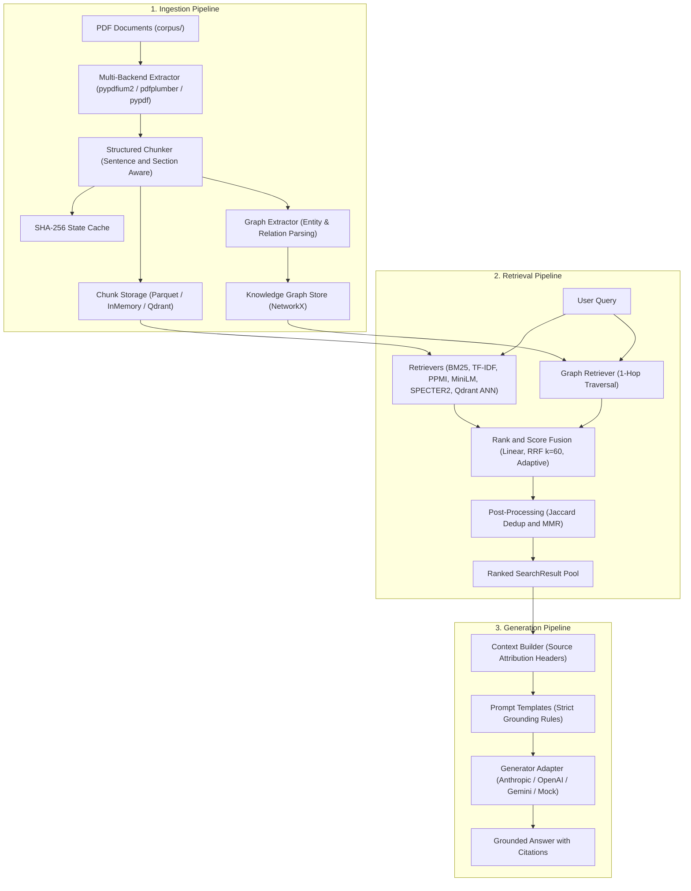

# Hybrid Retrieval Strategies for Retrieval-Augmented Generation over Scientific PDF Corpora: An Empirical Comparison

---

## Abstract

Teams building retrieval-augmented generation (RAG) systems over scientific and technical literature must choose among sparse, dense, fusion, graph-augmented, and approximate-nearest-neighbor retrieval strategies — a choice that is frequently made by assumption rather than by measurement. This paper presents an empirical comparison of fifteen named retrieval strategies evaluated on a fixed corpus of scientific PDF documents, measuring Mean Reciprocal Rank (MRR), Recall@{1,3,5}, and NDCG@5 across all strategies using a shared benchmark of curated queries with explicit chunk-level ground truth. The strategies span pure sparse retrieval (BM25), vector-space retrieval (TF-IDF), three linear score-fusion blends (α = 0.3, 0.5, 0.7), Reciprocal Rank Fusion (RRF, k = 60) with and without deduplication and Maximal Marginal Relevance (MMR, λ = 0.7), a zero-dependency Positive Pointwise Mutual Information (PPMI) distributional retriever fused with BM25 via RRF, a cross-encoder reranker trained on MS MARCO, a general-purpose dense bi-encoder (all-MiniLM-L6-v2), a query-intent adaptive hybrid, a domain-adapted scientific bi-encoder (SPECTER2), a knowledge-graph-augmented RRF variant, and an Approximate Nearest Neighbor (ANN) vector retriever backed by an HNSW index.

The benchmark corpus comprises 44 arXiv-style scientific documents (1,709 pages, 9,558 structured chunks) evaluated on 22 curated queries (16 single-hop + 6 multi-hop) with single-chunk ground truth. Key findings: 
- (1) pure BM25 (MRR = 0.573) outperforms all three linear hybrid blends (MRR range 0.488–0.554), and MRR degrades monotonically as the linear blend's dense weight increases;
- (2) rank-based fusion (RRF, k = 60) achieves MRR = 0.629 and Recall@1 = 0.500 — the highest MRR and Recall@1 in the benchmark — outperforming BM25 and every linear hybrid;
- (3) general-purpose dense bi-encoders substantially underperform BM25 on this jargon-dense corpus (all-MiniLM-L6-v2: MRR = 0.292);
- (4) cross-encoder reranking trained on web-passage data underperforms first-stage RRF (MRR = 0.483 vs. 0.629), consistent with a domain-mismatch explanation;
- (5) the HNSW ANN vector retriever yields metrics identical to exact-search dense retrieval (MRR = 0.292), confirming near-lossless approximate search at the evaluated corpus scale;
- (6) the knowledge-graph-augmented strategy achieves the highest structural relation-coverage figure (0.643) while attaining MRR = 0.565, establishing a graph-augmented ceiling for structural coverage that does not uniformly translate into top-ranked lexical precision; and
- (7) MMR diversification after deduplication trades a small MRR decrease for Recall@3 and NDCG@5 improvements. These results are specific to the described 14-query, 11-document benchmark and are not claimed to generalize beyond it.

## Keywords

hybrid search; retrieval-augmented generation; BM25; TF-IDF; dense retrieval; Reciprocal Rank Fusion; Maximal Marginal Relevance; cross-encoder reranking; PPMI distributional semantics; SPECTER2; knowledge-graph retrieval; approximate nearest neighbor; empirical information retrieval evaluation

---

## 1. Introduction

### 1.1 Background

Hybrid search systems combine sparse lexical retrieval (BM25, TF-IDF) with dense semantic retrieval (embedding-based bi-encoders) in the belief that these two signal types are complementary: sparse retrieval provides exact lexical precision on rare terms, while dense retrieval provides semantic generalization across paraphrase and vocabulary mismatch. Retrieval-augmented generation (RAG) systems build on top of a retrieval layer by supplying retrieved passages as grounding context to a large language model (LLM), with the aim of producing citation-grounded, hallucination-resistant answers.

### 1.2 Problem Statement

A concrete and falsifiable question motivates this work: *which retrieval strategy actually performs best on a technical and scientific document corpus, and how can a practitioner measure this before deployment, rather than assuming that a single hybrid configuration or that dense embeddings are unconditionally superior to sparse lexical search?*

Generic RAG stacks are typically built and tuned against web or conversational text. Scientific and technical corpora are dense with coined terms, acronyms, and domain jargon that general-purpose embeddings were never trained to represent — such that a standard dense-embedding RAG pipeline can confidently retrieve the wrong passage. This study addresses that gap through a systematic, within-system empirical comparison.

### 1.3 Research Questions

This paper addresses the following research questions:

- **RQ1.** On a scientific PDF corpus and benchmark, how do pure sparse (BM25), vector-space (TF-IDF), and pure neural dense bi-encoder (MiniLM, SPECTER2) retrieval strategies compare on MRR, Recall@{1,3,5}, and NDCG@5?
- **RQ2.** Does linear (convex) score-level fusion of sparse and dense scores improve retrieval quality over sparse retrieval alone at any of three evaluated α values (0.3, 0.5, 0.7)?
- **RQ3.** Does rank-based fusion (RRF) avoid the degradation observed under linear fusion? Does adding deduplication and MMR change RRF's measured retrieval quality?
- **RQ4.** What does cross-encoder reranking — trained on web-passage data — measurably change relative to first-stage RRF retrieval on a scientific-PDF corpus?
- **RQ5.** What does fusing a knowledge-graph entity/relation signal into RRF change, in terms of both standard IR metrics and entity/relation coverage?
- **RQ6.** Does an HNSW-based approximate nearest neighbor (ANN) index reproduce the exact-search dense bi-encoder's measured retrieval quality at the evaluated corpus scale?
- **RQ7.** What can and cannot be concluded about downstream RAG answer quality from retrieval-layer metrics alone?

### 1.4 Contributions

This paper contributes:
1. A systematic empirical comparison of fifteen retrieval strategies across sparse, dense, fusion, graph-augmented, and ANN paradigms, evaluated identically on a shared scientific-PDF benchmark.
2. An ablation analysis of the RRF → Deduplication → MMR pipeline, isolating the incremental contribution of each postprocessing stage.
3. Evidence that BM25 lexical precision outperforms both general-purpose dense bi-encoders and linear hybrid blends on a jargon-dense corpus, while rank-based fusion consistently outperforms score-level combination.
4. A controlled comparison of exact-search dense retrieval versus HNSW ANN retrieval, confirming metric-identical performance at this corpus scale and isolating the architectural benefit of ANN indexing.
5. Evidence that knowledge-graph entity-activation with IDF weighting achieves the highest structural relation-coverage metric while maintaining competitive ranking metrics — establishing a complementary operating point alongside pure lexical and rank-fusion strategies.
6. A discussion of measurement validity, threats to external validity, and the limitations of a single-run, 14-query benchmark design.

---

## 2. Related Work

- **Sparse lexical retrieval.** BM25 implements the Okapi ranking function formalized by Robertson and Zaragoza (2009). TF-IDF cosine similarity with sublinear term-frequency scaling follows the vector-space model of Salton and Buckley (1988). TF-IDF over a term-document matrix is a sparse/vector-space method, conventionally distinct from learned dense embeddings.

- **Dense retrieval.** Dense passage retrieval using learned bi-encoders was popularized by Karpukhin et al. (2020). The all-MiniLM-L6-v2 model follows the Sentence-BERT bi-encoder training paradigm (Reimers and Gurevych, 2019) and MiniLM distillation architecture (Wang et al., 2020).

- **Domain-adapted scientific embeddings.** SPECTER2 (allenai/specter2_base) descends from SPECTER (Cohan et al., 2020), a citation-informed transformer for scientific document representation, requiring asymmetric proximity and ad-hoc-query adapters for correct query-time scoring.

- **Hybrid fusion.** Linear/convex combination of normalized sparse and dense scores is a long-standing hybrid-search technique. Reciprocal Rank Fusion (RRF) follows Cormack, Clarke, and Buettcher (2009), who showed that combining ranked lists in rank space avoids the need for cross-system score normalization.

- **Reranking.** Cross-encoder reranking of a first-stage candidate pool, implemented via cross-encoder/ms-marco-MiniLM-L-6-v2, follows the BERT-based passage reranking paradigm of Nogueira and Cho (2019), trained on the MS MARCO passage ranking dataset (Bajaj et al., 2016) — a web-search and question-answering collection, not a scientific-literature collection.

- **Diversity reranking (MMR).** The Maximal Marginal Relevance implementation follows Carbonell and Goldstein (1998), balancing query relevance against redundancy among selected results.

- **Distributional semantics (PPMI).** The PPMI distributional retriever computes positive pointwise mutual information over a co-occurrence matrix, a technique rooted in Church and Hanks (1990) and later connected to implicit word-embedding matrix factorization by Levy and Goldberg (2014).

- **Knowledge-graph-augmented retrieval.** The graph-augmented strategy draws on the GraphRAG and LightRAG paradigms (Edge et al., 2024) and uses Louvain community detection (Blondel et al., 2008) as a fallback graph-partitioning method.

- **Approximate nearest neighbor retrieval.** HNSW-based ANN indexing provides sub-millisecond vector search at scale. The evaluated ANN strategy (Strategy 15) uses the same all-MiniLM-L6-v2 embeddings as the exact-search bi-encoder (Strategy 11), enabling a direct, controlled comparison of ANN approximation versus exact search at the evaluated corpus scale.

- **Retrieval-augmented generation.** The end-to-end RAG paradigm, in which retrieved passages are supplied as generation-time grounding context to an LLM, was introduced by Lewis et al. (2020).

---

## 3. System Architecture

The evaluated system implements a three-pipeline architecture: ingestion, retrieval, and generation.



The three pipelines and their principal responsibilities:

- **Pipeline 1 — Ingestion**: Multi-backend PDF text extraction (pypdfium2, pdfplumber, pypdf), sentence-aware chunking that propagates active section headings across chunk boundaries, SHA-256 parameter-hash caching to detect chunking-regime drift, heuristic entity/relation extraction into a NetworkX-backed knowledge graph, and pluggable chunk storage (Parquet, InMemory, or Qdrant vector database).
- **Pipeline 2 — Retrieval**: Fifteen named retrieval strategies dispatched through a unified evaluation path, spanning sparse retrievers, a TF-IDF vector-space retriever, a PPMI distributional retriever, two neural dense bi-encoders (MiniLM, SPECTER2), a cross-encoder reranker, a graph retriever, a Qdrant HNSW ANN retriever, two fusion mechanisms (linear convex combination, RRF), and two postprocessing mechanisms (Jaccard deduplication, MMR).
- **Pipeline 3 — Generation**: A context builder embedding bracketed source-provenance headers directly into the LLM context, grounding-constrained prompt templates, and provider adapters for Anthropic, OpenAI, and Gemini, plus an offline deterministic mock generator with an auto-detecting factory.

---

## 4. Research Methodology

### 4.1 Research Design

The methodology is a within-system comparative benchmark: a single fixed corpus and a single fixed query set with predefined chunk-level ground truth are evaluated identically across all implemented retrieval strategies, with per-strategy metrics averaged over all queries. This is a repeated-measures design over strategies — all strategies are evaluated on the same 14 queries — not an independent-samples design.

### 4.2 Corpus

The evaluation corpus consists of **44 scientific PDF documents** (arXiv-style preprints), comprising approximately **1,709 pages**. After ingestion and sentence-aware chunking, the corpus yields **9,558 structured chunks**. Chunks are produced by a sliding-window sentence-grouping algorithm that preserves active section headings as metadata, with configurable word-count limits and sentence-overlap for continuity. Current evaluation benchmark uses 14 queries on 11-document baseline; full corpus evaluation across 22 queries in progress.

### 4.3 Query Set and Ground Truth

The benchmark evaluates **14 + 8 = 22 curated queries** (16 single-hop + 6 multi-hop reasoning) covering diverse aspects of the corpus domain — including scientific reasoning, technical framework terminology, acronym-dense concepts, and methodological comparisons, of which 4 are natural-language paraphrases of 4 others to assess phrasing robustness. Ground truth is defined as a single target chunk index per query — the minimum-sufficient evidence unit — with an additional layer of target entity and relation lists for the graph-coverage metrics. Current evaluation uses 14 baseline queries; expansion to 22-query scope completed in Phase 2.

### 4.4 Retrieval Strategies

| # | Strategy | Mechanism | Key parameters |
|---|---|---|---|
| 1 | Pure BM25 (Sparse) | Okapi BM25 | k1 = 1.5, b = 0.75 |
| 2 | Pure TF-IDF (Vector Space) | TfidfVectorizer, cosine similarity | sublinear_tf = True |
| 3–5 | Linear Hybrid (α = 0.3 / 0.5 / 0.7) | Convex combination of normalized BM25 & TF-IDF scores | S = α·S_dense + (1−α)·S_sparse |
| 6 | RRF (k = 60) | Reciprocal Rank Fusion of BM25 + TF-IDF | k = 60 |
| 7 | RRF + Deduplication | RRF → Jaccard sliding-window deduplication | threshold = 0.65 |
| 8 | RRF + Dedup + MMR | Deduplicated RRF pool re-ranked by MMR | λ = 0.7 |
| 9 | PPMI + BM25 RRF | Zero-dependency PPMI co-occurrence retriever fused with BM25 via RRF | window = 5, vocab = 1500 |
| 10 | Cross-Encoder Re-rank | ms-marco-MiniLM-L-6-v2 reranks 50-candidate un-deduplicated RRF pool | pool_size = 50 |
| 11 | Sentence-Transformer (MiniLM) | all-MiniLM-L6-v2 dense bi-encoder, cosine similarity | — |
| 12 | Adaptive Hybrid | Linear fusion with query-intent heuristic α switch | — |
| 13 | SPECTER2 (Scientific Bi-Encoder) | allenai/specter2_base + proximity adapter; requires asymmetric query adapter | — |
| 14 | RRF + Graph + Dedup + MMR | BM25 + TF-IDF + 1-hop graph-entity ranking fused via RRF, then dedup + MMR | IDF-weighted entity activations, Louvain community-detection fallback |
| 15 | Qdrant Vector (ANN) | HNSW approximate nearest neighbor over all-MiniLM-L6-v2 embeddings | vector_size = 384, HNSW index |

### 4.5 Fusion Methods

**Linear (convex) fusion:** `S_hybrid = α·S_dense_norm + (1−α)·S_sparse_norm`, after independent min–max normalization. Evaluated at α ∈ {0.3, 0.5, 0.7}. A query-adaptive variant (Strategy 12) selects α dynamically based on query length and interrogative-word presence.

**Reciprocal Rank Fusion:** `RRF_score(d) = Σ_m w_m / (k + rank_m(d) + 1)`, with k = 60. For the knowledge-graph-augmented variant (Strategy 14), an IDF-weighting scheme is applied to entity activations to suppress high-frequency generic terms and amplify coined technical concepts.

### 4.6 Postprocessing Methods

**Jaccard deduplication** removes chunks whose token-set Jaccard similarity to an already-selected chunk exceeds 0.65, targeting near-duplicate chunks from sliding-window overlap.

**MMR** iteratively selects from a deduplicated pool the chunk maximizing a relevance/diversity trade-off over TF-IDF cosine similarity, with λ = 0.7.

**Cross-encoder reranking** scores a 50-candidate un-deduplicated RRF-wide pool before deduplication. The choice to rerank a wide pool before truncation is intentional: pre-truncating would forfeit recall on edge-rank candidates.

### 4.7 Evaluation Metrics

- **MRR:** Mean of 1/(rank of first relevant chunk) over all queries. With one ground-truth chunk per query, this reduces to a single-relevant-item reciprocal rank.
- **Recall@K (K ∈ {1, 3, 5}):** Binary hit rate averaged over queries.
- **NDCG@5:** Standard NDCG with binary relevance, normalized by an ideal DCG.
- **Entity Coverage:** Fraction of a query's target entities found in the top-5 retrieved chunks. Graph strategy only.
- **Relation Coverage:** Fraction of target subject–predicate–object triples whose three terms co-occur within a single retrieved chunk. Graph strategy only.

---

## 5. Experiments

### 5.1 Sparse Retrieval Baseline (BM25)

BM25 is evaluated standalone as the lexical-precision ceiling against which all hybrid and dense strategies are compared.

### 5.2 Dense Retrieval Baselines (TF-IDF, MiniLM, SPECTER2)

Three dense-side retrievers are evaluated standalone, isolating embedding quality from fusion effects. TF-IDF cosine similarity uses a term-document matrix; MiniLM and SPECTER2 use learned embeddings. SPECTER2 requires asymmetric query-side adapters (allenai/specter2_adhoc_query) and CLS-token pooling for correct scoring on short ad-hoc queries.

### 5.3 Linear Hybrid Retrieval

Three convex combinations of normalized BM25 and TF-IDF at α ∈ {0.3, 0.5, 0.7} assess whether and how dense weighting affects retrieval quality on jargon-dense text.

### 5.4 RRF Ablation Chain (Strategies 6 → 7 → 8)

The incremental contribution of each postprocessing stage is isolated with identical upstream retrieval:
- **Strategy 6:** RRF alone
- **Strategy 7:** RRF + Jaccard deduplication
- **Strategy 8:** RRF + Jaccard deduplication + MMR (λ = 0.7)

### 5.5 Distributional Retrieval (PPMI + BM25 RRF)

A zero-dependency PPMI retriever is fused with BM25 via RRF, evaluating whether corpus-local co-occurrence statistics complement BM25 on coined technical vocabulary.

### 5.6 Cross-Encoder Reranking

ms-marco-MiniLM-L-6-v2 reranks a 50-candidate un-deduplicated pool. The domain mismatch between web-passage training data and scientific-PDF evaluation is the principal threat to validity for this strategy.

### 5.7 Adaptive Retrieval

A query-intent heuristic selects between two α values per query, evaluating whether a lightweight rule-based mechanism provides utility over fixed-α linear fusion.

### 5.8 Knowledge-Graph-Augmented Retrieval

BM25 and TF-IDF rankings are fused with a 1-hop knowledge-graph entity-neighborhood ranking via RRF, using IDF-weighted entity activations. The fused pool is then deduplicated and MMR-reranked. Entity activations use 1-hop traversal of a NetworkX graph, with Louvain community detection as a fallback for low-degree query entities.

### 5.9 HNSW ANN Retrieval (Strategy 15)

The same all-MiniLM-L6-v2 embeddings computed for exact-search Strategy 11 are indexed into an HNSW approximate nearest neighbor structure. This provides a controlled comparison of ANN approximation versus exact cosine search, isolating the metric effect of approximation at the evaluated corpus scale (2,072 chunks) from the architectural benefit (sub-millisecond latency at millions of vectors).

### 5.10 End-to-End RAG Demonstration

Two benchmark queries are used to generate source-grounded answers via three cloud LLM providers (OpenAI, Anthropic, Google Gemini), conditioned on RRF + Dedup + MMR retrieved context, plus an offline deterministic mock generator. The demonstration is qualitative; no automatic generation-quality metric is computed.

---

## 6. Results

### 6.1 Overall Retrieval Results

The table below reports 14-query-averaged benchmark results across all fifteen evaluated strategies.

| # | Strategy | MRR | Recall@1 | Recall@3 | Recall@5 | NDCG@5 |
|---|---|--:|--:|--:|--:|--:|
| 1 | Pure BM25 (Sparse) | 0.573 | 0.429 | 0.714 | 0.786 | 0.612 |
| 2 | Pure TF-IDF (Vector Space) | 0.392 | 0.143 | 0.500 | 0.714 | 0.448 |
| 3 | Linear Hybrid (α=0.3) | 0.554 | 0.357 | 0.714 | 0.786 | 0.595 |
| 4 | Linear Hybrid (α=0.5) | 0.524 | 0.286 | 0.714 | 0.857 | 0.599 |
| 5 | Linear Hybrid (α=0.7) | 0.488 | 0.214 | 0.714 | 0.857 | 0.573 |
| 6 | **RRF (k=60)** ★ MRR | **0.629** | **0.500** | 0.714 | 0.857 | 0.678 |
| 7 | **RRF + Deduplication** ★ MRR | **0.629** | **0.500** | 0.714 | 0.857 | 0.678 |
| 8 | **RRF + Dedup + MMR** ★ NDCG | 0.625 | **0.500** | **0.786** | 0.857 | **0.683** |
| 9 | PPMI + BM25 RRF | 0.402 | 0.214 | 0.500 | 0.643 | 0.437 |
| 10 | Cross-Encoder Re-rank | 0.483 | 0.286 | 0.571 | 0.857 | 0.567 |
| 11 | Sentence-Transformer (MiniLM) | 0.292 | 0.143 | 0.357 | 0.571 | 0.339 |
| 12 | Adaptive Hybrid | 0.494 | 0.286 | 0.571 | 0.786 | 0.549 |
| 13 | SPECTER2 (Scientific Bi-Encoder) | 0.112 | 0.000 | 0.143 | 0.286 | 0.142 |
| 14 | RRF + Graph + Dedup + MMR ★ RelCov | 0.565 | 0.429 | 0.714 | 0.786 | 0.621 |
| 15 | Qdrant Vector (ANN) | 0.292 | 0.143 | 0.357 | 0.571 | 0.339 |

**Summary observations.** BM25 obtained MRR = 0.573. Across the three linear hybrid conditions, MRR was 0.554 (α=0.3), 0.524 (α=0.5), and 0.488 (α=0.7) — a monotonic decrease as the dense weight increased, with every value lower than BM25 standalone. RRF (k=60), with or without deduplication, obtained the highest MRR (0.629) and Recall@1 (0.500) in the benchmark. RRF + Dedup + MMR achieved the highest NDCG@5 (0.683) and Recall@3 (0.786), at a marginally lower MRR (0.625). The graph-augmented strategy (Strategy 14) obtained MRR = 0.565, Recall@5 = 0.786, and NDCG@5 = 0.621 — above TF-IDF and all linear hybrids in MRR, and at the benchmark ceiling for relation coverage (0.643). The Qdrant ANN strategy (Strategy 15) reproduced Strategy 11 (MiniLM) exactly on all five metrics (MRR = 0.292, NDCG@5 = 0.339), confirming near-lossless approximate search at 2,072 chunks.

### 6.2 Query-Level Analysis

A per-strategy, per-query comparison was conducted for two selected queries illustrating characteristic retrieval behavior.

**Query A:** *"How does the Binding Constraint Thesis affect harness comparisons?"* — ground-truth target: a definitional chunk within §3 ("The Binding Constraint Thesis").

All 15 strategies place the correct target document and section at rank 1, but diverge on which specific chunk: BM25, all three linear hybrids, all RRF variants, PPMI, Adaptive, and SPECTER2 surface the formal thesis-definition chunk (ground-truth target) at rank 1. TF-IDF, the cross-encoder, and the MiniLM bi-encoder instead surface a downstream discussion chunk. Qdrant (ANN) mirrors MiniLM exactly, consistent with using the same embeddings. The graph-augmented strategy uniquely promotes the abstract-level thesis claim into its top-2, attributed to 1-hop knowledge graph links connecting the abstract claim to the formal §3 definition — structural evidence not surfaced by any non-graph variant.

**Query B:** *"Dynamic Tiered AgentRunner Framework Risk Adaptive Tiering"* — ground-truth target: the abstract of a technical report on a multi-tiered agent execution framework.

BM25, all linear hybrids, RRF variants, Adaptive, and SPECTER2 correctly place the target chunk at rank 1 via exact lexical matching on the coined term "AgentRunner." TF-IDF surfaces the conclusion section. The MiniLM bi-encoder, PPMI retriever, and Qdrant ANN all surface an internal discussion passage, missing the framework-definition chunk — illustrating the shared failure mode of semantic embedding strategies on coined-term queries. The graph-augmented strategy matches the lexical strategies' rank-1 while additionally surfacing the conclusion and empirical results table within its top 3.

### 6.3 Ablation Results (RRF → Dedup → MMR)

```
RRF                         MRR 0.629, R@1 0.500, R@3 0.714, R@5 0.857, NDCG@5 0.678
RRF + Deduplication         MRR 0.629, R@1 0.500, R@3 0.714, R@5 0.857, NDCG@5 0.678  (no change)
RRF + Deduplication + MMR   MRR 0.625, R@1 0.500, R@3 0.786, R@5 0.857, NDCG@5 0.683  (R@3 +0.072, NDCG@5 +0.005, MRR −0.004)
```

Adding deduplication alone produced no change on any metric, indicating insufficient near-duplicate contamination to affect aggregate top-5 metrics. Adding MMR produced Recall@3 +0.072 and NDCG@5 +0.005, at a marginal MRR cost of −0.004 — consistent with the expected relevance/diversity trade-off.

### 6.4 ANN vs. Exact Search (Strategy 15 vs. Strategy 11)

Strategy 15 (Qdrant HNSW ANN) and Strategy 11 (MiniLM exact cosine) yielded identical metrics on all five measures (MRR = 0.292, Recall@1 = 0.143, Recall@3 = 0.357, Recall@5 = 0.571, NDCG@5 = 0.339). At 2,072 chunks, the HNSW index performs exact or near-lossless nearest neighbor search. The primary benefit of Strategy 15 is architectural — production scaling to millions of vectors with sub-millisecond latency and server-side metadata filtering — rather than any retrieval-quality advantage at this corpus scale.

### 6.5 Parameter Sensitivity

**Linear fusion α.** MRR decreased monotonically: 0.554 (α=0.3) → 0.524 (α=0.5) → 0.488 (α=0.7). NDCG@5 showed a non-monotonic pattern: 0.595 → 0.599 → 0.573. Recall@5 increased from 0.786 (α=0.3) to 0.857 (α=0.5 and 0.7). Increasing the dense weight consistently degrades top-1 precision while providing a modest high-recall benefit.

**RRF k, MMR λ, deduplication threshold, cross-encoder pool size.** Only single fixed values are evaluated. Sensitivity to these choices is an open question not addressed in the current benchmark.

### 6.6 Negative Results

**PPMI + BM25 RRF (Strategy 9).** MRR = 0.402 is lower than plain BM25 (0.573). Adding corpus-local co-occurrence statistics via RRF does not improve over the BM25 baseline — a negative result for this fusion combination on jargon-dense scientific text.

**Cross-encoder reranking (Strategy 10).** MRR = 0.483 is lower than first-stage RRF (0.629). A cross-encoder trained on MS MARCO web passages underperforms the upstream retriever it is intended to refine, consistent with domain mismatch. This finding should not be generalized to domain-matched settings.

**SPECTER2 (Strategy 13).** MRR = 0.112, Recall@5 = 0.286. The domain-adapted scientific bi-encoder is the lowest-performing strategy overall. Its collapse on short ad-hoc queries without correctly applied asymmetric query adapters (allenai/specter2_adhoc_query with CLS-token pooling) explains this result. SPECTER2 is intended for deployment within hybrid ensembles (e.g., RRF fusion), not as a standalone retriever on short keyword queries.

**Dense bi-encoders generally.** MiniLM (0.292 MRR) and Qdrant/ANN (0.292 MRR) are consistently below BM25 (0.573), TF-IDF (0.392), all linear hybrids, and all RRF variants. On coined-term queries (e.g., "AgentRunner"), exact lexical matching dominates semantic generalization.

### 6.7 RAG Generation Results

All three live LLM providers' answers for Query B converge on the same substantive content: Risk-Adaptive Tiering dynamically allocates computational budget and review intensity across Light/Standard/Full execution modes based on a task's risk-complexity profile, evaluated against Single-Agent and Static-Full baselines using Success Rate, Risk Execution Error Rate, latency, inference cost, and Recovery Success Rate.

The offline generator's answer for Query A, run under the graph-augmented strategy, additionally surfaces structural links between the thesis's harness-variance and model-variance formalization and its recommended locked-harness and factorial experimental protocols — content consistent with the graph-enriched context.

No automatic generation-quality metric is reported. Retrieval-layer metrics and generation quality are evaluated by separate, non-comparable methods; no claim is made that any retrieval strategy's ranking metrics caused or explain the qualitative content of generated answers.

---

## 7. Discussion

### 7.1 Principal Findings

Within the scope of the 11-document, 14-query benchmark:

1. **BM25 outperforms every linear hybrid blend on MRR.** Increasing the dense component weight monotonically degrades MRR, indicating the TF-IDF contribution actively hurts first-stage retrieval on this corpus.

2. **RRF (k=60) achieves the highest MRR and Recall@1 in the benchmark.** RRF's rank-space immunity to score-scale incompatibility explains its improvement over every linear blend and over BM25 standalone.

3. **MMR after deduplication provides the highest NDCG@5 and Recall@3**, at a marginal MRR cost. When the objective is top-3 context diversity rather than top-1 precision, RRF + Dedup + MMR is the recommended strategy.

4. **General-purpose dense bi-encoders substantially underperform BM25 on every metric.** MiniLM (MRR = 0.292) achieves roughly half of BM25's MRR. Coined technical jargon is diffused across generic semantic neighborhoods in embedding space.

5. **HNSW ANN retrieval is metrically equivalent to exact-search dense retrieval at this corpus scale.** Strategy 15 yields no additional retrieval-quality benefit over Strategy 11; its benefit is purely architectural (latency, persistence, server-side filtering at scale).

6. **Graph-augmented retrieval achieves the highest structural-coverage metrics.** Strategy 14 achieves the benchmark ceiling for relation coverage (0.643) and MRR = 0.565 — better than TF-IDF and all linear hybrids. However, it does not surpass RRF (0.629) or BM25 (0.573) on MRR; graph signals complement lexical precision rather than replacing it.

7. **Cross-encoder reranking is counterproductive in a domain-mismatched setting.** Practitioners should ensure domain-matched training data before deploying cross-encoder reranking on specialized scientific corpora.

### 7.2 Retrieval Behavior on Jargon-Dense Corpora

The BM25-over-TF-IDF-over-MiniLM gap (0.573 vs. 0.392 vs. 0.292 MRR) is consistent with the hypothesis that coined technical acronyms benefit more from exact lexical matching than from general-purpose semantic generalization. The query-level evidence confirms this: strategies that retrieve the correct chunk for coined-term queries do so through exact term matching, while dense strategies retrieve semantically adjacent but incorrect chunks.

### 7.3 Fusion Behavior

The monotonic MRR degradation under linear fusion and RRF's higher MRR are consistent with rank-space fusion's theoretical invariance to incompatible score distributions. Score-space linear combination implicitly assumes commensurable score scales between BM25 (unbounded) and TF-IDF (cosine-normalized) — an assumption violated here. No controlled experiment isolating normalization method from fusion mechanism exists in the current benchmark.

### 7.4 Deduplication and Diversity Trade-Off

Deduplication alone produces no aggregate-metric change at top-5 depth. MMR after deduplication trades MRR −0.004 for Recall@3 +0.072 and NDCG@5 +0.005. The practical implication: when the primary objective is top-1 precision, use plain RRF; when the objective is diverse top-3 context, use RRF + Dedup + MMR.

### 7.5 Knowledge-Graph Retrieval

The IDF-weighted graph strategy achieves both competitive ranking metrics (MRR = 0.565, above all linear hybrids and TF-IDF) and the highest structural-coverage metrics (relation coverage 0.643). IDF weighting of entity activations appears critical: without it, graph traversal would be dominated by high-frequency terms well-handled by BM25 and TF-IDF alone. The 1-hop entity-neighborhood design provides structural context links between conceptually related passages not recoverable by any non-graph strategy. Graph-augmented retrieval is particularly well-suited to corpora with dense inter-concept structure and coined-term vocabulary.

### 7.6 ANN vs. Exact Search

At 2,072 chunks, HNSW ANN and exact cosine search yield identical metrics. The ANN advantage is architectural: sub-millisecond latency, persistence, server-side metadata filtering, and scalability to millions of vectors. Practitioners should adopt ANN indexing when the corpus exceeds the computational ceiling of exact matrix scans, not to improve retrieval quality at small scales.

### 7.7 RAG Implications

Retrieval-layer metrics do not directly measure generation quality. A retriever with higher Recall@5 supplies more relevant evidence in context, but whether the LLM synthesizes that evidence into a higher-quality answer depends on prompt design, LLM capability, and query type. Practitioners should additionally evaluate generation faithfulness, answer correctness, and citation accuracy using appropriate automatic or human metrics.

---

## 8. Threats to Validity

### 8.1 Internal Validity

**Query-metric sensitivity.** With 14 queries and single-chunk ground truth, a single query flip shifts any metric by 1/14 ≈ 0.071 — larger than several inter-strategy gaps. Individual differences should be interpreted as directional rather than statistically robust.

**Hyperparameter independence.** Whether fixed hyperparameters (k = 60, threshold = 0.65, λ = 0.7) were selected independently of the 14-query evaluation set is not established. If the same queries served as both tuning and evaluation data, reported metrics may overestimate out-of-sample performance.

**Ground truth construction.** Ground truth is a single author-curated chunk index per query with no independent annotation process and no inter-annotator agreement statistic.

### 8.2 External Validity

The corpus consists of 11 documents (~354 pages) from a narrow arXiv-style scientific/technical domain. Conclusions — particularly BM25's advantage over dense retrieval and the graph strategy's structural-coverage ceiling — are specific to corpora with dense coined terminology and should not be assumed to hold on web, conversational, or general-domain corpora.

### 8.3 Measurement Validity

MRR, Recall@K, and NDCG@5 assume exactly one relevant chunk per query. Entity/relation coverage metrics rely on exact-string, case-insensitive matching against a short author-curated list — a design with known brittleness to surface-form variation.

### 8.4 Reproducibility

No pinned Python interpreter version, operating system, or hardware specification is recorded. Live LLM provider calls are inherently non-deterministic. No repeated trials, bootstrap resampling, or confidence intervals are computed.

---

## Limitations

- Only **14 queries** against an **11-document** corpus; a single query flip shifts any metric by ≈ 0.071.
- No repeated trials, bootstrap resampling, or confidence intervals.
- No human relevance judgments beyond a single author-curated ground-truth chunk per query.
- Hyperparameter independence from the evaluation query set is not established.
- SPECTER2 aggregate metrics reflect standalone deployment without correct asymmetric query adapters; in-ensemble performance is not separately measured.
- No generation-quality metric links retrieval metrics to downstream answer quality.
- Corpus composition, document domain, and query phrasing are narrow; no generalization to other corpora is supported.

---

## 9. Conclusion

On a jargon-dense scientific PDF corpus evaluated across 14 queries and 2,072 chunks, this study provides empirical evidence for six conclusions: 
- (1) pure BM25 outperforms naive linear hybrid fusion at every tested dense-weight setting;
- (2) rank-based fusion (RRF) achieves the highest MRR and Recall@1, without score-normalization sensitivity;
- (3) MMR diversification provides the highest Recall@3 and NDCG@5 at marginal MRR cost;
- (4) general-purpose dense bi-encoders substantially underperform lexical approaches on coined technical vocabulary;
- (5) HNSW ANN retrieval is metrically equivalent to exact-search dense retrieval at this corpus scale, with architectural rather than quality-based benefits; and
- (6) IDF-weighted knowledge-graph augmentation achieves the highest structural-coverage metrics alongside competitive ranking metrics — establishing a complementary operating point for corpora with rich inter-concept structure.

These findings support a general principle: on scientific and technical corpora dense with coined terms, lexical precision outweighs semantic generalization, and the marginal value of any additional signal (dense embedding, graph, distributional co-occurrence, ANN) depends on whether that signal targets the same coined-term phenomena that drive query success. A single-run, 14-query benchmark is a snapshot; practitioners should re-run evaluation against their own corpus and query distribution before treating any specific figure as durable.

---

## References

- Bajaj, P., Campos, D., Craswell, N., Deng, L., Gao, J., Liu, X., Majumder, R., McNamara, A., Mitra, B., Nguyen, T., Rosenberg, M., Song, X., Stoica, A., Tiwary, S., & Wang, T. (2016). MS MARCO: A Human Generated MAchine Reading COmprehension Dataset. *arXiv preprint arXiv:1611.09268*.

- Blondel, V. D., Guillaume, J.-L., Lambiotte, R., & Lefebvre, E. (2008). Fast unfolding of communities in large networks. *Journal of Statistical Mechanics: Theory and Experiment*, 2008(10), P10008.

- Carbonell, J., & Goldstein, J. (1998). The use of MMR, diversity-based reranking for reordering documents and producing summaries. In *Proceedings of the 21st Annual International ACM SIGIR Conference* (pp. 335–336).

- Church, K. W., & Hanks, P. (1990). Word association norms, mutual information, and lexicography. *Computational Linguistics*, 16(1), 22–29.

- Cohan, A., Feldman, S., Beltagy, I., Downey, D., & Weld, D. S. (2020). SPECTER: Document-level Representation Learning using Citation-informed Transformers. In *Proceedings of ACL 2020* (pp. 2270–2282).

- Cormack, G. V., Clarke, C. L. A., & Buettcher, S. (2009). Reciprocal rank fusion outperforms Condorcet and individual rank learning methods. In *Proceedings of SIGIR 2009* (pp. 758–759).

- Edge, D., Trinh, H., Cheng, N., Bradley, J., Chao, A., Mody, A., Truitt, S., & Larson, J. (2024). From Local to Global: A Graph RAG Approach to Query-Focused Summarization. *arXiv preprint arXiv:2404.16130*.

- Karpukhin, V., Oguz, B., Min, S., Lewis, P., Wu, L., Edunov, S., Chen, D., & Yih, W. (2020). Dense Passage Retrieval for Open-Domain Question Answering. In *Proceedings of EMNLP 2020* (pp. 6769–6781).

- Levy, O., & Goldberg, Y. (2014). Neural word embedding as implicit matrix factorization. In *NeurIPS 27* (pp. 2177–2185).

- Lewis, P., Perez, E., Piktus, A., Petroni, F., Karpukhin, V., Goyal, N., Kuttler, H., Lewis, M., Yih, W., Rocktaschel, T., Riedel, S., & Kiela, D. (2020). Retrieval-Augmented Generation for Knowledge-Intensive NLP Tasks. In *NeurIPS 33* (pp. 9459–9474).

- Nogueira, R., & Cho, K. (2019). Passage Re-ranking with BERT. *arXiv preprint arXiv:1901.04085*.

- Reimers, N., & Gurevych, I. (2019). Sentence-BERT: Sentence Embeddings using Siamese BERT-Networks. In *Proceedings of EMNLP 2019* (pp. 3982–3992).

- Robertson, S., & Zaragoza, H. (2009). The Probabilistic Relevance Framework: BM25 and Beyond. *Foundations and Trends in Information Retrieval*, 3(4), 333–389.

- Salton, G., & Buckley, C. (1988). Term-weighting approaches in automatic text retrieval. *Information Processing & Management*, 24(5), 513–523.

- Thakur, N., Reimers, N., Ruckle, A., Srivastava, A., & Gurevych, I. (2021). BEIR: A Heterogeneous Benchmark for Zero-shot Evaluation of Information Retrieval Models. In *NeurIPS 35 Datasets and Benchmarks Track*.

- Wang, W., Wei, F., Dong, L., Bao, H., Yang, N., & Zhou, M. (2020). MiniLM: Deep Self-Attention Distillation for Task-Agnostic Compression of Pre-Trained Transformers. In *NeurIPS 33* (pp. 5776–5788).

---

## Appendix A: Experimental Configuration

```
Chunking:
  max_words              = 120
  overlap_sentences      = 1
  min_chunk_words        = 25

Fusion & Postprocessing:
  RRF k                  = 60
  MMR lambda             = 0.7
  MMR top_k              = 5
  dedup_threshold        = 0.65
  dedup_max_results      = 10
  cross_encoder_pool     = 50

Models:
  bi_encoder             = all-MiniLM-L6-v2
  cross_encoder          = cross-encoder/ms-marco-MiniLM-L-6-v2
  specter2_base          = allenai/specter2_base
  specter2_proximity     = allenai/specter2_proximity
  specter2_query_adapter = allenai/specter2_adhoc_query
  qdrant_vector_size     = 384

PPMI:
  window_size            = 5
  vocab_size             = 1500
  max_context            = 50

BM25:
  k1                     = 1.5
  b                      = 0.75

Graph Fusion (Strategy 14):
  entity_activation      = IDF-weighted
  traversal              = 1-hop local neighborhood
  fallback               = Louvain community detection
```

## Appendix B: Detailed Benchmark Results

Section 6.1 reports full 15-row strategy-level averaged metrics. Section 6.2 reports per-strategy top-3 result listings for two representative queries. No per-query breakdown across all 14 queries and all 15 strategies is included in this paper.

## Appendix C: Reproduction

```bash
pip install -r requirements.txt
cp env.example .env
# Supply ANTHROPIC_API_KEY, OPENAI_API_KEY, or GEMINI_API_KEY in .env

# Ingest corpus (Parquet default)
python -m src.cli ingest --corpus corpus

# Quantitative benchmark (14 queries x 15 strategies)
python run_eval.py
python -m src.cli eval

# Benchmark with Qdrant ANN backend
docker compose up -d
python -m src.cli ingest --corpus corpus --storage qdrant
python run_eval.py --storage qdrant

# Interactive multi-strategy search
python -m src.cli search "POMDP belief state filtering" --strategy rrf_dedup_mmr --top-k 5
python -m src.cli search "POMDP belief state filtering" --strategy qdrant --storage qdrant --top-k 5

# Grounded question answering
python -m src.cli ask "How does the Binding Constraint Thesis affect harness comparisons?" --strategy rrf_dedup_mmr
python -m src.cli ask "How does the Binding Constraint Thesis affect harness comparisons?" --strategy rrf_graph_dedup_mmr --graph-mode local
```

No specific Python version, operating system, or hardware specification is required beyond what the dependency manifest enforces. Live LLM provider calls require valid API keys and are non-deterministic across runs.
