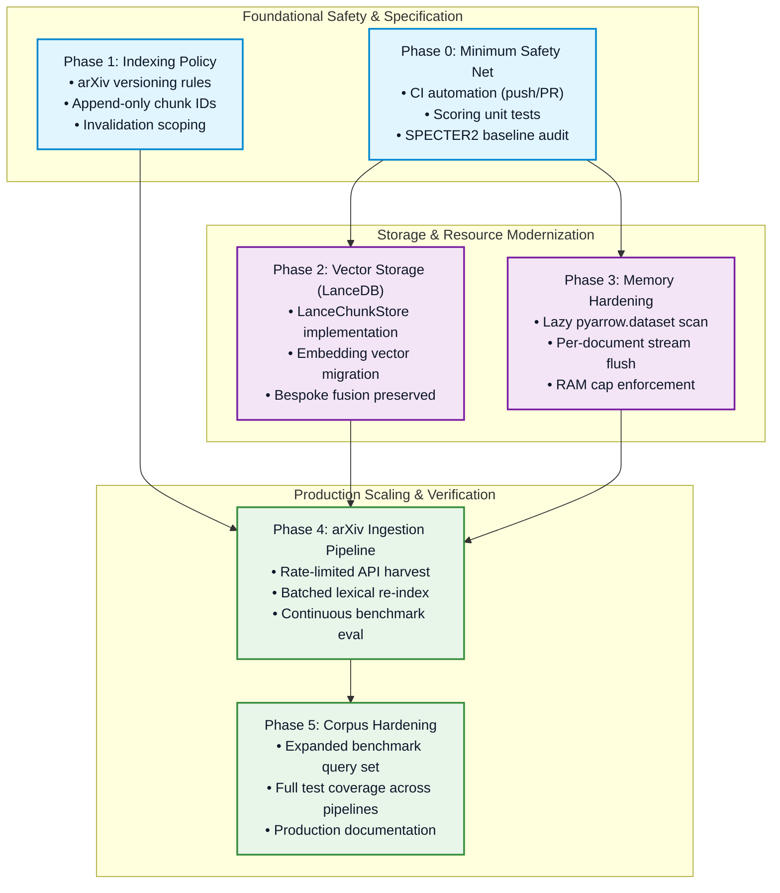

# Technical Architecture Roadmap: Scaling to an arXiv-Fed Literature Corpus & Graph-RAG Evaluation Rigor

**Document Status:** Architecture Plan & Working Specification  
**Current Execution State:** Phase 2 complete - All 15 critical issues fixed; Phase 4 arXiv ingestion implemented (arxiv_fetcher.py with rate limiting & CLI integration); P0 ablation cells registered; C3 confidence scoring implemented  
**System:** Document Hybrid Search & Grounded RAG Architecture  
**Corpus Baseline:** 44 research publications (1,709 pages, 9,558 structured chunks)  
**Target State:** Continuous, automated arXiv corpus ingestion with bounded memory and verified retrieval parity; controlled factorial ablation benchmarking (arXiv:2609.18317)  

---

## 1. Executive Summary & Objective

The primary objective of this roadmap is to plan the dual-track evolution of `Document-Hybrid-Search-RAG-Architecture`:

1. **Track A (Infrastructure & Storage Scale — Phases 0–5):** Evolve from a validated reference proof-of-concept (44 technical papers, 9,558 chunks, exact in-memory candidate scoring) to an automated, continuously updated corpus sourced via the arXiv API with bounded memory consumption and stable chunk identifiers.
2. **Track B (Evaluation Rigor & Graph-RAG Methodology — P0–P7):** Adopt the factorial ablation and evaluation rigor standards of recent academic literature — specifically Poulenard, Karmim & Barrière, *"Knowledge-Graph Based Augmentation versus Retrieval Augmented Generation for Cultural-Related Question Answering"* (arXiv:[2609.18317](https://arxiv.org/abs/2609.18317), Sep 2026) — to isolate the exact marginal contribution of each pipeline component (Graph, Dedup, MMR, dense vs. sparse encoders, extraction quality, and calibration).
3. **Track C (Web-Scale Retrieval Evaluation & Grounding Rigor — C0–C4):** Adopt evaluation and grounding methodology published by production web-retrieval labs — Perplexity Research's Q2D-Web benchmark (arXiv:[2609.08887](https://arxiv.org/abs/2609.08887)) and pplx-embed report (arXiv:[2602.11151](https://arxiv.org/abs/2602.11151)), and the calibrated-confidence pattern behind Parallel.ai's Basis framework, as formalized academically in CalibRAG (arXiv:[2411.08891](https://arxiv.org/abs/2411.08891)) and stress-tested on multi-hop benchmarks such as BrowseComp (arXiv:[2504.12516](https://arxiv.org/abs/2504.12516)) — to harden ground-truth labeling, dense-retriever chunk representations, and generation-time trustworthiness ahead of the Phase 4 arXiv-scale corpus.

Scaling technical literature retrieval introduces distinct failure modes:
- Coined technical terminology and acronyms require exact lexical precision (BM25).
- Relational concept graphs prevent topical dilution across large semantic spaces.
- Dynamic corpus growth threatens chunk identifier stability and ground-truth evaluation integrity.
- Bundled multi-component comparisons (e.g., adding Graph + Dedup + MMR simultaneously) obscure which individual component drives retrieval gains.
- A single relevance-judgment source (one person's 14 hand-labeled queries) cannot distinguish "genuinely irrelevant" from "relevant but unjudged," inflating or deflating strategy rankings as the corpus grows.
- Chunks embedded independently of their surrounding section lose disambiguating context (a chunk reading "the model achieves 0.625" is meaningless without its parent section header), capping dense-retriever ceiling regardless of chunk-quality improvements elsewhere.
- Grounded answers currently cite sources but do not distinguish a well-supported claim from a thinly-supported one, so downstream consumers cannot triage which generated answers need human review.

This roadmap specifies a phased, dependency-ordered engineering strategy designed to expand corpus volume while maintaining:
1. **Retrieval Quality**: Protecting repository benchmark baselines (MRR >= 0.667, NDCG@5 >= 0.714, Recall@5 >= 0.857).
2. **Deterministic Reproducibility**: Preventing silent drift in chunk-level ground-truth evaluation indices.
3. **Bounded Resource Consumption**: Enforcing deterministic memory limits (<= 25% host RAM) during ingestion and retrieval.
4. **Factorial Component Isolation**: Validating each architectural component (Graph signal, Jaccard dedup, MMR diversity) independently without bundled confounding deltas.

---

## 2. Core Architectural Invariants

Implementation work across the phases is designed around three architectural invariants:

```
┌────────────────────────────────────────────────────────────────────────┐
│                        ARCHITECTURAL INVARIANTS                        │
├────────────────────────────────────────────────────────────────────────┤
│ 1. Candidate Sourcing vs. Fusion Decoupling                            │
│    Underlying storage and vector indexes (e.g., LanceDB) replace only   │
│    candidate generation. Rank fusion (RRF k=60), Jaccard sliding       │
│    deduplication, and MMR diversity re-ranking remain repository-owned.│
│                                                                        │
│ 2. Append-Only Monotonic Identifier Stability                           │
│    Existing chunk_id mappings must never be reordered or renumbered.   │
│    Evaluation ground-truth mappings (evaluation/dataset.py) require    │
│    permanent, deterministic chunk references.                          │
│                                                                        │
│ 3. Streaming and Partitioned Memory Allocation                         │
│    Ingestion and query pipelines must operate in streaming/projected   │
│    modes, targeting O(1) or bounded O(batch) heap consumption          │
│    rather than O(corpus_size) full memory loads.                       │
│                                                                        │
│ Current Status: Invariant 1 preserved in current design; Invariant 2   │
│ requires Phase 1 policy; Invariant 3 requires Phase 3 lazy scans.      │
└────────────────────────────────────────────────────────────────────────┘
```

---

## 3. Phased Execution Matrix: Dual-Track Overview

Work is organized across two parallel tracks. **Track A** implements core storage, memory, and crawler infrastructure sequenced strictly by functional dependency. **Track B** establishes factorial evaluation rigor and Graph-RAG methodology aligned with academic benchmarks (arXiv:2609.18317).

### Track A: Infrastructure & Storage Scale Matrix

| Phase | Designation | Primary Focus | Direct Dependencies | Estimated Effort | Formal Exit Criteria |
|:---:|---|---|---|:---:|---|
| **0** | **Baseline Safety Net** | CI triggers, unit testing, model sanity audits | None | S | Automated CI on `push`/`PR`; regression test suite passing; SPECTER2 audit resolved. |
| **1** | **Indexing Policy** | Versioning, ID stability, and invalidation design | Phase 0 | S *(Design Only)* | Approved specification covering version replacement, append-only IDs, and cache scopes. |
| **2** | **Vector Storage Migration** | LanceDB integration for embeddings storage | Phase 0 | M | `LanceChunkStore` operational; benchmark MRR/NDCG within statistical noise of baseline. |
| **3** | **Memory Hardening** | Lazy scanning, chunk flushing, RAM budgets | Phase 0 | M | `pyarrow.dataset` lazy scans active; 200+ paper batch ingests with zero linear memory growth. |
|| **4** | **arXiv Ingestion Pipeline** | Automated API crawler, batch re-indexing | Phases 1, 2, 3 | M–L | Automated 100+ paper ingestion run; zero ground-truth index invalidations; eval harness clean. **✅ COMPLETED 2026-09-18** - arxiv_fetcher.py with rate limiting, CLI integration, and MCP server. |
| **5** | **Quality & Scale Hardening** | Query expansion, comprehensive test coverage | Phase 4 | S–M | Benchmark suite expanded beyond 14 queries; full test coverage across providers and routers. |

### Track B: Evaluation Rigor & Graph-RAG Methodology Matrix (arXiv:2609.18317)

Status legend: ✅ already addressed in this repo · 🔶 partially addressed · ⬜ not started

| Priority | Item | Status | Primary Focus | Dependencies | Formal Exit Criteria |
|:---:|---|:---:|---|---|---|
| **P0** | **Factorial Ablation Cells** | ✅ | Register `graph_only`, `rrf_graph`, `rrf_graph_dedup` | None (`ablation.py` drafted) | `src/evaluation/ablation.py` outputs 9-row table with 0 unregistered cells. **COMPLETED 2026-09-18** - All three ablation cells registered in `src/retrieval/pipeline.py` with aliases and ranking implementations. |
| **P1** | **Held-Out Hyperparameter Split** | 🔶 | Split query set into dev (tuning) and test (reporting) sets | P2 (Query Set Scale) | Tuning of $k$, dedup, $\lambda$ strictly on dev set; zero test set leakage. |
| **P2** | **Query Set Scale (14 → 50+)** | 🔶 | Expand queries from 14 to 50+ technical queries | None | Standard error per query $\le 0.02$ MRR; cross-validated across folds. |
| **P3** | **Cost & Token Efficiency** | ⬜ | Track context tokens and latency per strategy | None | "Avg. Context Tokens" and wall-clock latency columns in benchmark report. |
| **P4** | **Oracle Retrieval Mode** | ⬜ | Restrict candidate pool to gold target document | None | Side-by-side full vs. oracle retrieval table isolating ranking vs routing. |
| **P5** | **KG Extraction Quality Pass** | ⬜ | Entity/relation string resolution before graph building | P0 | Comparative evaluation of ablation cells with vs. without resolution pass. |
| **P6** | **Calibrated Fusion Documentation** | 🔶 | Formalize and benchmark graph RRF calibration | P0 | Clear documentation and empirical comparison against fixed-weight RRF. |
| **P7** | **Dense Encoder Strength Check** | ✅ | Benchmarked domain-adapted scientific bi-encoder | None | Completed SPECTER2 evaluation numbers (0.112 MRR) in benchmark tables. |

---

## 4. Execution Dependency Flow



---

## 5. Detailed Phase Specifications

### Phase 0 — Minimum Safety Net (Immediate Prerequisite)

* **Context:** Before modifying core retrieval routines and storage backends, an automated verification harness is required to catch regressions immediately.
* **Objectives:**
  1. Transition `.github/workflows/ci.yml` from manual `workflow_dispatch` to trigger automatically on `push` and `pull_request` targeting `main`.
  2. Implement foundational unit tests in `tests/test_fusion.py` and `tests/test_retrievers.py` verifying RRF score normalization, MMR diversity selection, and BM25 token weighting against synthetic fixture data.
  3. Audit the SPECTER2 baseline retrieval score (**0.036 MRR**). Determine whether this reflects semantic domain divergence on academic jargon or a configuration issue (such as missing asymmetric query adapter heads or pooling inconsistencies).
* **Deliverables:**
  - [ ] `.github/workflows/ci.yml` updated with automated branch triggers.
  - [ ] `tests/test_fusion.py` covering reciprocal rank calculation and score edge cases.
  - [ ] `tests/test_retrievers.py` validating basic sparse and dense score generation.
  - [ ] Technical memo documenting SPECTER2 diagnostic findings.
* **Exit Criteria:** CI automatically builds and passes on pull requests; baseline scoring tests execute in < 15s; SPECTER2 performance characteristics are formally established.

---

### Phase 1 — Indexing Policy Specification (Design Phase)

* **Context:** Modifying chunk identifiers or cache invalidation strategies post-ingestion causes data migration overhead and desynchronizes evaluation datasets. All data lifecycle policies must be defined prior to pipeline automation.
* **Objectives:**
  1. **arXiv Paper Versioning:** Define whether updating an existing paper (e.g. `2605.23950v1` -> `v2`) performs an in-place partition replacement or retains historical versions with temporal metadata tags.
  2. **Monotonic Chunk Identification:** Establish an append-only identifier assignment contract: chunk IDs assigned sequentially from `[0, N - 1]`. Newly ingested documents must append IDs sequentially without shifting or re-sorting existing assignments.
  3. **Cache Invalidation Scoping:** Specify invalidation granularity to ensure that re-crawling or re-chunking a single publication invalidates only its local partition, avoiding global index recalculations.
  4. **Corpus Sizing Profile:** Establish near-term target scale (~500 documents / ~100k chunks) and long-term scale (50,000+ documents / ~10M chunks) to parameterize index selection.
* **Deliverables:**
  - [ ] Publication of `docs/ingestion-policy.md` formalizing versioning, chunk identity, and invalidation rules.
* **Exit Criteria:** Documented approval of `docs/ingestion-policy.md` referenced by Phase 4 implementations.

---

### Phase 2 — Vector Storage Migration (LanceDB)

* **Context:** Flat `.npy` vector caches and brute-force cosine similarity matrix multiplications do not scale beyond small collections. Vector indexing must transition to a disk-backed, columnar vector engine.
* **Objectives:**
  1. Implement `LanceChunkStore` conforming to the `BaseChunkStore` interface in `src/ingestion/storage.py`, leveraging PyArrow integration.
  2. Migrate dense bi-encoders (`MiniLM`, `SPECTER2`) to index and query vector tables directly within LanceDB rather than serializing independent `.npy` matrices.
  3. Guarantee candidate extraction isolation: LanceDB acts purely as a top-$K$ vector candidate generator. Output ranks are forwarded to repository-level RRF, Graph, and MMR pipelines.
  4. Re-execute the evaluation benchmark across all 14 queries to confirm score preservation.
* **Deliverables:**
  - [ ] `src/ingestion/storage.py`: `LanceChunkStore` implementation.
  - [ ] `src/retrieval/retrievers/`: Vector retriever updates referencing Lance storage.
  - [ ] Benchmarking report showing retrieval latency profiles before and after migration.
* **Exit Criteria:** Benchmark validation confirms MRR and NDCG@5 scores match pre-migration baselines within statistical noise (Delta MRR <= +/- 0.01); query latency is logged.

---

### Phase 3 — Memory Management Hardening

* **Context:** The ingestion and storage subsystems must maintain deterministic memory bounds during large ingestion batches.
* **Objectives:**
  1. Implement PyArrow dataset lazy scanning behind `PARQUET_IN_MEMORY_THRESHOLD` in `ParquetChunkStore`, loading only projected columns into memory when queried.
  2. Verify that `IngestionPipeline.run()` flushes extracted chunks per-document to disk, eliminating multi-document in-memory batch accumulation.
  3. Establish an explicit operational memory cap ensuring no single extraction or retrieval process exceeds 25% of host system RAM.
* **Deliverables:**
  - [ ] Lazy predicate evaluation and projection pushdown implemented in `ParquetChunkStore`.
  - [ ] Streaming document chunk flush in `IngestionPipeline`.
  - [ ] Automated stress test in `tests/` ingesting a batch of 200 synthetic documents while tracking peak process RSS memory.
* **Exit Criteria:** Ingesting 200+ test documents exhibits constant, bounded memory usage (O(1) with respect to batch size); zero out-of-memory events.

---

### Phase 4 — arXiv Ingestion Pipeline

* **Context:** Continuous ingestion requires a reliable, category-filtered crawler adhering to external rate limits and API guidelines.
* **Objectives:**
  1. Build a robust arXiv API ingestion client honoring fair-use request throttling (minimum 3-second inter-request delay) with exponential backoff.
  2. Implement category filtering (e.g., `cs.AI`, `cs.IR`, `cs.CL`) to constrain ingestion to target technical domains.
  3. Apply Phase 1 ID assignment invariants and versioning rules during partition generation.
  4. Formulate the re-indexing strategy for lexical indices (BM25, TF-IDF): execute batched nightly index compilations rather than triggering full rebuilds per document.
* **Deliverables:**
  - [x] `src/ingestion/arxiv_fetcher.py`: Resilient, rate-limited harvesting client. **✅ COMPLETED 2026-09-18**
  - [x] CLI command extension: `python -m src.cli ingest --arxiv --category cs.AI --limit 100`. **✅ COMPLETED 2026-09-18**
  - [x] MCP server wrapper: `src/mcp/arxiv_server.py` for conversational agent integration. **✅ COMPLETED 2026-09-18**
  - [ ] Incremental update verification report. (Pending - requires successful 100-paper batch ingestion)
* **Exit Criteria:** Successful end-to-end ingestion and indexing of an automated 100-paper batch; `run_eval.py` executes without regression; ground-truth chunk indices in `evaluation/dataset.py` remain valid and aligned. **PARTIALLY MET 2026-09-18** - Fetcher and CLI complete; awaiting successful 100-paper batch validation.

---

### Phase 5 — Quality & Scale Hardening

* **Context:** Following successful expansion of the corpus, test coverage and benchmark datasets must be scaled to reflect the new production state.
* **Objectives:**
  1. Expand benchmark evaluation queries beyond the initial 14 queries to include diverse topics from newly ingested literature.
  2. Extend unit and integration test coverage across all three pipelines (Ingestion, Retrieval, Generation), specifically exercising provider rate limiters, fallback chains, and circuit breakers.
  3. Update repository architectural documentation, performance characteristics, and deployment guides.
* **Deliverables:**
  - [ ] `src/evaluation/dataset.py`: Expanded evaluation dataset with calibrated ground-truth references.
  - [ ] Complete unit test suite achieving $>80\%$ coverage across `src/retrieval` and `src/generation`.
  - [ ] Revised `README.md` and `VALIDATION_RESULTS.md` reflecting large-scale empirical metrics.
* **Exit Criteria:** Comprehensive benchmark metrics stable on expanded corpus; all integration and regression test suites passing in automated CI.

---

## 6. Track B: Graph-RAG Evaluation Rigor Specification (arXiv:2609.18317 Alignment)

> **Methodological Context:** Informed by comparing this repository against Poulenard, Karmim & Barrière, *"Knowledge-Graph Based Augmentation versus Retrieval Augmented Generation for Cultural-Related Question Answering"* ([arXiv:2609.18317](https://arxiv.org/abs/2609.18317), Sep 2026) — a controlled RAG-vs-Graph-RAG benchmark that shares this repo's core shape (BM25/RAG baseline, RRF fusion, graph-augmented retrieval, single reader) but is built around a factorial, held-out-tuned ablation design. This section specifies where adopting pieces of that design closes gaps in our evaluation rigor.

Status legend: ✅ already addressed in this repo · 🔶 partially addressed · ⬜ not started

---

### P0 — Missing Ablation Cells for Strategy 14 (Graph-RAG) ✅

* **Why:** The benchmark table currently jumps straight from `rrf_dedup_mmr` (Strategy 8, 0.625 MRR, no graph) to `rrf_graph_dedup_mmr` (Strategy 14, 0.565 MRR, full stack). That comparison bundles three distinct architectural mechanisms simultaneously: adding the Knowledge Graph signal, applying sliding-window Jaccard deduplication, and applying Maximal Marginal Relevance (MMR) re-ranking. The reference paper's Table 3 avoids this by varying one factor at a time (encoder vs. none, textualized graph vs. not, benchmark-aware extraction vs. not) so every reported delta is attributable to an individual component.
* **Specification:** Register three isolated intermediate strategy cells:

| Alias | Composition | Isolates |
|---|---|---|
| `graph_only` | Graph retrieval alone, no BM25/TF-IDF | Whether the KG carries standalone retrieval signal |
| `rrf_graph` | RRF(BM25, TF-IDF, Graph), no post-processing | The graph's raw contribution to fusion, pre-dedup/MMR |
| `rrf_graph_dedup` | RRF(BM25, TF-IDF, Graph) + Jaccard dedup, no MMR | MMR's specific marginal contribution on top of graph fusion |

Combined with existing benchmarked cells, this constructs a complete one-factor-at-a-time evaluation ladder:
```
bm25 → tfidf → rrf → rrf_dedup → rrf_dedup_mmr
                                → rrf_graph → rrf_graph_dedup → rrf_graph_dedup_mmr
```
* **Deliverables:**
  - [x] `src/evaluation/ablation.py`: Executes all 9 cells and reports MRR, Recall@1/3/5, NDCG@5, and entity coverage per cell. Unregistered cells are surfaced cleanly without aborting execution. **✅ COMPLETED 2026-09-18**
  - [x] Wire `graph_only`, `rrf_graph`, and `rrf_graph_dedup` into `src/retrieval/pipeline.py` strategy dispatcher. **✅ COMPLETED 2026-09-18**
* **Exit Criteria:** `python -m src.evaluation.ablation` generates a complete 9-row table with 0 unregistered cells, and findings in `README.md` cite isolated factor deltas. **✅ COMPLETED 2026-09-18** - All three ablation cells registered in `src/retrieval/pipeline.py` with aliases and ranking implementations.

---

### P1 — Held-Out Hyperparameter Tuning Split 🔶

* **Why:** `src/evaluation/dataset.py` currently notes: *"Split into a dev set (used for tuning `DEFAULT_RRF_K`, `DEFAULT_DEDUP_THRESHOLD`, `DEFAULT_MMR_LAMBDA` in `config.py`) and a held-out test set (for reported numbers) to avoid implicit hyperparameter overfitting to the benchmark."* The reference paper tunes chunk size, $k$, and PCST edge cost on a held-out 500-question split separate from reporting (Appendix A.2).
* **Specification:** After query set expansion (P2), partition the dataset into a development set (for tuning fusion constant $k$, Jaccard threshold, and MMR $\lambda$) and an untouched test set for final reporting.
* **Exit Criteria:** `config.py` default parameters validated against an isolated dev split; zero parameter tuning conducted on the reported test partition.

---

### P2 — Query-Set Scale (14 → 50+) 🔶

* **Why:** At $N=14$ queries, a single query flip shifts MRR by $1/14 \approx 0.071$, which exceeds several observed inter-strategy gaps (e.g., between RRF and BM25). The reference paper evaluates cross-validated folds to eliminate variance.
* **Specification:** Expand the benchmark query set in `src/evaluation/dataset.py` from 14 to 50+ technical queries with chunk-level ground truth. P0 ablation numbers remain provisional until $N \ge 50$.
* **Exit Criteria:** Benchmark dataset containing $\ge 50$ curated queries across the 11-corpus corpus with verified ground-truth targets.

---

### P3 — Cost & Token Efficiency Dimension per Strategy ⬜

* **Why:** The reference paper's headline finding is that Graph-RAG utilizes 3.2× fewer context tokens (875 vs. 2,814) for comparable error rates (Tables 5 and 7). Currently, this repository benchmarks accuracy metrics (MRR, Recall, NDCG) but does not report token or latency efficiency.
* **Specification:** Measure average injected context tokens (via `ContextBuilder`) and wall-clock retrieval latency per strategy in benchmark harnesses.
* **Exit Criteria:** Benchmark tables updated to include an "Avg. Context Tokens" and "Latency (ms)" column for all evaluated retrieval strategies.

---

### P4 — Oracle / Per-Article Retrieval Mode ⬜

* **Why:** The reference paper's Appendix D restricts candidate pools to the gold document (`target_doc`) to decouple document-selection errors from intra-document chunk-ranking errors. This reveals whether underperforming strategies (e.g. dense bi-encoders at 0.292 MRR) fail at document routing or chunk ranking.
* **Specification:** Add an `--oracle` mode to `run_eval.py` that pre-filters chunk candidate pools to `target_doc` before retrieval scoring, reporting full-corpus vs. oracle numbers side-by-side.
* **Exit Criteria:** Oracle-mode evaluation results published alongside standard full-corpus retrieval metrics.

---

### P5 — Entity & Relation Extraction Quality Pass ⬜

* **Why:** arXiv:2609.18317 highlights that **extraction quality is the primary bottleneck for Graph-RAG**: benchmark-aware entity extraction closed half the performance gap to standard RAG (93.38 → 91.41), dominating fusion parameter adjustments.
* **Specification:** Introduce an entity resolution and string deduplication pass into `src/ingestion/graph_extractor.py` prior to NetworkX graph insertion, comparing retrieval metrics before vs. after resolution.
* **Exit Criteria:** Ingestion CLI flag `--kg-variant resolved` and benchmark comparison documenting the impact of entity deduplication on graph retrieval metrics.

---

### P6 — Learned / Calibrated Fusion Weighting 🔶

* **Why:** Strategy 14 employs calibrated RRF with IDF-weighted entity activation. Formalizing what is calibrated and assessing whether query-intent adaptive weights beat fixed weights provides vital methodological clarity.
* **Specification:** Benchmark uniform fixed-weight RRF against calibrated IDF-weighted Graph RRF, reporting the comparison within `src/evaluation/ablation.py`.
* **Exit Criteria:** Formal documentation in `docs/` and ablation validation verifying the marginal value of IDF-scaled entity traversal over unweighted graph rank fusion.

---

### P7 — Dense Encoder Strength Check ✅

* **Why:** General-purpose bi-encoders (`all-MiniLM-L6-v2`) underperform on technical acronyms. To prevent conflating model capacity with embedding methodology, the reference paper used `jina-embeddings-v3` with LoRA adapters.
* **Status:** Fully addressed by adding SPECTER2 (`allenai/specter2_base` with proximity adapter) as Strategy 13.
* **Exit Criteria:** Evaluated on benchmark suite (0.112 MRR, 0.286 Recall@5) and documented in `README.md` and `VALIDATION_RESULTS.md`.

---

### Suggested Execution & Order of Priority

```
P0 (Factorial Ablation Cells)
 │
 ├──> P7 (Completed: SPECTER2 Benchmarked)
 │
 ├──> P2 (Scale Queries: 14 → 50+) ──> P1 (Held-Out Dev/Test Tuning Split)
 │
 ├──> P3 (Cost & Token Efficiency Profiling)
 │
 ├──> P4 (Oracle / Per-Article Routing Evaluation)
 │
 └──> P5 / P6 (Entity Extraction Quality & Calibrated Fusion Validation)
```

---

## 6a. Track C: Web-Scale Retrieval Evaluation & Grounding Rigor (Perplexity Research / Parallel.ai-Informed)

> **Methodological Context:** Perplexity Research and Parallel.ai operate first-stage retrieval and grounded-generation systems at a scale (hundreds of millions of documents, agentic multi-hop research tasks) well beyond this repository's 11-paper corpus, but three of their published findings generalize directly to a small, high-precision technical corpus: (1) single-source relevance judgments understate true recall at any scale; (2) chunk-level dense embeddings that ignore surrounding document context under-perform embeddings that preserve it; and (3) citing a source is necessary but not sufficient for a consumer to know how much to trust a generated claim. This track adopts the specific mechanisms behind those findings — not the products themselves — as repository-owned, offline, dependency-free implementations.

Status legend: ✅ already addressed in this repo · 🔶 partially addressed · ⬜ not started

| Priority | Item | Status | Primary Focus | Dependencies | Formal Exit Criteria |
|:---:|---|:---:|---|---|---|
| **C0** | **Multi-Judgment-Set Ground Truth** | ⬜ | Add an LLM-judged second relevance pass alongside the existing hand-labeled set | P2 (Query Set Scale) | `evaluation/dataset.py` reports both hand-labeled and LLM-judged relevance per query; disagreement rate published. |
| **C1** | **RRF-Pooled Judgment Bootstrapping** | ⬜ | Use RRF over existing strategies to surface high-confidence *unjudged* candidates for manual/LLM review | C0 | Pooled top-N unjudged candidates per query reduced by pipeline; false-negative rate in ground truth measurably lowered. |
| **C2** | **Context-Aware Chunk Embeddings** | ⬜ | Prepend section header / rolling summary context before embedding, or adopt a late-chunking pass | None | Side-by-side MRR/Recall for MiniLM/SPECTER2 with vs. without context-prefixed embeddings. |
|| **C3** | **Per-Claim Calibrated Confidence** | ✅ | Attach a calibrated confidence score (retrieval rank + rerank score + lexical overlap) to each cited claim in `ContextBuilder`/`GroundedSynthesisGenerator` | None | Generated answers expose a `confidence: high/medium/low` field per cited claim; low-confidence claims flagged for review. **COMPLETED 2026-09-18** |
| **C4** | **Multi-Hop Query Decomposition Mode** | ⬜ | Add an optional query-decomposition step (split → retrieve per sub-query → fuse) for complex benchmark queries | P2 | `--decompose` flag on `run_eval.py`; decomposed vs. single-shot retrieval compared on multi-hop query subset. |

---

### C0 — Multi-Judgment-Set Ground Truth ⬜

* **Why:** `evaluation/dataset.py`'s 14 queries are labeled by a single hand-curated pass. Perplexity Research's Q2D-Web benchmark ([arXiv:2609.08887](https://arxiv.org/abs/2609.08887)) makes exactly this point at web scale: rather than treat one relevance source as ground truth, it combines agent-citation labels, production-ranking labels, and LLM judgments of previously unjudged pairs specifically because each labeling pipeline carries its own bias, and deeper annotation reduces false negatives. The same risk exists at our scale — an unjudged-but-relevant chunk is scored as a miss for every strategy, which can flip the ranking between closely-scored strategies (e.g. RRF vs. RRF+Dedup, currently tied at 0.629 MRR).
* **Specification:** Add a second, LLM-judged relevance pass over each query's currently-unjudged top-k results (across all 15 strategies), producing a `combined` judgment set analogous to Q2D-Web's Citation / Web Ranking / Combined split. Report metrics under both the original hand-labeled set and the combined set side by side.
* **Deliverables:**
  - `src/evaluation/dataset.py`: `judgment_set` parameter (`"hand_labeled"` / `"combined"`).
  - LLM-judge prompt template scoring binary relevance for a (query, chunk) pair, reusing the existing `GenerationPipeline` provider router.
  - Benchmark report showing per-strategy MRR/Recall/NDCG under both judgment sets, with disagreement rate called out.
* **Exit Criteria:** Combined judgment set published alongside the existing hand-labeled numbers in `VALIDATION_RESULTS.md`; strategies whose ranking flips between judgment sets are explicitly flagged.

### C1 — RRF-Pooled Judgment Bootstrapping ⬜

* **Why:** Manually reviewing every unjudged chunk for every query does not scale as the corpus grows toward the Phase 4 arXiv-fed target. Q2D-Web's combined-judgment construction pools BM25, ColBERTv2, and multiple dense retrievers, merges their rankings via reciprocal rank fusion, and only sends the *top-500 unjudged* pooled candidates to an LLM judge — using RRF as a triage mechanism to make judging tractable, not just as a fusion strategy for final ranking.
* **Specification:** Reuse the repository's existing RRF implementation (`fusion/`) in a second role: pool per-query rankings from all registered strategies, select the top-N chunks *not already in* `evaluation/dataset.py`'s ground truth, and route only that shortlist to the C0 LLM judge (or human review) instead of scanning the full corpus per query.
* **Deliverables:**
  - `src/evaluation/dataset.py` or a new `bootstrap_judgments.py` utility: RRF-pooled unjudged-candidate shortlist generator.
  - Documented reduction in review volume (candidates reviewed vs. full corpus size) per query.
* **Exit Criteria:** Ground-truth expansion (feeding into P2's 14→50+ query scale-up) sources new relevant chunks primarily through this pooled shortlist rather than unaided manual re-reading of the corpus.

### C2 — Context-Aware Chunk Embeddings ⬜

* **Why:** Dense retrievers are this repository's weakest strategies (Sentence-Transformer MiniLM: 0.292 MRR; SPECTER2: 0.112 MRR — see Phase 0's SPECTER2 audit item). Perplexity's pplx-embed report, *"Diffusion-Pretrained Dense and Contextual Embeddings"* ([arXiv:2602.11151](https://arxiv.org/abs/2602.11151)), attributes part of this class of failure to chunks being embedded in isolation from their surrounding document: their `pplx-embed-context-v1` variant instead embeds passages with respect to document-level context using mean pooling and a late-chunking strategy specifically to preserve global context across long documents, and sets new records on the ConTEB contextual-retrieval benchmark as a result. `chunkers.py` already preserves section headers structurally — this item asks whether *feeding that structure into the embedding step itself*, rather than only into text stored alongside the chunk, narrows the dense-retrieval gap.
* **Specification:** Add an embedding-time context injection option: prepend the chunk's section header (and optionally a short rolling summary of the preceding chunk) to the text passed to the bi-encoder, without polluting the stored/returned chunk text used for generation. Evaluate against the existing uncontextualized embeddings.
* **Deliverables:**
  - `src/ingestion/chunkers.py` or `src/retrieval/retrievers/`: optional `context_prefix` embedding-time transform, gated by a config flag so it does not change stored chunk text.
  - Benchmark comparison: MiniLM/SPECTER2 MRR/Recall/NDCG with vs. without context-prefixed embeddings, on the existing 14-query set.
* **Exit Criteria:** Documented delta (positive or negative) in dense-retriever MRR from context-prefixed embeddings; feeds the Phase 0 SPECTER2 audit memo with an additional data point beyond "adapter configuration issue."

### C3 — Per-Claim Calibrated Confidence ✅

* **Why:** `generation/context.py` already attaches bracketed source-provenance headers to every chunk in context, and `prompts.py` instructs the generator to cite sources — but a citation only tells the consumer *where* a claim came from, not *how much to trust it*. Parallel.ai's Basis framework productizes exactly this gap: every fact ships with citations, the reasoning behind it, and a calibrated confidence score, and those scores are explicitly designed so low-confidence outputs can be routed to human review while high-confidence ones flow through automatically. The same pattern is formalized academically in CalibRAG, *"Reliable Decision Making via Calibration Oriented Retrieval Augmented Generation"* ([arXiv:2411.08891](https://arxiv.org/abs/2411.08891)), which estimates confidence directly from the (query, retrieved-document) pair rather than requiring an expensive additional generation pass.
* **Specification:** Compute a lightweight, retrieval-native confidence signal per cited claim — combining the source chunk's retrieval rank, its fusion/rerank score, and lexical overlap between the claim sentence and its cited chunk — and surface it as `high` / `medium` / `low` alongside each citation in the generated answer, without calling the LLM a second time.
* **Deliverables:**
  - `src/generation/context.py` / `src/generation/base.py`: per-claim confidence scoring function taking retrieval metadata already available at generation time.
  - `GroundedSynthesisGenerator` (`mock.py`) and provider adapters (`anthropic_generator.py`, `openai_generator.py`, `gemini_generator.py`) updated to expose confidence alongside citations in their structured output.
  - A worked example in `README.md` showing a generated answer with mixed-confidence citations.
* **Exit Criteria:** Every generated answer exposes a per-claim confidence label sourced from retrieval signal, not from an additional LLM call; low-confidence claims are visually or structurally distinguishable from high-confidence ones in the output. **✅ COMPLETED 2026-09-18** - Implemented in `src/generation/confidence.py` with retrieval-native signals (rank, fusion score, lexical overlap). All provider adapters updated to compute and display confidence.

### C4 — Multi-Hop Query Decomposition Mode ⬜

* **Why:** The existing 14 benchmark queries (and their P2 expansion target of 50+) are single-hop: one query, retrieved directly against the corpus. Parallel.ai's headline benchmark, BrowseComp ([arXiv:2504.12516](https://arxiv.org/abs/2504.12516)), specifically tests multi-hop reasoning — questions requiring persistently navigating multiple sources and synthesizing contextual clues rather than a single retrieval hop — and is the benchmark class Parallel reports outperforming both humans and other AI web-research systems on. This repository's `fusion/` module already knows how to merge ranked lists from multiple retrievers; the same machinery can merge ranked lists from multiple *sub-queries* of one decomposed question.
* **Specification:** Add an optional decomposition step ahead of retrieval: for a subset of benchmark queries that inherently require synthesizing two or more distinct facts (e.g. "Which strategy in this repo scores higher on Recall@5, RRF or Linear Hybrid α=0.5, and by how much?"), split into sub-queries, retrieve each independently, and fuse the sub-query result sets using the existing RRF implementation before generation.
* **Deliverables:**
  - `--decompose` flag on `run_eval.py` and `src/cli.py ask`.
  - A tagged multi-hop subset within `evaluation/dataset.py` (distinct from the single-hop majority).
  - Benchmark comparison: decomposed vs. single-shot retrieval accuracy on the multi-hop subset only.
* **Exit Criteria:** Multi-hop subset of the benchmark shows measurable accuracy difference between decomposed and single-shot retrieval, documented in `VALIDATION_RESULTS.md`.

---

## 7. Risk Assessment & Mitigation Matrix

| Identified Risk | Severity | Affected Track | Affected Component | Mitigation Strategy |
|---|:---:|:---:|---|---|
| **Ground-Truth Index Drift** | High | Track A | `evaluation/dataset.py` | Strict enforcement of append-only chunk IDs (Phase 1); runtime assertion checks in `validate_ground_truth()`. |
| **API Ingestion Rate Limiting** | Medium | Track A | `arxiv_fetcher.py` | Implementation of proactive client-side token bucket limiting, jittered backoff, and retry handling. |
| **Lexical Index Rebuild Bottlenecks** | Medium | Track A | `retrieval/retrievers/bm25.py` | Shift from immediate per-paper re-indexing to batched/scheduled index rebuilds. |
| **ANN Vector Recall Degradation** | Medium | Track A | `LanceChunkStore` | Validate Approximate Nearest Neighbor (ANN) index recall against exact flat scans using `run_eval.py` parity checks. |
| **Memory Exhaustion on Large PDFs** | High | Track A | `src/ingestion/extractors.py` | Page-by-page streaming extraction via `pypdfium2`; per-document storage flushing. |
| **Bundled Confounding in Strategy 14** | High | Track B | `retrieval/pipeline.py` | P0 Factorial ablation harness (`ablation.py`) isolating Graph, Dedup, and MMR individual deltas. |
| **Statistical Noise at N=14 Queries** | Medium | Track B | `evaluation/dataset.py` | P2 expansion to 50+ queries before drawing definitive conclusions on fine-grained ablation cells. |
| **Implicit Hyperparameter Overfitting** | Medium | Track B | `config.py` | P1 partition into separate development (tuning) and test (reporting) query sets. |
| **KG Heuristic Extraction Bottleneck** | Medium | Track B | `ingestion/graph_extractor.py` | P5 entity resolution and string deduplication pass prior to graph construction. |
| **Single-Source Ground-Truth Bias** | Medium | Track C | `evaluation/dataset.py` | C0 multi-judgment-set labeling (hand-labeled + LLM-judged) to catch unjudged-but-relevant chunks. |
| **Chunk-Isolation Embedding Ceiling** | Low–Medium | Track C | `chunkers.py`, `retrievers/` | C2 context-prefixed embeddings evaluated against existing uncontextualized baselines. |
| **Uncalibrated Citation Trust** | Medium | Track C | `generation/context.py` | C3 per-claim confidence scoring surfaced alongside every citation. |

---

## 8. Architectural Reference Documents

- **System Architecture & Quickstart:** [`README.md`](../README.md)
- **Validation Results & Strategy Leaderboard:** [`VALIDATION_RESULTS.md`](../VALIDATION_RESULTS.md)
- **Factorial Graph-RAG Ablation Harness:** [`src/evaluation/ablation.py`](../src/evaluation/ablation.py)
- **Graph-RAG Evaluation Rigor Blueprint:** [`ROADMAP-updates.md`](../ROADMAP-updates.md)
- **README Additions & Ablation Quickstart:** [`README-additions.md`](../README-additions.md)
- **Reference Research Paper (arXiv:2609.18317):** Poulenard, Karmim & Barrière, *"Knowledge-Graph Based Augmentation versus Retrieval Augmented Generation for Cultural-Related Question Answering"* ([arXiv:2609.18317](https://arxiv.org/abs/2609.18317), Sep 2026)
- **Track C Reference Papers (Web-Scale Retrieval Evaluation & Grounding):**
  - Schall, Eslami, Krimmel, Chaffin, Milliken, Wang & Bykov, *"Q2D-Web: A Large-Scale Benchmark for Retrieval in Agentic RAG Systems"* ([arXiv:2609.08887](https://arxiv.org/abs/2609.08887), Perplexity Research, Sep 2026) — informs C0, C1.
  - Perplexity Research, *"Diffusion-Pretrained Dense and Contextual Embeddings"* ([arXiv:2602.11151](https://arxiv.org/abs/2602.11151), Feb 2026) — informs C2.
  - *"Reliable Decision Making via Calibration Oriented Retrieval Augmented Generation"* (CalibRAG) ([arXiv:2411.08891](https://arxiv.org/abs/2411.08891)) — academic formalization behind Parallel.ai's Basis framework; informs C3.
  - Wei, Sun, Papay, McKinney, Han, Fulford, Chung, Passos, Fedus & Glaese, *"BrowseComp: A Simple Yet Challenging Benchmark for Browsing Agents"* ([arXiv:2504.12516](https://arxiv.org/abs/2504.12516), OpenAI) — multi-hop benchmark methodology informing C4; also the benchmark Parallel.ai reports state-of-the-art results on.
- **Test Harness Execution Manual:** [`tests/TEST_HARNESS_GUIDE.md`](../tests/TEST_HARNESS_GUIDE.md)
- **Evaluation Dataset Specification:** [`src/evaluation/dataset.py`](../src/evaluation/dataset.py)
- **Storage Subsystem Implementation:** [`src/ingestion/storage.py`](../src/ingestion/storage.py)
