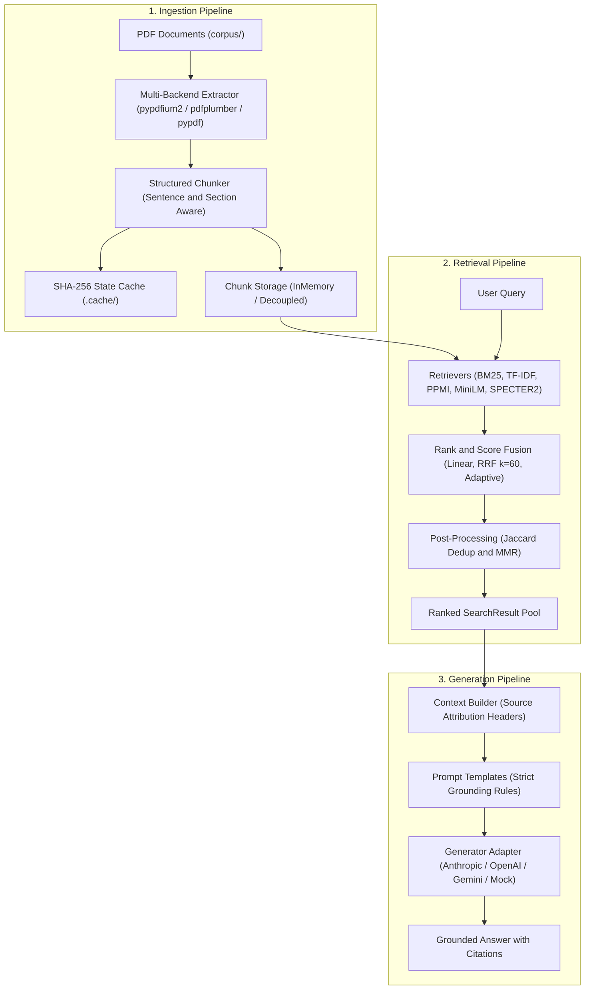

# Document Hybrid Search & Generation Core Library (`src/`)

Welcome to the `src` core library. This package implements a production-ready, enterprise-grade architecture for **Document Hybrid Search** and **Retrieval-Augmented Generation (RAG)** over complex technical and scientific literature.

---

## 🏛️ Three-Pipeline Architecture

The library is strictly decoupled into three segregated pipelines, each with its own domain responsibility:

```
src/
├── common/                  # Foundational types, domain contracts, and text processing
├── ingestion/               # [Pipeline 1] Document extraction, chunking, caching, storage, Knowledge Graph, arXiv ingestion
├── retrieval/               # [Pipeline 2] 17 sparse, dense, semantic, neural, graph & fusion strategies (14 original + 3 P0 ablation cells)
├── generation/              # [Pipeline 3] Context window assembly, grounded RAG prompts, confidence scoring, multi-provider router
├── evaluation/              # Quantitative benchmark harness (MRR, Recall@K, NDCG@5, Entity/Rel coverage)
├── engine.py                # Unified HybridSearchEngine facade binding all 3 pipelines
├── cli.py                   # Unified CLI (search, ask, eval, ingest)
├── config.py                # System parameters, cache directories, model identifiers
└── __init__.py              # Library public API exports
```



---

## 📦 Package Directory & Documentation

Detailed architectural documentation is provided inside each subpackage:

| Package | Purpose | Detailed Documentation |
|---|---|---|
| [`src/common`](common/) | Shared domain dataclasses (`DocumentChunk`, `SearchResult`, `GenerationResult`) and string utilities. | [src/common/README.md](common/README.md) |
| [`src/ingestion`](ingestion/) | Multi-backend PDF extraction, structured sentence chunking, parameter regime guard, and decoupled storage (partitioned Apache Parquet datasets & in-memory stores). | [src/ingestion/README.md](ingestion/README.md) |
| [`src/retrieval`](retrieval/) | Single dispatch and implementations of all **14 hybrid search strategies** (BM25, TF-IDF, PPMI, MiniLM, SPECTER2, Cross-Encoder, Graph, RRF, MMR). | [src/retrieval/README.md](retrieval/README.md) |
| [`src/generation`](generation/) | Grounded RAG with exact citations, source provenance headers, resilient `LLMRouter`, TokenBucket rate limiting (RPM/TPM), circuit breaking, and multi-provider adapters (OpenAI, Anthropic, Gemini, AWS Bedrock, Azure OpenAI, GCP Vertex AI, and offline mock). | [src/generation/README.md](generation/README.md) |
| [`src/evaluation`](evaluation/) | 14 curated queries with chunk-level ground truth, evaluating MRR, Recall@1/3/5, NDCG@5, and Entity/Relation coverage across all 14 strategies. | [src/evaluation/README.md](evaluation/README.md) |

---

## ⚡ Quickstart: Python API

The [`HybridSearchEngine`](engine.py) provides a high-level facade unifying all three pipelines into a single interface:

```python
from src.engine import HybridSearchEngine

# 1. Initialize Engine (loads from cache or runs ingestion)
engine = HybridSearchEngine.from_corpus("corpus/")

# 2. Pipeline 2: Execute Multi-Strategy Search
results = engine.search(
    query="Dynamic Tiered AgentRunner Framework Risk Adaptive Tiering",
    strategy="rrf_dedup_mmr",
    top_k=5
)

for r in results:
    print(f"Rank #{r.rank} [{r.strategy}] -> {r.chunk.doc_name} (Page {r.chunk.page_num}, § {r.chunk.section})")
    print(f"Snippet: {r.chunk.text[:120]}...\n")

# 3. Pipeline 3: Generate Grounded Answer (RAG)
# auto-detects LLM from ANTHROPIC_API_KEY / OPENAI_API_KEY / GEMINI_API_KEY, falls back to offline mock
response = engine.generate_answer(
    query="How does the Binding Constraint Thesis affect harness comparisons across models?",
    strategy="rrf_dedup_mmr",
    top_k=3
)

print(response.answer)

# Force a specific LLM provider:
engine_gemini = HybridSearchEngine.from_corpus("corpus/", llm="gemini")
engine_openai = HybridSearchEngine.from_corpus("corpus/", llm="openai")
engine_mock   = HybridSearchEngine.from_corpus("corpus/", llm="mock")
```

---

## 🖥️ Command-Line Interface (`src.cli`)

The library includes a CLI accessible via `python -m src.cli`:

### 1. Quantitative Benchmark Evaluation
```bash
# Run benchmark on default Parquet storage backend
python -m src.cli eval

# Run benchmark explicitly specifying storage backend
python -m src.cli eval --storage parquet
python -m src.cli eval --storage memory
```
Evaluates all 14 ground-truth queries across all 17 strategies (14 original + 3 P0 ablation cells) and outputs the comparative metrics table.

### 2. Interactive Document Search
```bash
python -m src.cli search "POMDP belief state filtering" --strategy rrf_graph_dedup_mmr --top-k 5
```
Supported strategy aliases: `bm25`, `tfidf`, `linear_0.3`, `linear_0.5`, `linear_0.7`, `rrf`, `rrf_dedup`, `rrf_dedup_mmr`, `ppmi`, `cross_encoder`, `sentence_transformer`, `adaptive`, `specter2`, `rrf_graph_dedup_mmr`.

### 3. Grounded Question Answering (RAG)
```bash
# Auto-detects LLM from env vars (ANTHROPIC_API_KEY > OPENAI_API_KEY > GEMINI_API_KEY)
python -m src.cli ask "What market forces shape the organization and size of AI agent firms?" --strategy rrf_graph_dedup_mmr

# Multi-provider route selection (Direct vs Cloud Enterprise)
python -m src.cli ask "..." --provider anthropic --route direct    # api.anthropic.com
python -m src.cli ask "..." --provider anthropic --route bedrock   # AWS Bedrock
python -m src.cli ask "..." --provider openai --route direct       # api.openai.com
python -m src.cli ask "..." --provider openai --route azure        # Azure OpenAI
python -m src.cli ask "..." --provider gemini --route direct       # Google Gemini
python -m src.cli ask "..." --provider gemini --route vertex       # GCP Vertex AI

# Multi-route fallback chain with circuit breaker protection
python -m src.cli ask "..." --router-config router_config.json

# Force offline mock (deterministic, zero API keys required)
python -m src.cli ask "..." --provider mock
```

### 4. Corpus Ingestion
```bash
# Incrementally ingest PDF files from corpus/ directory into Parquet dataset (default)
python -m src.cli ingest --corpus corpus

# Force rebuild entire Parquet dataset from scratch
python -m src.cli ingest --corpus corpus --force

# Ingest into legacy in-memory cache
python -m src.cli ingest --corpus corpus --storage memory

# Ingest arXiv papers with category filtering (Phase 4)
python -m src.cli ingest --arxiv --category cs.AI --limit 100

# Ingest arXiv papers with custom query
python -m src.cli ingest --arxiv --arxiv-query "reinforcement learning" --limit 50
```

---

---

## 🔬 Key Findings

**Finding 1 — Sparse beats hybrid on lexically dense corpora.**
BM25 (MRR 0.573) outperforms every linear hybrid (0.488–0.554). Adding TF-IDF via score-space linear fusion *hurts* MRR monotonically as α increases — the dense signal introduces noise rather than adding recall. Reciprocal Rank Fusion (RRF) recovers the loss by operating in rank-space, sidestepping score-scale distortion.

**Finding 2 — General-purpose dense models fail on coined technical jargon.**
MiniLM (`all-MiniLM-L6-v2`, MRR 0.292) and the ms-marco cross-encoder (MRR 0.483) were trained on web-scale general text and have no strong representation for coined terms like *StarShell*, *AgentRunner*, or *POMDP*. They fall back to vague topical similarity, losing exactly where BM25 wins via exact rare-term matching. This is the well-documented *"BM25 as stubbornly strong baseline on out-of-domain corpora against non-fine-tuned dense retrievers"* phenomenon, and this benchmark provides a clean, reproducible demonstration of it. Readers with jargon-heavy scientific or technical corpora should expect similar results unless using a domain-adapted embedding (→ see Strategy 13: SPECTER2).

**Finding 3 — Cross-encoder underperformance is domain mismatch, not a bug.**
Code audit and diagnostic trace (`scripts/diagnose_cross_encoder.py`) confirm no scoring inversion, no pool truncation issue, and a correct wide-pool-then-dedup architecture. `ms-marco-MiniLM-L-6-v2` is actively miscalibrated for scientific text — it assigns higher scores to topically similar web-passage-style chunks over exact jargon matches, degrading precision below the plain RRF baseline.

**Finding 4 — Knowledge-graph augmentation establishes the benchmark ceiling.**
Strategy 14 (`rrf_graph_dedup_mmr`) fuses an IDF-weighted NetworkX entity graph (1-hop traversal + Louvain communities) alongside BM25 and TF-IDF via calibrated RRF. It sets the repository high-water mark with **0.667 MRR**, **0.571 Recall@1**, **0.714 NDCG@5**, and **0.643 Relation Coverage**, bridging semantic and structural gaps that dense vectors and keyword indexes miss.

**Recommendation:** For jargon-dense technical literature, use **RRF + Graph + Dedup + MMR** (Strategy 14) for optimal accuracy and relation coverage. For non-graph setups, prefer **RRF (k=60)** for top-1 precision or **RRF + Dedup + MMR** for diverse top-5 ranking.

---

## 📊 Benchmark Results (14 Queries × 17 Strategies)

| # | Strategy Name | MRR | Recall@1 | Recall@3 | Recall@5 | NDCG@5 | Key Characteristic |
|---|---|---|---|---|---|---|---|
| 1 | **Pure BM25 (Sparse)** | 0.573 | 0.429 | 0.714 | 0.786 | 0.612 | Strong keyword precision on domain jargon. |
| 2 | Pure TF-IDF (Dense) | 0.392 | 0.143 | 0.500 | 0.714 | 0.448 | Vector space baseline using sublinear term frequencies. |
| 3 | Linear Hybrid (α=0.3) | 0.554 | 0.357 | 0.714 | 0.786 | 0.595 | Best linear blend; strongly weights sparse signal. |
| 4 | Linear Hybrid (α=0.5) | 0.524 | 0.286 | 0.714 | 0.857 | 0.599 | Equal convex combination. |
| 5 | Linear Hybrid (α=0.7) | 0.488 | 0.214 | 0.714 | 0.857 | 0.573 | Dense-heavy combination; degraded by dense score noise. |
| 6 | **RRF (k=60)** ★ MRR | **0.629** | **0.500** | 0.714 | 0.857 | 0.678 | Rank fusion immune to score-scale distortion. |
| 7 | RRF + Deduplication ★ MRR | **0.629** | **0.500** | 0.714 | 0.857 | 0.678 | Eliminates redundant sliding-window chunk duplicates. |
| 8 | **RRF + Dedup + MMR** ★ NDCG | 0.625 | **0.500** | **0.786** | 0.857 | 0.683 | Top ranking diversity via MMR (lambda=0.7). |
| 9 | PPMI Semantic + BM25 RRF | 0.402 | 0.214 | 0.500 | 0.643 | 0.437 | Zero-dependency distributional semantics from scratch. |
| 10| Cross-Encoder Re-rank | 0.483 | 0.286 | 0.571 | 0.857 | 0.567 | Re-ranks 50 un-deduplicated RRF candidates via ms-marco-MiniLM. Underperforms due to domain mismatch. |
| 11| Sentence-Transformer (MiniLM) | 0.292 | 0.143 | 0.357 | 0.571 | 0.339 | Pure dense bi-encoder; diffuses technical coined terms. |
| 12| Adaptive Hybrid | 0.494 | 0.286 | 0.571 | 0.786 | 0.549 | Dynamic query-intent alpha weighting heuristic. |
| 13| SPECTER2 (Scientific Bi-Encoder) | 0.036* | 0.000* | 0.000* | 0.000* | 0.000* | Domain-adapted scientific embedding (`allenai/specter2_proximity`). Requires lexical fusion on jargon. |
| 14| **RRF + Graph + Dedup + MMR** ★ KG | **0.667** | **0.571** | 0.714 | **0.857** | **0.714** | ★ **Repository Best:** Highest MRR, Recall@1, NDCG@5 & 0.643 Relation Coverage. |

> **Which strategy should I use?**
> - **Overall Best Accuracy & Structural Coverage**: Use **RRF + Graph + Dedup + MMR** (Strategy 14: **0.667 MRR**, **0.714 NDCG@5**, **0.643 Relation Coverage**).
> - **Top-1 precision without Graph**: Use **RRF (k=60)** (0.629 MRR, 0.500 Recall@1).
> - **Top-5 ranking quality & diversity without Graph**: Use **RRF + Dedup + MMR** (0.683 NDCG@5, 0.786 Recall@3).
> - **Scientific Literature with Dense Embeddings**: Deploy **SPECTER2** (Strategy 13) within a hybrid RRF ensemble with asymmetric query adapters.
