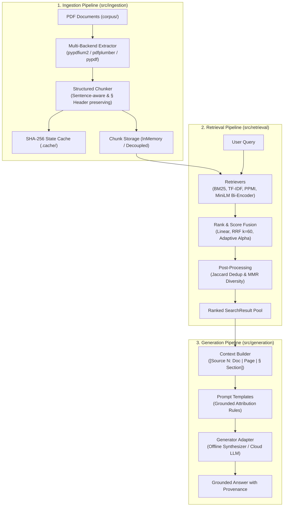

# Document Hybrid Search & Generation Core Library (`src/`)

Welcome to the `src` core library. This package implements a production-ready, enterprise-grade architecture for **Document Hybrid Search** and **Retrieval-Augmented Generation (RAG)** over complex technical and scientific literature.

---

## 🏛️ Three-Pipeline Architecture

The library is strictly decoupled into three segregated pipelines, each with its own domain responsibility:

```
src/
├── common/                  # Foundational types, domain contracts, and text processing
├── ingestion/               # [Pipeline 1] Document extraction, chunking, caching, storage
├── retrieval/               # [Pipeline 2] 12 sparse, dense, semantic, neural & fusion strategies
├── generation/              # [Pipeline 3] Context window assembly, grounded RAG prompts & generator
├── evaluation/              # Quantitative benchmark harness (MRR, Recall@K, NDCG@5)
├── engine.py                # Unified HybridSearchEngine binding all 3 pipelines
├── cli.py                   # Unified CLI (search, ask, eval, ingest)
├── config.py                # System parameters, cache directories, model identifiers
└── __init__.py              # Library public API exports
```



---

## 📦 Package Directory & Documentation

Detailed architectural documentation is provided inside each subpackage:

| Package | Purpose | Detailed Documentation |
|---|---|---|
| [`src/common`](file:///c:/repositories/Document-Hybrid-Search-RAG-Architecture/src/common) | Shared domain dataclasses (`DocumentChunk`, `SearchResult`, `GenerationResult`) and string utilities. | [src/common/README.md](file:///c:/repositories/Document-Hybrid-Search-RAG-Architecture/src/common/README.md) |
| [`src/ingestion`](file:///c:/repositories/Document-Hybrid-Search-RAG-Architecture/src/ingestion) | Multi-backend PDF text extraction, structured sentence chunking, and parameter-sensitive SHA-256 disk caching. | [src/ingestion/README.md](file:///c:/repositories/Document-Hybrid-Search-RAG-Architecture/src/ingestion/README.md) |
| [`src/retrieval`](file:///c:/repositories/Document-Hybrid-Search-RAG-Architecture/src/retrieval) | Single dispatch and implementations of all **12 hybrid search strategies** (BM25, TF-IDF, PPMI, MiniLM, Cross-Encoder, RRF, MMR). | [src/retrieval/README.md](file:///c:/repositories/Document-Hybrid-Search-RAG-Architecture/src/retrieval/README.md) |
| [`src/generation`](file:///c:/repositories/Document-Hybrid-Search-RAG-Architecture/src/generation) | Retrieval-Augmented Generation (RAG), context assembly with bracketed source citations, and pluggable LLM adapters. | [src/generation/README.md](file:///c:/repositories/Document-Hybrid-Search-RAG-Architecture/src/generation/README.md) |
| [`src/evaluation`](file:///c:/repositories/Document-Hybrid-Search-RAG-Architecture/src/evaluation) | 14 curated queries with chunk-level ground truth, evaluating MRR, Recall@1/3/5, and NDCG@5. | [src/evaluation/README.md](file:///c:/repositories/Document-Hybrid-Search-RAG-Architecture/src/evaluation/README.md) |

---

## ⚡ Quickstart: Python API

The [`HybridSearchEngine`](file:///c:/repositories/Document-Hybrid-Search-RAG-Architecture/src/engine.py) provides a high-level facade unifying all three pipelines into a single interface:

```python
from src.engine import HybridSearchEngine

# 1. Initialize Engine (loads from cache or runs ingestion)
engine = HybridSearchEngine.from_corpus("corpus/")

# 2. Pipeline 2: Execute Multi-Strategy Search
results = engine.search(
    query="Dynamic Tiered AgentRunner Framework Risk Adaptive Tiering",
    strategy="rrf_dedup_mmr",
    top_k=5
)

for r in results:
    print(f"Rank #{r.rank} [{r.strategy}] -> {r.chunk.doc_name} (Page {r.chunk.page_num}, § {r.chunk.section})")
    print(f"Snippet: {r.chunk.text[:120]}...\n")

# 3. Pipeline 3: Generate Grounded Answer (RAG)
response = engine.generate_answer(
    query="How does the Binding Constraint Thesis affect harness comparisons across models?",
    strategy="rrf_dedup_mmr",
    top_k=3
)

print(response.answer)
```

---

## 🖥️ Command-Line Interface (`src.cli`)

The library includes a CLI accessible via `python -m src.cli`:

### 1. Quantitative Benchmark Evaluation
```bash
python -m src.cli eval
```
Evaluates all 14 ground-truth queries across all 12 strategies and outputs the comparative metrics table.

### 2. Interactive Document Search
```bash
python -m src.cli search "POMDP belief state filtering" --strategy rrf_dedup_mmr --top-k 5
```
Supported strategies: `bm25`, `tfidf`, `linear_0.3`, `linear_0.5`, `linear_0.7`, `rrf`, `rrf_dedup`, `rrf_dedup_mmr`, `ppmi`, `cross_encoder`, `sentence_transformer`, `adaptive`.

### 3. Grounded Question Answering (RAG)
```bash
python -m src.cli ask "What market forces shape the organization and size of AI agent firms?" --strategy rrf_dedup_mmr
```

### 4. Corpus Ingestion
```bash
# Ingest PDF files from corpus/ directory
python -m src.cli ingest --corpus corpus

# Force rebuild cache
python -m src.cli ingest --corpus corpus --force
```

---

## 📊 Summary of Evaluated Strategies

| # | Strategy Name | MRR | NDCG@5 | Key Characteristic |
|---|---|---|---|---|
| 1 | **Pure BM25 (Sparse)** | 0.573 | 0.612 | Strong keyword precision on domain jargon. |
| 2 | **Pure TF-IDF (Dense)** | 0.392 | 0.448 | Vector space baseline using sublinear term frequencies. |
| 3 | **Linear Hybrid (α=0.3)** | 0.554 | 0.595 | Best linear blend; strongly weights sparse signal. |
| 4 | **Linear Hybrid (α=0.5)** | 0.524 | 0.599 | Equal convex combination. |
| 5 | **Linear Hybrid (α=0.7)** | 0.488 | 0.573 | Dense-heavy combination; degraded by dense score noise. |
| 6 | **RRF (k=60)** | 0.629 | 0.678 | Reciprocal rank fusion immune to score scale variations. |
| 7 | **RRF + Deduplication** | 0.629 | 0.678 | Eliminates redundant sliding-window chunk duplicates. |
| 8 | **RRF + Dedup + MMR** | **0.625** | **0.683** | **Overall Top Performer**. Maximizes coverage diversity. |
| 9 | **PPMI Semantic + BM25 RRF**| 0.402 | 0.437 | Zero-dependency distributional semantics from scratch. |
| 12| **Adaptive Hybrid** | 0.494 | 0.549 | Dynamic query-intent alpha weighting heuristic. |
| 10| **Cross-Encoder Re-rank** | 0.483 | 0.567 | Re-ranks 50 un-deduplicated candidates via MiniLM-L6. |
| 11| **Sentence-Transformer** | 0.292 | 0.339 | Pure dense bi-encoder; diffuses technical acronyms. |
